## 학습 목표
- OpenStack 실습 환경에서 필요한 3-NIC 네트워크 요구사항을 이해한다.
- VMware Fusion의 Custom Network(vmnet2, vmnet3, vmnet4)를 설계하고 구성한다.
- Ubuntu VM에 정적 IP를 설정하고 네트워크 동작을 검증한다.

## 학습 내용
### 2.2.1 네트워크 요구사항
- 모든 노드는 NIC 3개를 사용한다.

| 역할 | 대역 | 인터넷 | DHCP | 비고 |
| --- | --- | --- | --- | --- |
| MGMT | `10.100.100.0/24` | O | X | 관리/API/SSH 네트워크 |
| Tenant (VXLAN) | `10.100.200.0/24` | X | X | 오버레이 내부 통신 네트워크 |
| Provider | `10.200.100.0/24` | O | X | 노드 NIC는 무IP(인터페이스만 유지) 가능 |

### 2.2.2 VM 생성 및 기본 설정
1. VMware Fusion을 설치하고 Ubuntu Server 22.04 LTS(ARM) 기반 VM을 생성한다.
2. 부팅 방식은 UEFI를 선택한다.

|  |  |  |
| --- | --- | --- |
| 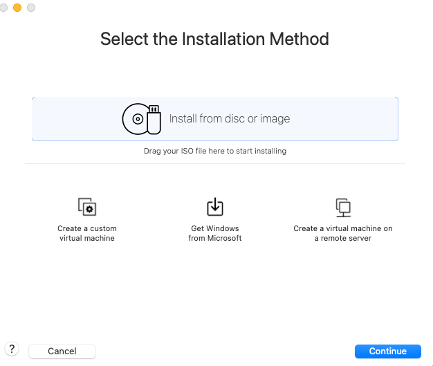{width="100%"} | 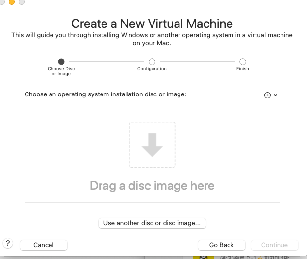{width="100%"} | 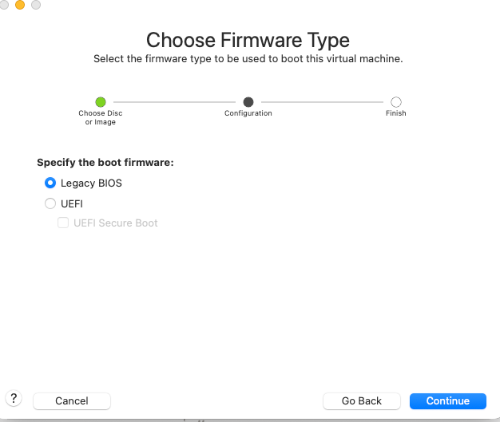{width="100%"} |
| (1) 새 VM 생성 마법사를 시작하고 실습용 Ubuntu 서버 VM 생성을 진행한다. | (2) Ubuntu Server 22.04 LTS(ARM) 이미지를 선택해 설치 대상을 확정한다. | (3) 부팅 모드를 UEFI로 선택해 최신 Linux 서버 환경과의 호환성을 확보한다. |

### 2.2.3 VMware Fusion 네트워크 설계
위치: `VMware Fusion > Settings > Network`

논리 토폴로지:

- `vmnet-mgmt` (Custom Host-Only): Host(macOS) <-> VM 관리 통신
- `vmnet-tenant` (Custom Isolated): VM <-> VM 내부 오버레이 통신
- `provider` (학습 환경에서는 NAT 기반 Custom): 외부망 역할 시뮬레이션
```bash
[외부 제3자 PC] --(물리 스위치/공유기)-- [macOS의 물리 NIC]
                                         |
                                     (Bridged)
                                         |
                                  [Provider NIC of OpenStack Node]
                                         |
                               [Neutron Router / L3 NAT]
                                         |
                               [Tenant Network (VXLAN)]
                                         |
                                    [VM (Fixed IP)]
```

:::: {.columns}
::: {.column width="40%"}
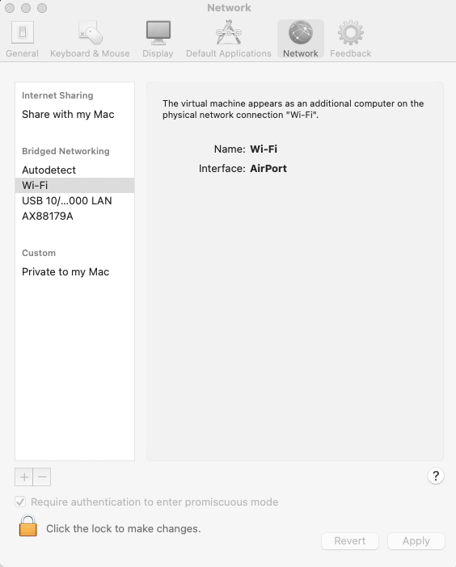{width="100%"}
:::
::: {.column width="full"}
| Fusion 네트워크 타입 | 의미 | 성격 | 실습 역할 |
| --- | --- | --- | --- |
| Share with my Mac (NAT) | 호스트를 통해 인터넷 연결 | L3 (NAT) | MGMT |
| Private to my Mac (Host-only) | 호스트와 VM 간 통신 | L2 격리 | Tenant |
| Bridged Networking | 물리 네트워크 직결 | L2 브리지 | Provider(정석) |
:::
::::

:::: {.columns}
::: {.column width="40%"}
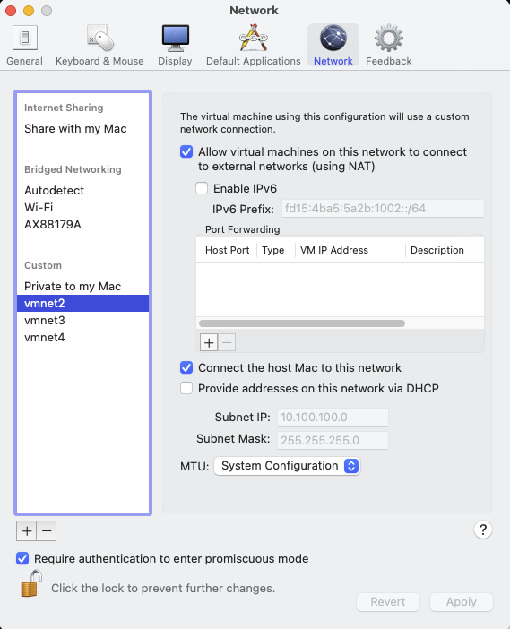{width="100%"}
:::
::: {.column width="60%"}
| 역할 | 대역 | 인터넷<br>연결 | DHCP | Host<br>접근 | VM 간<br>통신 |
| --- | --- | --- | --- | --- | --- |
| MGMT | 10.100.100.0/24 | O | X | O | O |
| Tenant (VXLAN) | 10.100.200.0/24 | X | X | X | O |
| Provider | 10.200.100.0/24 | O | X | X | O |

**Custom 네트워크 생성 방법**  
1. 좌측 하단의 자물쇠 아이콘을 눌러 설정 변경 권한을 활성화한다.  
2. 좌측 하단의 `+` 버튼을 눌러 새 Custom 네트워크를 생성한다.  
3. 대역과 옵션을 입력한 뒤 Apply로 저장해 설정을 완료한다.  
:::

::::

### 2.2.4 Custom 네트워크별 상세 옵션
#### 1) MGMT 네트워크(vmnet2)
- Host(macOS) <-> VM 관리 접속이 가능한 네트워크다.
- OpenStack API/SSH/관리 트래픽의 기본 경로다.
- DHCP를 비활성화하고 정적 IP를 사용한다.

:::: {.columns}
::: {.column width="52%"}
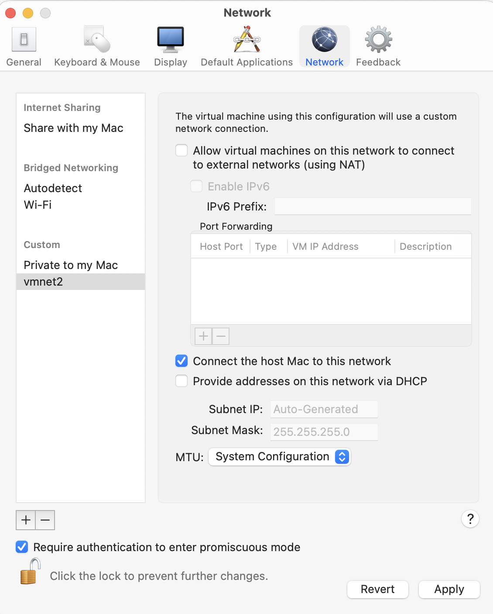{width="100%"}
:::
::: {.column width="48%"}
설정 포인트:

- **Host 연결**  
  옵션명: Connect the host Mac to this network  
  권장값: ON  
  이유: Host에서 MGMT IP로 SSH/API 관리 접속을 수행한다.

- **외부망 연결(NAT)**  
  옵션명: Allow virtual machines on this network to connect to external networks (using NAT)  
  권장값: ON (실습 기준)  
  이유: 패키지 설치/업데이트를 위한 인터넷 경로를 확보한다.

- **DHCP 자동 할당**  
  옵션명: Provide addresses on this network via DHCP  
  권장값: OFF  
  이유: OpenStack 노드는 정적 IP를 기본 전제로 사용한다.

- **MTU**  
  권장값: System Configuration 유지  
  이유: VXLAN 오버헤드는 Tenant 네트워크 쪽에서 고려한다.
:::
::::

#### 2) Tenant 네트워크(vmnet3)
- VM 간 오버레이(VXLAN) 트래픽 전용 네트워크다.
- Host(macOS) 및 외부 인터넷 경로와 분리한다.
- DHCP 없이 정적 IP를 사용해 터널 종단점을 고정한다.

:::: {.columns}
::: {.column width="52%"}
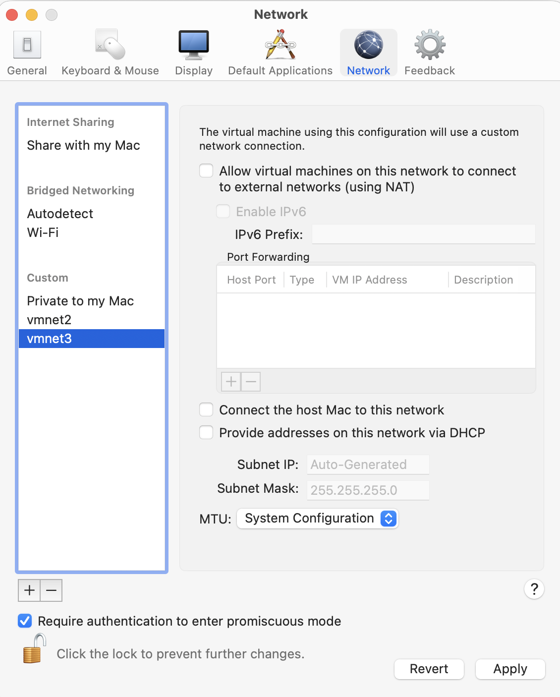{width="100%"}
:::
::: {.column width="48%"}
설정 포인트:

- **Host 연결**  
  옵션명: Connect the host Mac to this network  
  권장값: OFF  
  이유: Host에서 Tenant 대역으로 직접 접근하지 않도록 분리한다.

- **외부망 연결(NAT)**  
  옵션명: Allow virtual machines on this network to connect to external networks (using NAT)  
  권장값: OFF  
  이유: Tenant 대역은 외부 통신용이 아니라 내부 오버레이 통신용이다.

- **DHCP 자동 할당**  
  옵션명: Provide addresses on this network via DHCP  
  권장값: OFF  
  이유: 노드 간 VXLAN 통신을 위해 고정 IP를 사용한다.

- **인터페이스 매핑 확인**  
  확인 방법: VM 내부에서 `ip a` 실행  
  기준: Tenant 대역이 의도한 NIC에 정확히 매핑되어야 한다.
:::
::::

#### 3) Provider 네트워크(vmnet4)
OpenStack의 Provider(External)는 원칙적으로 물리 NIC 기반 Bridged 구성을 사용한다.  
개인 단일 호스트 실습에서는 별도 물리망이 없으므로 NAT 기반 Custom Network로 대체한다.

:::: {.columns}
::: {.column width="52%"}
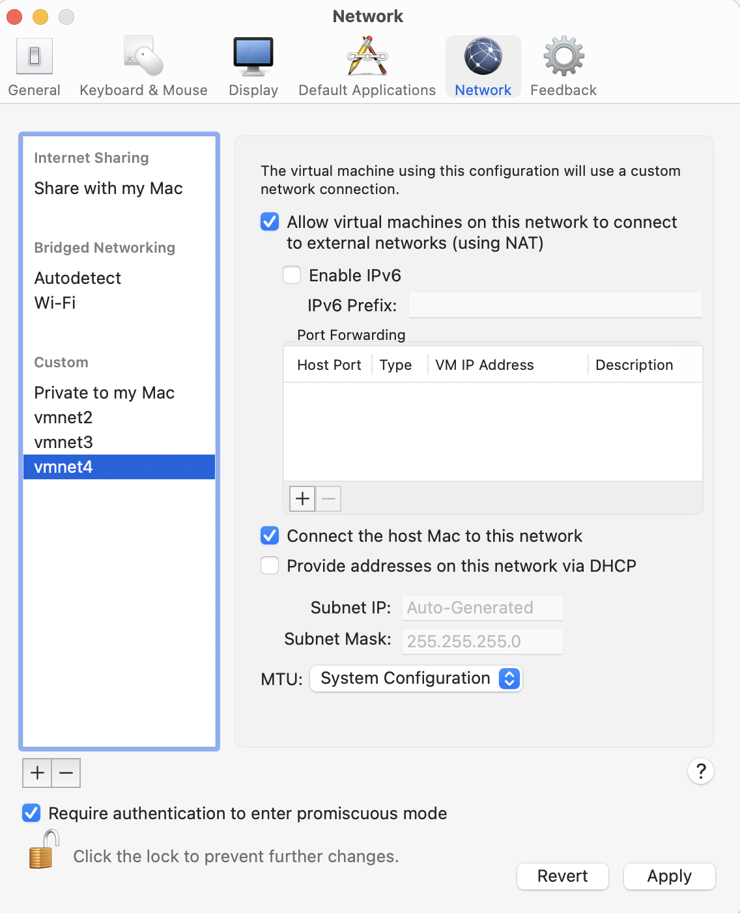{width="100%"}
:::
::: {.column width="48%"}
설정 포인트:

- **외부망 연결(NAT)**  
  옵션명: Allow virtual machines on this network to connect to external networks (using NAT)  
  권장값: ON  
  이유: 실습 환경에서 External 네트워크 역할을 시뮬레이션하는 출구 경로다.

- **DHCP 자동 할당**  
  옵션명: Provide addresses on this network via DHCP  
  권장값: OFF  
  이유: Provider NIC는 실습 기준으로 무IP(Disabled) 또는 최소 할당을 사용한다.

- **Host 연결**  
  옵션명: Connect the host Mac to this network  
  권장값: 기본 OFF, 디버깅 시 ON  
  이유: 정상 설계에서는 Host 직접 연결이 필수는 아니다.
:::
::::

| 항목 | NAT 기반 Provider 대체 |
| --- | --- |
| 외부 PC -> VM 직접 접근 | X |
| L2 브로드캐스트 재현 | X |
| Floating IP 외부 유입 실검증 | 제한적 |
| External 라우팅 흐름 학습 | O |

### 2.2.5 VM NIC 3개 구성 및 정적 IP 설정
아래 순서로 진행하면 NIC 매핑 실수를 줄일 수 있다.

**1. 새 VM 생성 마법사를 시작한다.**

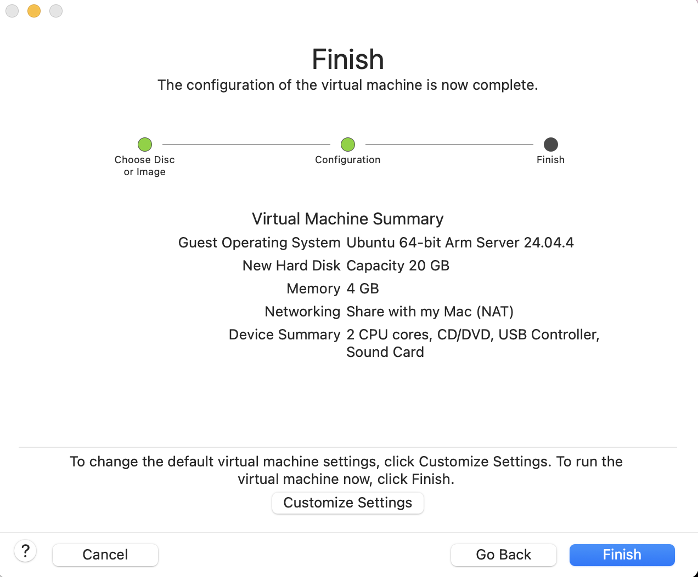{width="55%" fig-align="left"}

- Ubuntu Server ARM 이미지를 기준으로 새 VM 생성을 시작한다.

---

**2. `Customize Settings`로 진입한다.**

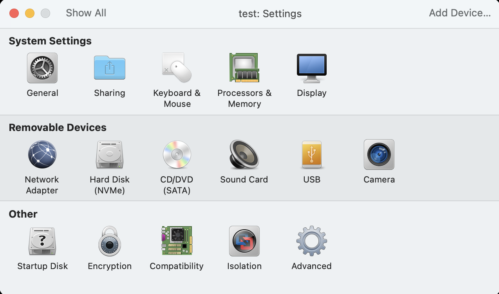{width="55%" fig-align="left"}

- 설치 전 단계에서 CPU/메모리/네트워크 장치를 확정한다.

---

**3. Network Adapter를 총 3개로 확장한다.**

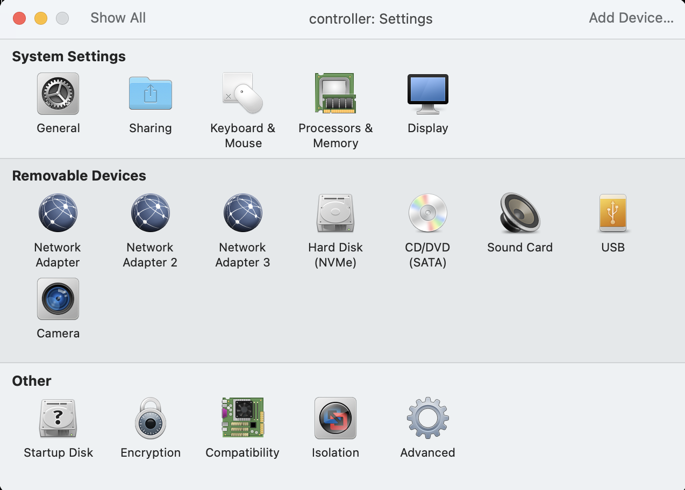{width="55%" fig-align="left"}

- 각각 `vmnet2(MGMT)`, `vmnet3(Tenant)`, `vmnet4(Provider)`에 연결한다.

---

**4. Ubuntu 설치 후 네트워크 설정 메뉴로 이동한다.**

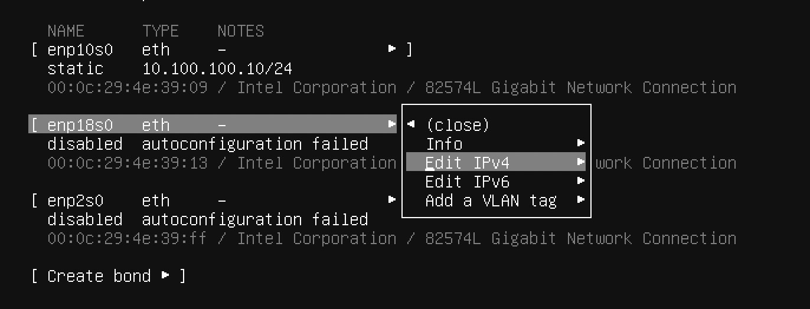{width="55%" fig-align="left"}

- NIC별 IPv4 방식을 자동이 아닌 수동(Manual)으로 변경할 준비를 한다.

---

**5. MGMT 인터페이스부터 정적 IP를 설정한다.**

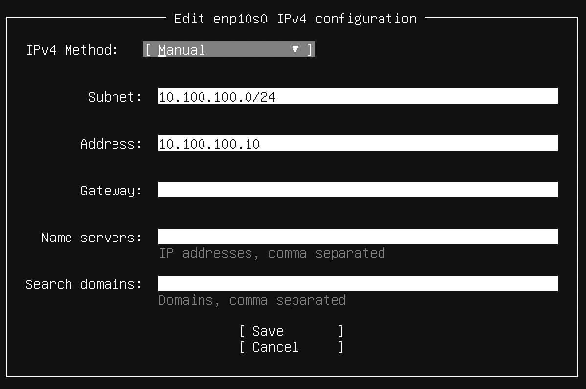{width="55%" fig-align="left"}

- MGMT NIC에는 주소/서브넷/게이트웨이/DNS를 입력한다.

---

**6. 인터페이스 이름과 VMware 어댑터 MAC 주소를 대조한다.**

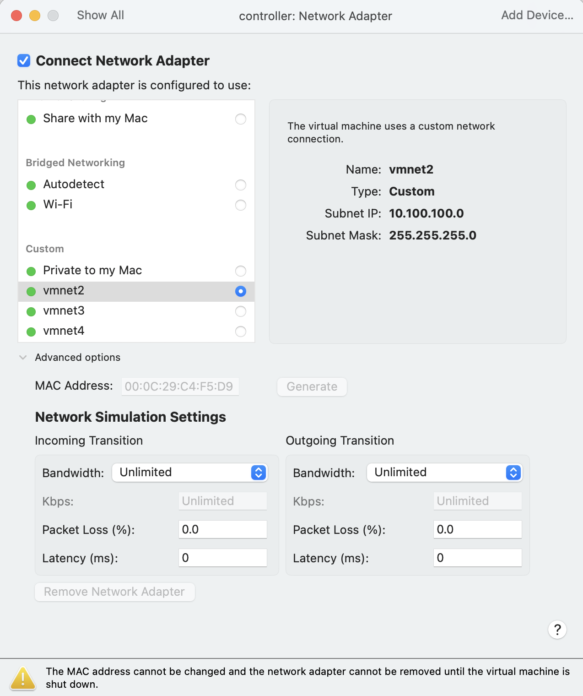{width="55%" fig-align="left"}

- `enpXsY` 이름만 보지 말고 MAC 주소로 vmnet 매핑을 확정한다.

---

**7. 3개 NIC의 최종 상태를 검토한다.**

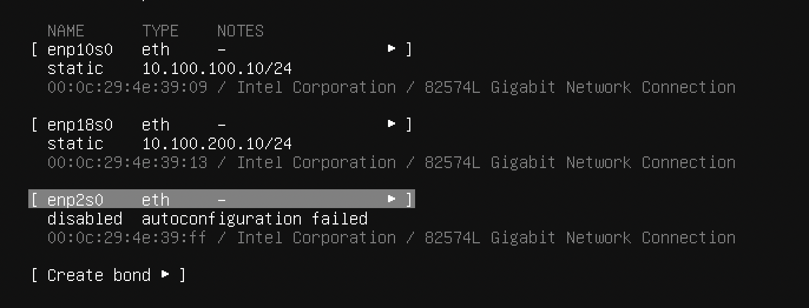{width="55%" fig-align="left"}

- MGMT/Tenant는 정적 IP, Provider는 실습 기준 Disabled로 맞춘다.

정적 IP 설정:

| 항목 | MGMT | Tenant | Provider |
| --- | --- | --- | --- |
| IPv4 | Manual | Manual | Disabled |
| Subnet | `10.100.100.0/24` | `10.100.200.0/24` | - |
| Address | `10.100.100.10` | `10.100.200.10` | - |
| Gateway | `10.100.100.2` | - | - |
| DNS | `8.8.8.8` | - | - |


### 2.2.6 Controller/Compute IP 할당 예시표
아래 표는 2노드(Controller 1대 + Compute 1대) 기준의 권장 예시이다.

| 노드 | 용도 | 인터페이스 예시 | IP/Prefix | Gateway | 비고 |
| --- | --- | --- | --- | --- | --- |
| controller | MGMT/API/SSH | `enp2s0` | `10.100.100.10/24` | `10.100.100.2` | DNS `8.8.8.8` |
| controller | Tenant(VXLAN) | `enp10s0` | `10.100.200.10/24` | 없음 | 내부 오버레이 통신 |
| controller | Provider(External) | `enp18s0` | 미할당(Disabled) | 없음 | 학습환경 NAT 대체 |
| compute1 | MGMT/API/SSH | `enp2s0` | `10.100.100.20/24` | `10.100.100.2` | DNS `8.8.8.8` |
| compute1 | Tenant(VXLAN) | `enp10s0` | `10.100.200.20/24` | 없음 | controller와 상호 ping |
| compute1 | Provider(External) | `enp18s0` | 미할당(Disabled) | 없음 | 링크 UP 여부 확인 |

### 2.2.7 트러블슈팅
| 증상 | 가능한 원인 | 확인 명령 | 조치 |
| --- | --- | --- | --- |
| MGMT에서 인터넷 ping 실패 | default route 누락, DNS 미설정 | `ip route`, `resolvectl status` | MGMT NIC에만 gateway 설정, DNS 재설정 |
| Controller <-> Compute Tenant ping 실패 | Tenant NIC 대역 오타, NIC DOWN | `ip a`, `ping 10.100.200.X` | 양쪽 Tenant IP/마스크 재확인, 인터페이스 UP |
| NIC 매핑이 뒤바뀜 | 어댑터 순서 변경, 잘못된 인터페이스 선택 | `ip link`, MAC 주소 대조 | VMware MAC과 Ubuntu NIC를 매핑 후 재설정 |
| Provider 관련 동작이 불안정 | NAT/Host 옵션 혼합, Provider IP 오할당 | VMware Network 설정 화면, `ip a` | Provider NIC는 원칙적으로 IP 미할당, NAT 대체 조건 유지 |
| 설정 후에도 값이 복원됨 | netplan 미적용 또는 설치기 설정 누락 | `sudo netplan get`, `sudo netplan try` | netplan에 정적 설정 반영 후 `apply` |

### 2.2.8 실습 완료 체크리스트
- [ ] VM마다 NIC 3개(MGMT/Tenant/Provider)가 모두 추가되어 있다.
- [ ] MGMT는 `10.100.100.0/24`, Tenant는 `10.100.200.0/24`로 정적 IP가 설정되어 있다.
- [ ] Provider NIC는 학습 환경 기준으로 IP 미할당(Disabled) 상태다.
- [ ] `ip a`에서 인터페이스 상태와 IP 매핑이 의도와 일치한다.
- [ ] `ip route`에서 default route가 MGMT에만 존재한다.
- [ ] MGMT에서 `ping 8.8.8.8`이 정상 동작한다.
- [ ] Controller와 Compute 간 Tenant 대역 ping이 정상 동작한다.

### 2.2.9 네트워크 검증
#### NIC/IP 확인
```bash
ip a
```  
출력 예시)
```bash
1: lo: <LOOPBACK,UP,LOWER_UP> mtu 65536 qdisc noqueue state UNKNOWN group default qlen 1000
    link/loopback 00:00:00:00:00:00 brd 00:00:00:00:00:00
    inet 127.0.0.1/8 scope host lo
       valid_lft forever preferred_lft forever
    inet6 ::1/128 scope host noprefixroute
       valid_lft forever preferred_lft forever
2: enp2s0: <BROADCAST,MULTICAST,UP,LOWER_UP> mtu 1500 qdisc fq_codel state UP group default qlen 1000
    link/ether 00:0c:29:0a:d9:c1 brd ff:ff:ff:ff:ff:ff
    inet 10.100.100.10/24 brd 10.100.100.255 scope global enp2s0
       valid_lft forever preferred_lft forever
    inet6 fe80::20c:29ff:fe0a:d9c1/64 scope link
       valid_lft forever preferred_lft forever
3: enp10s0: <BROADCAST,MULTICAST,UP,LOWER_UP> mtu 1500 qdisc fq_codel state UP group default qlen 1000
    link/ether 00:0c:29:0a:d9:cb brd ff:ff:ff:ff:ff:ff
    inet 10.100.200.10/24 brd 10.100.200.255 scope global enp10s0
       valid_lft forever preferred_lft forever
    inet6 fe80::20c:29ff:fe0a:d9cb/64 scope link
       valid_lft forever preferred_lft forever
4: enp18s0: <BROADCAST,MULTICAST> mtu 1500 qdisc noop state DOWN group default qlen 1000
    link/ether 00:0c:29:0a:d9:d5 brd ff:ff:ff:ff:ff:ff
```

확인 기준:

- NIC 3개가 인식된다.
- MGMT/Tenant 대역이 의도한 인터페이스에 매핑된다.
- 사용 인터페이스 상태가 `UP`이다.

#### 라우팅 확인
```bash
ip route
```
출력 예시)
```bash
default via 10.100.100.2 dev enp2s0 proto static
10.100.100.0/24 dev enp2s0 proto kernel scope link src 10.100.100.10
10.100.200.0/24 dev enp10s0 proto kernel scope link src 10.100.200.10
```

확인 기준:

- default route는 MGMT 인터페이스에만 존재한다.
- Tenant 인터페이스에는 default gateway를 두지 않는다.

#### 핑 테스트
MGMT:
```bash
ping 10.100.100.1
ping 8.8.8.8
```

Tenant (노드 간):
```bash
ping 10.100.200.20
```

Provider (IP 미할당 시 링크 상태 확인):
```bash
ip link show enp18s0
```

## 참고 자료
- [VMWare 제품 종류 및 특징](ch2_2_vmware_products.qmd)
- [VMware Fusion Documentation](ch2_2_vmware_fusion_docs.qmd)
