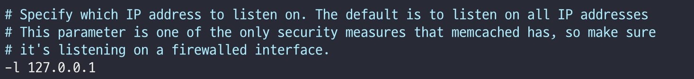

# 7. **Memcached**

### **공식 문서**

- Memcached (Ubuntu): https://docs.openstack.org/install-guide/environment-memcached-ubuntu.html

[개념 정리]

- Keystone 토큰/세션 같은 걸 메모리에 캐싱해서 성능 올리는 용도.
- controller에만 두고, 다른 노드들이 여기에 붙는다.

### **controller에서만**

### **① 패키지 설치**

```yaml
apt install -y memcached python3-memcache
```

### **② bind 주소를 관리망 IP로 변경**

/etc/memcached.conf 편집:



```yaml
# 원래는 -l 127.0.0.1 이런 줄이 있음
# 그 줄을 아래처럼 교체
-l 10.100.100.11
```

**③ 재시작**

```yaml
service memcached restart
```

> 이렇게 하면 compute 같은 다른 노드에서도
10.100.100.11:11211 으로 Keystone 캐시를 공유하게 된다.
> 

---
