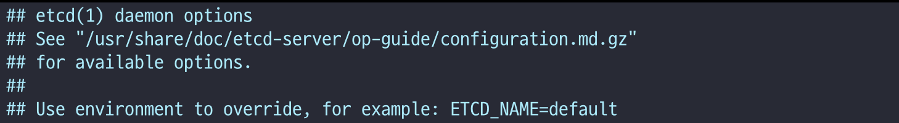
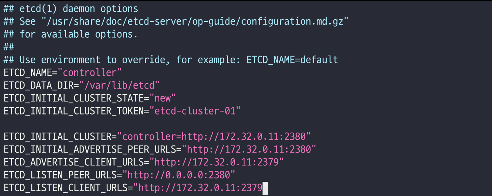

# **8. Etcd**

### **공식 문서**

- Etcd (Ubuntu): https://docs.openstack.org/install-guide/environment-etcd-ubuntu.html

[개념 정리]

- Nova/Neutron 등에서 **분산 락 / 서비스 상태 / 설정** 등을 저장하는
 
 경량 key-value 스토어.
 
- 역시 controller에 하나만 띄우는 구조.

### **controller에서만 (Ubuntu 24.04 기준)**

### **① 패키지 설치**

```
apt install -y etcd-server
```

(Ubuntu 24.04는 etcd-server 패키지 이름이 맞다고 문서에 명시.)

**②/etc/default/etcd 수정**

문서 예제에서 10.0.0.11 되어 있는 부분을 **10.100.100.11** 로 바꿔서 넣어주면 됨:

초기 파일은 아래와 같은 형태다. 기존 내용을 확인한 뒤, 아래 설정을 추가한다.



```
cat >/etc/default/etcd << 'EOF'
ETCD_NAME="controller"
ETCD_DATA_DIR="/var/lib/etcd"
ETCD_INITIAL_CLUSTER_STATE="new"
ETCD_INITIAL_CLUSTER_TOKEN="etcd-cluster-01"

ETCD_INITIAL_CLUSTER="controller=http://10.100.100.11:2380"
ETCD_INITIAL_ADVERTISE_PEER_URLS="http://10.100.100.11:2380"
ETCD_ADVERTISE_CLIENT_URLS="http://10.100.100.11:2379"
ETCD_LISTEN_PEER_URLS="http://0.0.0.0:2380"
ETCD_LISTEN_CLIENT_URLS="http://10.100.100.11:2379"
EOF
```



### **③ 서비스 enable + 재시작**

```
systemctl enable etcd
systemctl restart etcd
systemctl status etcd #상태확인
```

---
