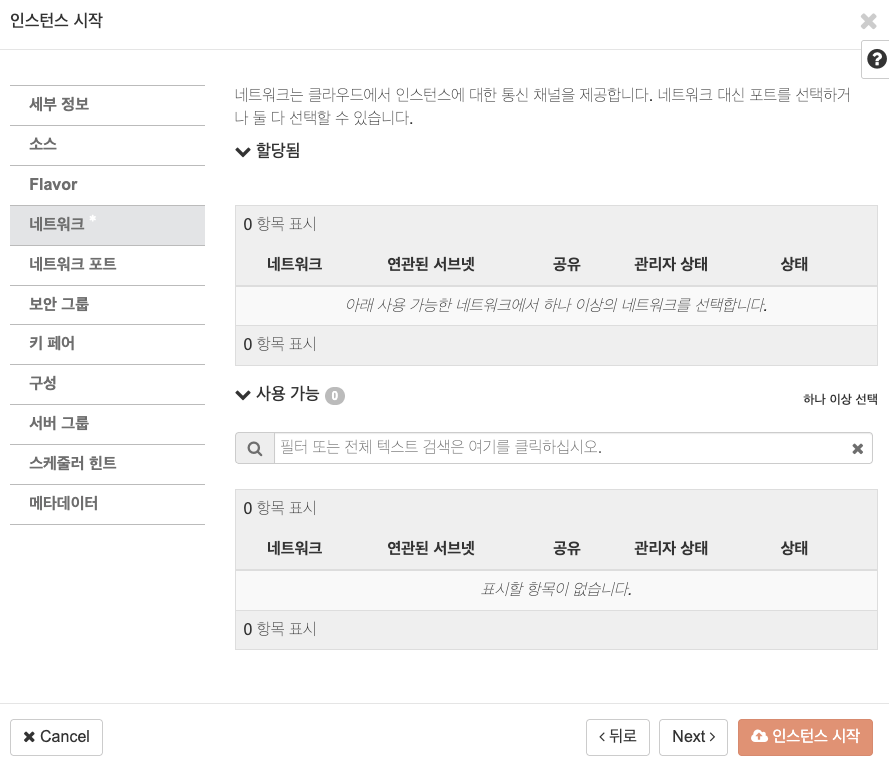
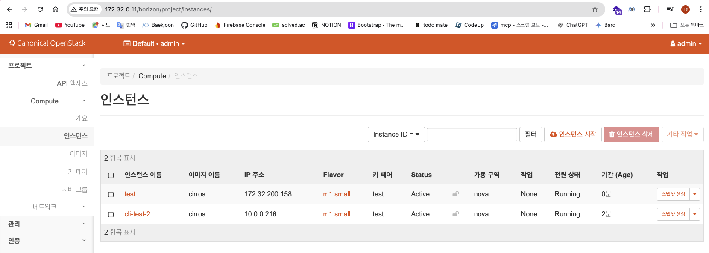

# Horizon 대시보드에서 인스턴스 생성

인스턴스 시작 버튼 누르기

대시보드가 정상적으로 표시되었다.

이제 인스턴스 생성 가능 상태다.

다만 “정상 생성 여부 / 외부 ping·ssh 가능 여부”는 Nova/Neutron 설정 완료 상태에 따라 달라진다.

아래 순서로 확인한다.

---

## **1. 지금 바로 체크하면 좋은 것들 (컨트롤러에서)**

터미널에서:

```
source /root/admin-openrc.sh

# Nova / compute 상태
openstack compute service list
openstack hypervisor list

# Neutron 에이전트 상태
openstack network agent list

# 이미지 / flavor / 네트워크가 있는지
openstack image list
openstack flavor list
openstack network list
```

아래와 같은 형태로 구성되면 된다:

- compute 서비스가 up
- hypervisor list 에 compute1 보임
- network agent 들(OVS agent, L3, DHCP, metadata)이 :-) / UP
- cirros 이미지 하나, m1.small 같은 flavor 하나, selfservice/provider 네트워크 있음

이 정도면 Horizon에서 인스턴스 띄워 볼 수 있어.

---

## **2. Horizon에서 인스턴스 만드는 방법**

지금 화면이 “프로젝트 → Compute → 인스턴스”니까 거기서:

1. **오른쪽 위 인스턴스 시작 버튼 클릭**
2. **탭별로 설정**
 
 ### **(1) 세부 정보(Details)**
 
 - 인스턴스 이름: 예) test-cirros-1
 - 가용 영역: nova
 - 수량: 1
 
 ### **(2) 소스(Source)**
 
 - 부팅 소스: **이미지로 부팅** (Boot from image)
 - 선택 가능한 이미지 목록에서 **cirros** 골라서 오른쪽으로 추가
 
 ### **(3) Flavor**
 
 - 선택 가능한 flavor 있으면 아무거나 (예: m1.small).
 - 만약 flavor가 하나도 없으면 컨트롤러에서:

```
openstack flavor create --id 1 --ram 512 --disk 5 --vcpus 1 m1.small
```

1. 
 - 만들고 새로고침해서 선택
 
 ### **(4) 네트워크(Network)**
 
 - self-service 네트워크(SDN)까지 만들었으면
 
 → **selfservice 같은 네트워크를 선택해서 오른쪽으로 추가**
 
 - 아직 self-service 안 만들고 provider만 있다면
 
 → provider 네트워크 선택
 
 
 ### **(5) 보안 그룹(Security Groups)**
 
 - 기본 default 하나만 있으면:
 - 미리 CLI에서 ICMP/SSH Allow 룰 추가해 두는 게 좋아:

```
openstack security group rule create --proto icmp default
openstack security group rule create --proto tcp --dst-port 22 default
```

1. 
 
 ### **(6) 키 페어(Key Pair)**
 
 - 이미 키 페어 있으면 선택
 - 없으면 상단 메뉴의 **키 페어** 메뉴에서 하나 생성하고,
 
 PEM 파일 다운 받아두고, 그걸 선택
 
2. **인스턴스 시작 버튼 클릭**

잠시 후 리스트에 test-cirros-1 이 올라오고

Status가 Active 로 바뀌면 성공 ✨

---

## **3. 그 다음에 할 수 있는 것들**

- **콘솔로 접속 테스트**
 - 인스턴스 이름 오른쪽 작업 → “콘솔 보기”
 - noVNC 콘솔 열리면 로그인:
 - cirros / gocubsgo (기본 계정)
- **네트워크 테스트**
 - self-service 네트워크까지 만들었다면:
 - 같은 네트워크에 인스턴스 두 개 띄워서 서로 ping
 - 외부에서 ping/ssh 까지 하고 싶으면:
 - provider 네트워크 + router + floating IP 구성까지 끝내야 함
 
 (이건 우리가 Neutron Option 2 파트에서 하려던 거)
 

---

## **4. 요약**

- 지금 대시보드 뜨는 시점까지 왔으면 **Nova/Keystone/Horizon 라인은 정상**이고,
- Neutron 쪽 agent/status만 괜찮다면 **인스턴스 만들기 가능**.
- 인스턴스 시작 마법사에서:
 - 이미지 = cirros
 - flavor = m1.small
 - 네트워크 = selfservice(or provider)
 - 보안 그룹/키페어 세팅
 - → Launch!

해보고 Status가 Error로 떨어지거나 부팅 안 되면,

- Horizon에서 에러 메시지,
- openstack server show <인스턴스ID> 결과,
- nova-compute / neutron-openvswitch-agent 로그

점검 중 확인한 사항은 다음과 같다.



네트워크 목록이 비어 있다.

대시보드 접속이 정상적으로 확인되었다 

지금 화면에서 **네트워크 탭이 비어있는 이유**는 다음 한 가지다:

> 아직 Neutron 네트워크를 하나도 안 만들어서 그래.
> 

> (NIC를 붙일 네트워크가 없으니 “사용 가능 0개”)
> 

그래서 인스턴스 만들기 전에 **provider / self-service 네트워크 + 서브넷 + 라우터**를 먼저 만들어줘야 돼.

아래는 **컨트롤러에서 CLI로 일괄 생성하는 방법**이다.

(예시 값이므로, 필요 시 IP 대역은 실습 환경에 맞게 변경한다.)

---

## **1. 준비: admin 자격 로딩 + 상태 확인**

컨트롤러에서:

```
sudo -i
source /root/admin-openrc.sh

# Neutron 에이전트 상태 체크
openstack network agent list

# 이미 만들어진 네트워크 있는지
openstack network list
```

- agent 들이 전부 Alive :-), State UP 이면 OK
- network 리스트가 비어 있으면 아래대로 새로 만드는 거.

---

## **2. provider(외부) 네트워크 만들기**

예시로 **172.32.200.0/24** 를 외부 풀로 쓰겠다고 가정할게.

(중요: 실제로는 네 로컬 네트워크 대역에 맞춰서 subnet-range, gateway, allocation-pool 을 바꿔야 함.)

[외부에서 접근 가능한 IP 대역이란?](ch2_4_30_lec.qmd)

```
# 1) provider 네트워크 생성 (external, flat)
openstack network create provider \
 --share \
 --external \
 --provider-network-type flat \
 --provider-physical-network provider

# 2) provider 서브넷 생성
openstack subnet create provider-subnet \
 --network provider \
 --subnet-range 172.32.200.0/24 \
 --allocation-pool start=172.32.200.100,end=172.32.200.200 \
 --gateway 172.32.200.1 \
 --dns-nameserver 8.8.8.8
```

> 주의: 여기 나오는 `172.32.200.0/24`, `172.32.200.1`, `200.100~200.200` 은 예시 값이다.
> 

> 실제로는
> 
> 
> **외부에서 접근 가능한 IP 대역**
> 

---

## **3. self-service(테넌트) 네트워크 + 라우터 만들기**

`admin` 프로젝트에서 생성해도 되며, 이후 `demo` 프로젝트를 분리하면 해당 프로젝트에서 다시 생성하면 된다.

```
# self-service 네트워크 생성
openstack network create selfservice

# self-service 서브넷 생성 (10.0.0.0/24 예시)
openstack subnet create selfservice-subnet \
 --network selfservice \
 --subnet-range 10.0.0.0/24 \
 --dns-nameserver 8.8.8.8 \
 --gateway 10.0.0.1
```

라우터 생성 + 연결:

```
# 라우터 생성
openstack router create router1

# 라우터에 selfservice-subnet 연결
openstack router add subnet router1 selfservice-subnet

# 라우터 외부 게이트웨이를 provider 네트워크로 설정
openstack router set router1 --external-gateway provider
```

마지막으로 한 번 확인:

```
openstack network list
openstack subnet list
openstack router list
```

여기서 provider, selfservice, router1 이 보이면 준비 완료 

---

## **4. Horizon에서 다시 인스턴스 시작 시도**

이제 Horizon으로 돌아가서:

1. **인스턴스 시작 → 네트워크 탭** 다시 열어보면
 - 사용 가능 목록에 selfservice 네트워크가 떠야 함
2. selfservice 선택해서 **할당됨** 쪽으로 옮긴 뒤 인스턴스 시작

나머지 탭은:

- 소스: cirros 이미지
- Flavor: m1.small (없으면 CLI로 하나 생성)
- 보안 그룹: default (ICMP/22 허용 룰 추가해두면 좋음)
- 키페어: 만들어서 선택

위 항목까지 맞춘 뒤 시작하면 인스턴스 리스트에 VM이 표시된다.

---

## **5. 인스턴스가 보이지 않을 때 점검 항목**

- 인스턴스가 ERROR 로 떨어지면:

```
openstack server show <인스턴스ID>
openstack console log show <인스턴스ID> | tail
```

- 
- 네트워크 문제 같으면:

```
openstack port list --server <인스턴스ID>
openstack network agent list
```

로그/출력을 확인하면 해당 지점에서 추가 디버깅이 가능하다.

일단 먼저 위 명령으로 provider + self-service 네트워크부터 하나 만들어 보고,

인스턴스 시작 화면의 네트워크 탭에 `selfservice`가 표시되는지 확인한다.

이제 실제 워크로드 검증 단계로 진행한다 

- **1단계:** provider / self-service 네트워크 + 라우터 만들어주기
- **2단계:** 네트워크 포트 / 키페어가 Horizon에 보이게 하기

전부 **controller 노드**에서 root + admin-openrc 로 한다고 가정할게.

```
sudo -i
source /root/admin-openrc.sh
```

---

## **1. provider(외부) 네트워크 만들기**

네 Proxmox 환경 기준으로:

- 물리망 서브넷: 10.100.100.0/24
- 게이트웨이(공유기/라우터): 10.100.100.1
- OpenStack 전용 Floating IP 풀: `172.32.200.100 ~ 172.32.200.200` (기존 사용 구간과 충돌하지 않는 범위로 선택)

### **1-1. provider 네트워크 생성**

```
openstack network create provider \
 --share \
 --external \
 --provider-network-type flat \
 --provider-physical-network provider
```

### **1-2. provider 서브넷 생성**

```
openstack subnet create provider-subnet \
 --network provider \
 --subnet-range 10.100.100.0/24 \
 --allocation-pool start=172.32.200.100,end=172.32.200.200 \
 --gateway 10.100.100.1 \
 --dns-nameserver 8.8.8.8
```

> 주의: 나중에 `172.32.200.*` 대역에 다른 장비를 올릴 계획이라면,
> 

> allocation-pool 범위만 조정해도 된다. (미사용 구간으로 설정)
> 

---

## **2. self-service 네트워크 + 라우터 만들기**

### **2-1. selfservice 네트워크/서브넷**

```
openstack network create selfservice

openstack subnet create selfservice-subnet \
 --network selfservice \
 --subnet-range 10.0.0.0/24 \
 --gateway 10.0.0.1 \
 --dns-nameserver 8.8.8.8
```

### **2-2. 라우터 생성 + 연결**

```
# 라우터 만들기
openstack router create router1

# selfservice 서브넷을 라우터 내부 인터페이스로 추가
openstack router add subnet router1 selfservice-subnet

# 라우터 외부 게이트웨이를 provider 네트워크로 지정
openstack router set router1 --external-gateway provider
```

### **2-3. 확인**

```
openstack network list
openstack subnet list
openstack router list
```

여기서 provider, selfservice, router1 나오면 OK.

Horizon에서도 프로젝트 → 네트워크 → 네트워크 / 라우터 메뉴에 두 리소스가 모두 표시된다.

---

## **3. 네트워크 포트(“네트워크 포트” 탭이 비어있는 이유)**

지금 인스턴스 마법사에서 **네트워크 포트** 탭이 비는 건 정상임:

- 이 탭은 “미리 만들어 둔 포트가 있으면 그 포트를 붙일 때” 쓰는 거고
- 아직 포트를 따로 만든 적이 없으니 0개가 맞아.

일반적인 흐름은:

> 네트워크 탭에서 네트워크(selfservice)를 선택하면 → Nova가 자동으로 port 만들어줌
> 

> → 별도 요구가 없다면 포트를 수동으로 생성할 필요는 없다.
> 

그래도 테스트용으로 포트를 하나 만들어보고 싶으면:

```
# selfservice 네트워크에 포트 하나 생성
openstack port create demo-port1 --network selfservice

# 확인
openstack port list --network selfservice
```

그러면 Horizon의 네트워크 포트 탭에도 demo-port1 이 뜨고,

인스턴스 시작할 때 “네트워크 포트” 탭에서 이 포트를 직접 선택해서 붙일 수도 있어.

---

## **4. 키 페어가 안 뜨는 이유 + 만드는 방법**

키페어도 똑같이:

> “아직 한 번도 키페어를 생성한 적이 없어서 리스트가 빈 상태”
> 

### **4-1. CLI로 키페어 만들기**

컨트롤러에서:

```
# admin 프로젝트 기준 예시
openstack keypair create admin-key > /root/admin-key.pem
chmod 600 /root/admin-key.pem

openstack keypair list
```

- admin-key 가 리스트에 보이면 성공
- 이 키는 이후 `ssh -i admin-key.pem` 접속 시 사용하는 비밀키이다.

### **4-2. Horizon에서 키페어 만드는 방법**

Horizon UI에서도 만들 수 있어:

1. 왼쪽 메뉴 → **프로젝트 → Compute → 키 페어**
2. 오른쪽 위 **키 페어 생성**
3. 이름: admin-key 같은 거
4. “키 페어 생성” 누르면 브라우저에서 .pem 파일 다운됨 → 안전한 데 저장

그 뒤에 인스턴스 마법사의 키 페어 탭에서도 선택 가능해져.

---

## **5. 인스턴스 다시 시작해보기 (요약)**

이제 필요한 것들:

- 네트워크: selfservice (필수), provider (external)
- 라우터: router1
- 키페어: admin-key
- 보안 그룹: default (ICMP/SSH 룰 추가 권장)

보안 그룹 룰도 CLI로 미리 넣어두자:

```
openstack security group rule create --proto icmp default
openstack security group rule create --proto tcp --dst-port 22 default
```

그 다음 Horizon에서:

1. **인스턴스 시작**
2. **소스**: cirros 이미지 선택
3. **Flavor**: m1.small (없으면 CLI로 생성했을 거고)
4. **네트워크**: selfservice 를 “할당됨” 쪽으로 이동
5. **키 페어**: admin-key 선택
6. **보안 그룹**: default 선택
7. 시작!

Status가 Active 되면,

나중에 openstack floating ip create provider → server add floating ip 해서

외부 ping/ssh 검증까지 완료되면 전체 경로 검증이 끝난다 

해보다가 인스턴스가 Error 로 떨어지거나, 네트워크가 이상하면

- openstack server show … 결과
- openstack port list --server …
 
 같이 던져주면 거기서부터 같이 디버깅하자.
 

인스턴스가 생성되지 않는 경우 점검 항목

[오류를 고쳐봐요!](ch2_4_31_lec.qmd)


