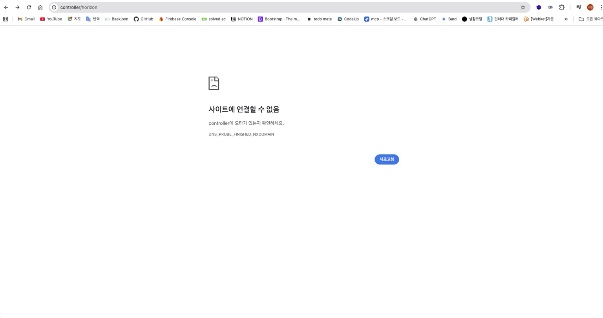
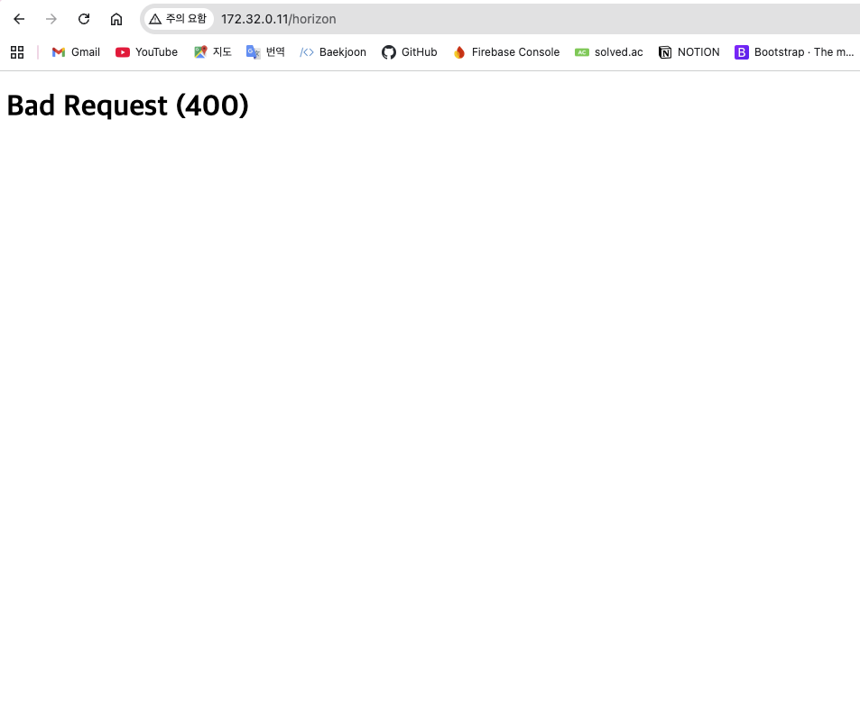
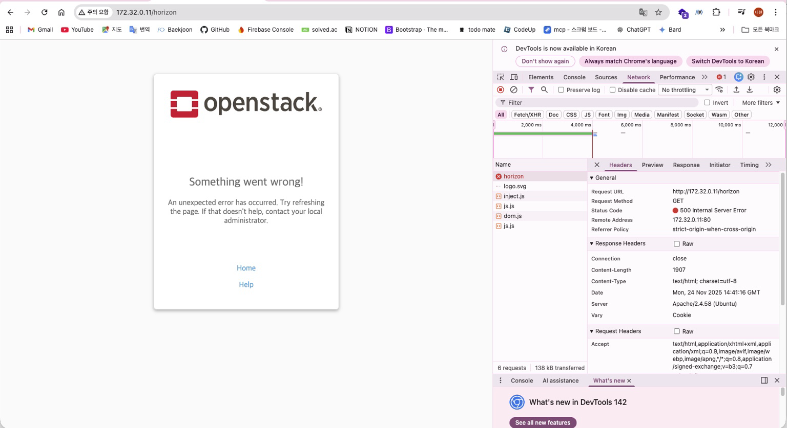
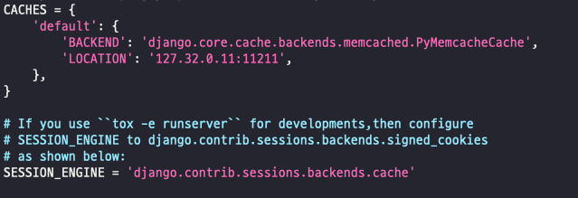
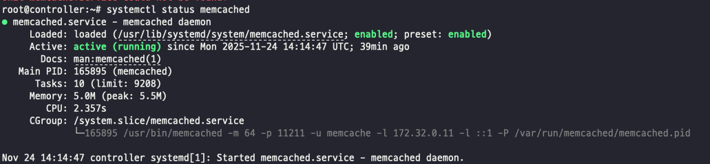
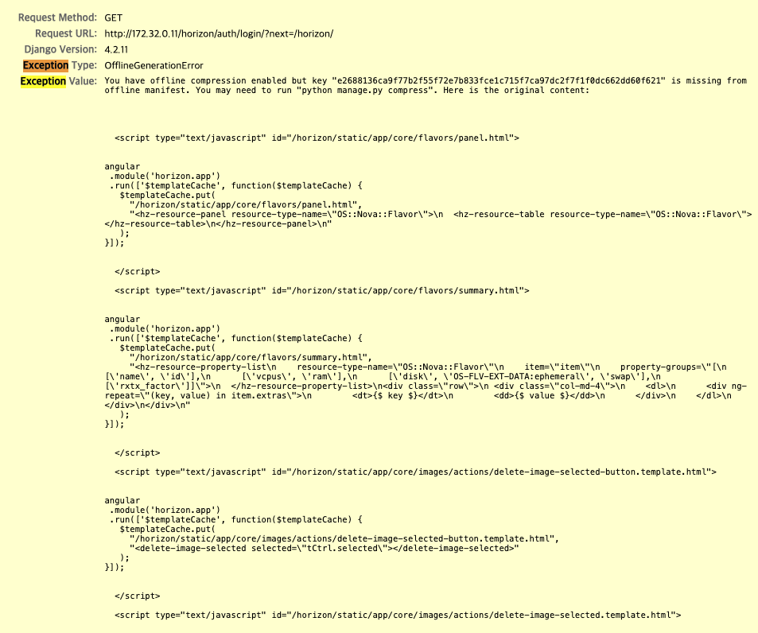
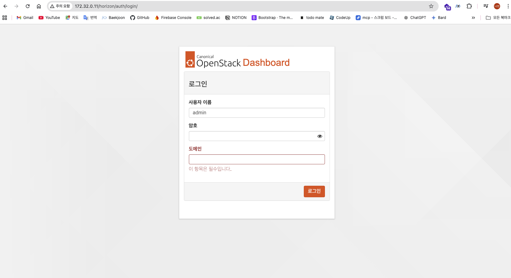
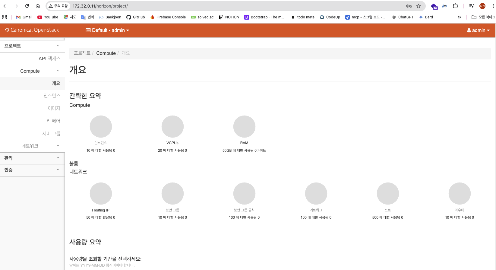

# 에러 해결



처음에 [http://controller/horizon이렇게](http://controller/horizon이렇게) 접속하라길래 아무생각 없이 접속했는데 이렇게 아무것도 안뜸 .. → DNS 문제

- 컨트롤러 VM에는 hosts 매핑이 있으나 로컬 PC에는 매핑이 없어 NXDOMAIN이 발생한 상황이다.

정리하면 `10.100.100.11/horizon` 으로 접속한다.



접속이 되지 않는다면 설정값을 추가로 확인한다. 

상황을 정리하면 다음과 같다.

아까 local_settings.py 아래 쪽에 

```yaml
ALLOWED_HOSTS = ['10.100.100.11', 'controller', 'localhost']
또는 
ALLOWED_HOSTS = ['*']
```

이 설정이 잘못된 도메인으로 연결되어 있었다. 위와 같이 수정한다. (공식 문서 예시도 현재 환경에 맞춰 검증이 필요하다.)

흐음 ,, 그랬더니 .. 이렇게 openstack 글자는 볼 수 있었다 ..



Horizon 대시보드가 표시되지 않았으며, 초기에는 단순 설정 이슈로 판단하였다.

<aside>


IP를 직접 입력해야 하는 항목에 `controller`가 들어가 있다면, 환경 기준 `10.100.100.11`로 명확히 기입한다.

</aside>

```yaml
tail -n 50 /var/log/apache2/error.log
[Mon Nov 24 23:40:58.469734 2025] [wsgi:error] [pid 167778:tid 137418327971520] [remote 172.33.0.10:59898] ^^^^^^^^^^^^^^^^^^^^^^^^^^^^^
[Mon Nov 24 23:40:58.469738 2025] [wsgi:error] [pid 167778:tid 137418327971520] [remote 172.33.0.10:59898] File "/usr/lib/python3/dist-packages/pymemcache/client/hash.py", line 347, in get
[Mon Nov 24 23:40:58.469741 2025] [wsgi:error] [pid 167778:tid 137418327971520] [remote 172.33.0.10:59898] return self._run_cmd("get", key, default, default=default, **kwargs)
[Mon Nov 24 23:40:58.469745 2025] [wsgi:error] [pid 167778:tid 137418327971520] [remote 172.33.0.10:59898] ^^^^^^^^^^^^^^^^^^^^^^^^^^^^^^^^^^^^^^^^^^^^^^^^^^^^^^^^^^^^^
[Mon Nov 24 23:40:58.469749 2025] [wsgi:error] [pid 167778:tid 137418327971520] [remote 172.33.0.10:59898] File "/usr/lib/python3/dist-packages/pymemcache/client/hash.py", line 322, in _run_cmd
[Mon Nov 24 23:40:58.469752 2025] [wsgi:error] [pid 167778:tid 137418327971520] [remote 172.33.0.10:59898] return self._safely_run_func(client, func, default_val, *args, **kwargs)
[Mon Nov 24 23:40:58.469756 2025] [wsgi:error] [pid 167778:tid 137418327971520] [remote 172.33.0.10:59898] ^^^^^^^^^^^^^^^^^^^^^^^^^^^^^^^^^^^^^^^^^^^^^^^^^^^^^^^^^^^^^^^^^
[Mon Nov 24 23:40:58.469782 2025] [wsgi:error] [pid 167778:tid 137418327971520] [remote 172.33.0.10:59898] File "/usr/lib/python3/dist-packages/pymemcache/client/hash.py", line 211, in _safely_run_func
[Mon Nov 24 23:40:58.469786 2025] [wsgi:error] [pid 167778:tid 137418327971520] [remote 172.33.0.10:59898] result = func(*args, **kwargs)
[Mon Nov 24 23:40:58.469788 2025] [wsgi:error] [pid 167778:tid 137418327971520] [remote 172.33.0.10:59898] ^^^^^^^^^^^^^^^^^^^^^
[Mon Nov 24 23:40:58.469791 2025] [wsgi:error] [pid 167778:tid 137418327971520] [remote 172.33.0.10:59898] File "/usr/lib/python3/dist-packages/pymemcache/client/base.py", line 687, in get
[Mon Nov 24 23:40:58.469794 2025] [wsgi:error] [pid 167778:tid 137418327971520] [remote 172.33.0.10:59898] return self._fetch_cmd(b"get", [key], False, key_prefix=self.key_prefix).get(
[Mon Nov 24 23:40:58.469796 2025] [wsgi:error] [pid 167778:tid 137418327971520] [remote 172.33.0.10:59898] ^^^^^^^^^^^^^^^^^^^^^^^^^^^^^^^^^^^^^^^^^^^^^^^^^^^^^^^^^^^^^^^^^
[Mon Nov 24 23:40:58.469799 2025] [wsgi:error] [pid 167778:tid 137418327971520] [remote 172.33.0.10:59898] File "/usr/lib/python3/dist-packages/pymemcache/client/base.py", line 1133, in _fetch_cmd
[Mon Nov 24 23:40:58.469802 2025] [wsgi:error] [pid 167778:tid 137418327971520] [remote 172.33.0.10:59898] self._connect()
[Mon Nov 24 23:40:58.469804 2025] [wsgi:error] [pid 167778:tid 137418327971520] [remote 172.33.0.10:59898] File "/usr/lib/python3/dist-packages/pymemcache/client/base.py", line 424, in _connect
[Mon Nov 24 23:40:58.469807 2025] [wsgi:error] [pid 167778:tid 137418327971520] [remote 172.33.0.10:59898] sock.connect(sockaddr)
[Mon Nov 24 23:40:58.469809 2025] [wsgi:error] [pid 167778:tid 137418327971520] [remote 172.33.0.10:59898] ConnectionRefusedError: [Errno 111] Connection refused
[Mon Nov 24 23:41:18.642630 2025] [wsgi:error] [pid 167777:tid 137418302793408] /usr/lib/python3/dist-packages/debreach/__init__.py:6: DeprecationWarning: distutils Version classes are deprecated. Use packaging.version instead.
[Mon Nov 24 23:41:18.642744 2025] [wsgi:error] [pid 167777:tid 137418302793408] version_info = version.StrictVersion(__version__).version
[Mon Nov 24 23:41:20.923381 2025] [wsgi:error] [pid 167777:tid 137418302793408] [remote 172.33.0.10:60011] ERROR django.request Internal Server Error: /horizon/
[Mon Nov 24 23:41:20.923511 2025] [wsgi:error] [pid 167777:tid 137418302793408] [remote 172.33.0.10:60011] Traceback (most recent call last):
[Mon Nov 24 23:41:20.923518 2025] [wsgi:error] [pid 167777:tid 137418302793408] [remote 172.33.0.10:60011] File "/usr/lib/python3/dist-packages/django/core/handlers/exception.py", line 55, in inner
[Mon Nov 24 23:41:20.923523 2025] [wsgi:error] [pid 167777:tid 137418302793408] [remote 172.33.0.10:60011] response = get_response(request)
[Mon Nov 24 23:41:20.923526 2025] [wsgi:error] [pid 167777:tid 137418302793408] [remote 172.33.0.10:60011] ^^^^^^^^^^^^^^^^^^^^^
[Mon Nov 24 23:41:20.923533 2025] [wsgi:error] [pid 167777:tid 137418302793408] [remote 172.33.0.10:60011] File "/usr/lib/python3/dist-packages/horizon/middleware/simultaneous_sessions.py", line 30, in __call__
[Mon Nov 24 23:41:20.923539 2025] [wsgi:error] [pid 167777:tid 137418302793408] [remote 172.33.0.10:60011] self._process_request(request)
[Mon Nov 24 23:41:20.923542 2025] [wsgi:error] [pid 167777:tid 137418302793408] [remote 172.33.0.10:60011] File "/usr/lib/python3/dist-packages/horizon/middleware/simultaneous_sessions.py", line 37, in _process_request
[Mon Nov 24 23:41:20.923548 2025] [wsgi:error] [pid 167777:tid 137418302793408] [remote 172.33.0.10:60011] cache_value = cache.get(cache_key)
[Mon Nov 24 23:41:20.923551 2025] [wsgi:error] [pid 167777:tid 137418302793408] [remote 172.33.0.10:60011] ^^^^^^^^^^^^^^^^^^^^
[Mon Nov 24 23:41:20.923557 2025] [wsgi:error] [pid 167777:tid 137418302793408] [remote 172.33.0.10:60011] File "/usr/lib/python3/dist-packages/django/core/cache/backends/memcached.py", line 75, in get
[Mon Nov 24 23:41:20.923668 2025] [wsgi:error] [pid 167777:tid 137418302793408] [remote 172.33.0.10:60011] return self._cache.get(key, default)
[Mon Nov 24 23:41:20.923677 2025] [wsgi:error] [pid 167777:tid 137418302793408] [remote 172.33.0.10:60011] ^^^^^^^^^^^^^^^^^^^^^^^^^^^^^
[Mon Nov 24 23:41:20.923683 2025] [wsgi:error] [pid 167777:tid 137418302793408] [remote 172.33.0.10:60011] File "/usr/lib/python3/dist-packages/pymemcache/client/hash.py", line 347, in get
[Mon Nov 24 23:41:20.923688 2025] [wsgi:error] [pid 167777:tid 137418302793408] [remote 172.33.0.10:60011] return self._run_cmd("get", key, default, default=default, **kwargs)
[Mon Nov 24 23:41:20.923691 2025] [wsgi:error] [pid 167777:tid 137418302793408] [remote 172.33.0.10:60011] ^^^^^^^^^^^^^^^^^^^^^^^^^^^^^^^^^^^^^^^^^^^^^^^^^^^^^^^^^^^^^
[Mon Nov 24 23:41:20.923693 2025] [wsgi:error] [pid 167777:tid 137418302793408] [remote 172.33.0.10:60011] File "/usr/lib/python3/dist-packages/pymemcache/client/hash.py", line 322, in _run_cmd
[Mon Nov 24 23:41:20.923696 2025] [wsgi:error] [pid 167777:tid 137418302793408] [remote 172.33.0.10:60011] return self._safely_run_func(client, func, default_val, *args, **kwargs)
[Mon Nov 24 23:41:20.923699 2025] [wsgi:error] [pid 167777:tid 137418302793408] [remote 172.33.0.10:60011] ^^^^^^^^^^^^^^^^^^^^^^^^^^^^^^^^^^^^^^^^^^^^^^^^^^^^^^^^^^^^^^^^^
[Mon Nov 24 23:41:20.923701 2025] [wsgi:error] [pid 167777:tid 137418302793408] [remote 172.33.0.10:60011] File "/usr/lib/python3/dist-packages/pymemcache/client/hash.py", line 211, in _safely_run_func
[Mon Nov 24 23:41:20.923704 2025] [wsgi:error] [pid 167777:tid 137418302793408] [remote 172.33.0.10:60011] result = func(*args, **kwargs)
[Mon Nov 24 23:41:20.923707 2025] [wsgi:error] [pid 167777:tid 137418302793408] [remote 172.33.0.10:60011] ^^^^^^^^^^^^^^^^^^^^^
[Mon Nov 24 23:41:20.923709 2025] [wsgi:error] [pid 167777:tid 137418302793408] [remote 172.33.0.10:60011] File "/usr/lib/python3/dist-packages/pymemcache/client/base.py", line 687, in get
[Mon Nov 24 23:41:20.923712 2025] [wsgi:error] [pid 167777:tid 137418302793408] [remote 172.33.0.10:60011] return self._fetch_cmd(b"get", [key], False, key_prefix=self.key_prefix).get(
[Mon Nov 24 23:41:20.923715 2025] [wsgi:error] [pid 167777:tid 137418302793408] [remote 172.33.0.10:60011] ^^^^^^^^^^^^^^^^^^^^^^^^^^^^^^^^^^^^^^^^^^^^^^^^^^^^^^^^^^^^^^^^^
[Mon Nov 24 23:41:20.923717 2025] [wsgi:error] [pid 167777:tid 137418302793408] [remote 172.33.0.10:60011] File "/usr/lib/python3/dist-packages/pymemcache/client/base.py", line 1133, in _fetch_cmd
[Mon Nov 24 23:41:20.923722 2025] [wsgi:error] [pid 167777:tid 137418302793408] [remote 172.33.0.10:60011] self._connect()
[Mon Nov 24 23:41:20.923724 2025] [wsgi:error] [pid 167777:tid 137418302793408] [remote 172.33.0.10:60011] File "/usr/lib/python3/dist-packages/pymemcache/client/base.py", line 424, in _connect
[Mon Nov 24 23:41:20.923727 2025] [wsgi:error] [pid 167777:tid 137418302793408] [remote 172.33.0.10:60011] sock.connect(sockaddr)
[Mon Nov 24 23:41:20.923730 2025] [wsgi:error] [pid 167777:tid 137418302793408] [remote 172.33.0.10:60011] ConnectionRefusedError: [Errno 111] Connection refused
root@controller:~# ls /var/log/horizon
tail -n 50 /var/log/horizon/horizon.log
ls: cannot access '/var/log/horizon': No such file or directory
tail: cannot open '/var/log/horizon/horizon.log' for reading: No such file or directory
```





설정 차이를 비교해 원인을 확인한다.

 .. 알고보니 memcached에 연결해놓은 ip주소와 내가 Cache Location에 연결해놓은 주소가 달랐다 ..

보이시나 …

127… 172…

증상이 즉시 드러나지 않아 원인 파악에 시간이 소요되었다.

정리하면 다음과 같은 조치가 필요하다.

같은 결과를 받았다 …

로그를 확인해도 HTML 출력에 가려져 원인 식별이 어려웠다.

결국 

loca_settings.py에서

```yaml
DEBUG=True
```

로 디버깅 코드를 작성했다. 



이렇게 뜬다 …

“GPT SAYS”

스크린샷에 다 나와있어:

- **Exception Type:** OfflineGenerationError
- **Exception Value:**
 
 > You have offline compression enabled but key “…” is missing from offline manifest.
 > 
 
 > You may need to run “python manage.py compress”.
 > 

정리하면 현재 상황은 다음과 같다:

> Horizon이
> 
> 
> **오프라인 압축 모드**
> 

> 정작 압축 결과(manifest)가 안 맞아서 템플릿 렌더링이 터진 것.
> 

패키지 설치 후 기본 설정이랑 우리가 DEBUG 켜고/끄면서 약간 꼬인 것 같아서 그래.

랩/스터디 환경에서는 **압축 기능을 비활성화하는 방식이 가장 단순하고 안전한 해결책**이다.

라고 한다 

```yaml
vi /etc/openstack-dashboard/local_settings.py

COMPRESS_OFFLINE = True 이 부분을
COMPRESS_OFFLINE = False
이렇게 고치자!

켜뒀던 디버깅도 끄자!
DEBUG = False
```

후에 여느때와 같이 Apache 재시작을 한다. 

```yaml
systemctl restart apache2
```



정리하면, 여기까지 점검이 완료되었다.

근데 도메인에 뭐써야하지..?

Default였다..

모르겠으면 죄다 admin, Default일것이다..

만약 기본 설정을 바꾸지 않았다면



휴 성공했다
