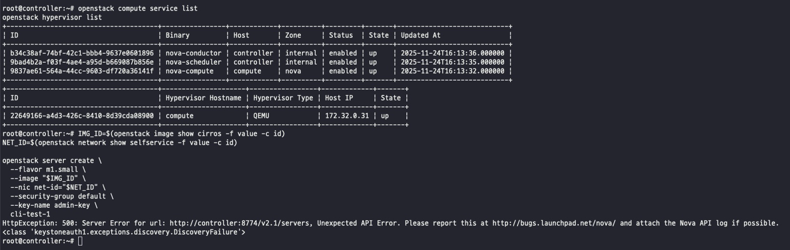
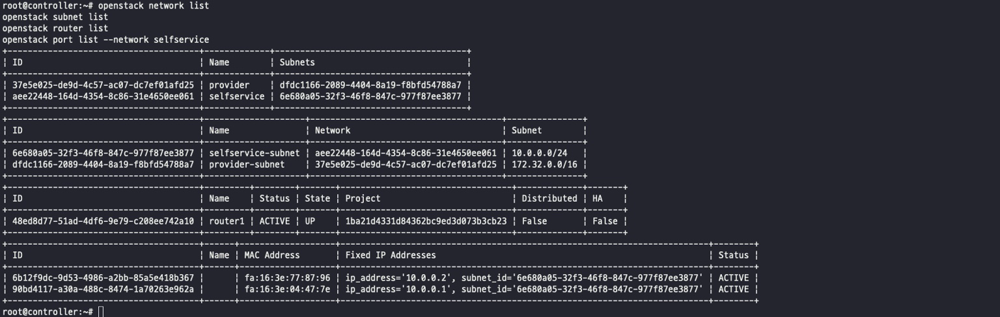
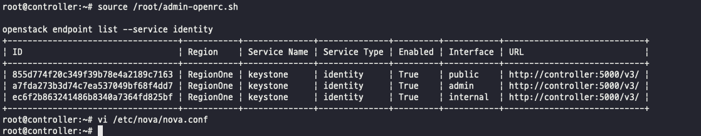
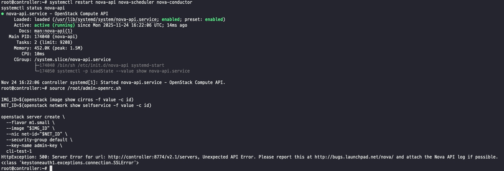
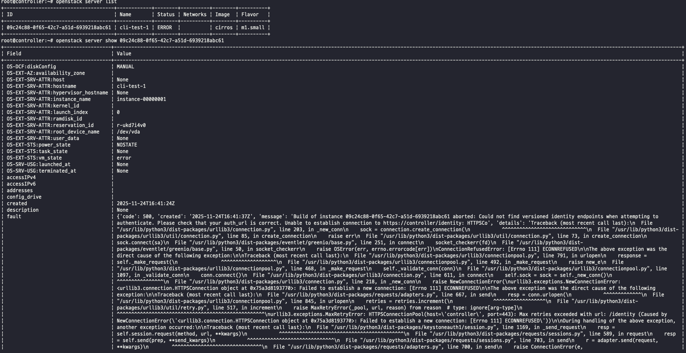
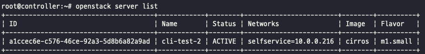
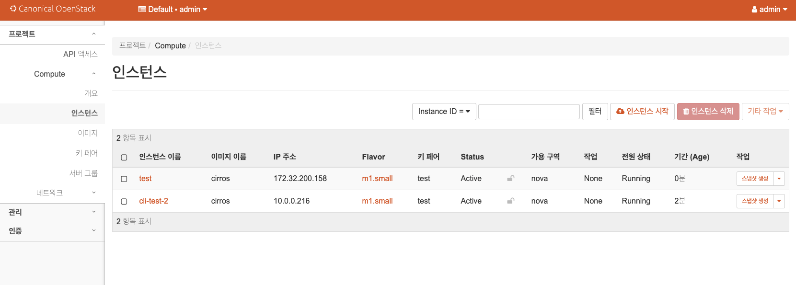

# 오류 해결

아래 순서로 원인 분석을 진행한다.

Horizon 에서 **“서버를 생성하지 못했습니다”** 뜨고 인스턴스 목록이 비어 있다는 건:

> Horizon → Nova 로 보낸 “VM 만들어줘” API 호출이 실패했고,
> 

> Nova 쪽에서
> 
> 
> **instance row 자체를 만들기 전에 에러**
> 

> (따라서 ERROR 상태 인스턴스도 목록에 나타나지 않음)
> 

즉, 이유는 대부분 **Nova/Neutron 쪽 설정 문제**고,

Horizon은 실패 메시지만 표시하므로, 실제 원인은 Nova/Neutron 설정과 로그에서 확인해야 한다.

아래 순서대로 **컨트롤러에서 점검하면 병목 지점을 빠르게 확인할 수 있다.**

---

### **1. Nova 서비스/하이퍼바이저가 살아있는지**

컨트롤러에서:

```bash
sudo -i
source /root/admin-openrc.sh

openstack compute service list
openstack hypervisor list
```

위 출력 기준으로 서비스 상태는 정상이다.

### 2. CLI로 서버 생성 재현

컨트롤러에서:

```bash
source /root/admin-openrc.sh

IMG_ID=$(openstack image show cirros -f value -c id)
NET_ID=$(openstack network show selfservice -f value -c id)

openstack server create \
 --flavor m1.small \
 --image "$IMG_ID" \
 --nic net-id="$NET_ID" \
 --security-group default \
 --key-name admin-key \
 cli-test-1
```

주의: `admin-key`에는 사전에 생성한 키페어 이름을 사용하거나, 새 키페어를 생성한 뒤 해당 이름을 사용한다.



### **3. Neutron 네트워크/포트 상태 간단 체크**

계속 CLI에서:

```bash
openstack network list
openstack subnet list
openstack router list
openstack port list --network selfservice
```



- `provider`, `selfservice`, `router1`이 보이는지 확인한다.
- `selfservice` 네트워크에서 `port list` 결과가 비어 있으면, 인스턴스 생성 전 단계에서는 정상이다.
- 인스턴스 생성 시 “사용 가능한 네트워크가 없습니다” 오류가 발생하면, 네트워크/포트 구성 쪽을 우선 점검한다.
 

또 한 번:

```bash
openstack network agent list
```

- Open vSwitch agent (또는 linuxbridge agent)가 controller/compute 둘 다 Alive :-), State UP 인지
- DHCP agent, L3 agent, Metadata agent 가 UP 인지

위 항목이 모두 `UP`이면 에이전트 상태는 정상이다.

그런데 CLI에서 다음 오류가 발생했다.

HttpException: 500: Server Error for url: [http://controller:8774/v2.1/servers](http://controller:8774/v2.1/servers), Unexpected API Error.
<class 'keystoneauth1.exceptions.discovery.DiscoveryFailure'>

의미는 다음과 같다.

> `nova-api`가 Keystone(인증 서비스)와 통신하는 과정에서 `DiscoveryFailure`가 발생해 500을 반환했다.
> 

즉,

- Nova의 keystone_authtoken / service_user / placement 같은 설정에서
 
 **Keystone endpoint(주소) 또는 인증 정보가 잘못되었음을 의미한다.**
 

Compute/네트워크 상태 자체는 정상이다:

- openstack compute service list → nova-compute up
- openstack hypervisor list → `compute1` 확인
- openstack network list / subnet list / router list / port list → `provider/selfservice/router1` 확인

따라서 **스케줄링/자원 문제가 아니라, Nova의 Keystone URL 설정 불일치** 가능성이 높다.

1. **Keystone 엔드포인트 주소 확인부터**

먼저 Keystone의 **정식 URL**을 확인한다:

```bash
source /root/admin-openrc.sh

openstack endpoint list --service identity
```

`http://controller:5000/v3`

**이 URL을 그대로 `nova.conf`에 적용해야** `keystoneauth`의 discovery가 정상 동작한다.

점검 결과, `auth_url` 값이 설정 파일별로 서로 다르게 기록되어 있었다.

1. `vi /etc/nova/nova.conf`에서 아래 섹션의 `auth_url`을 확인하고 수정한다.

[keystone_authtoken]
**[service_user]
[placement]**

> 요약: nova.conf 안의 **모든 auth_url / www_authenticate_uri 를** 
openstack endpoint list --service identity 에 나오는 identity URL로 맞춰준다.
> 



1. Nova 서비스 재시작

```bash
systemctl restart nova-api nova-scheduler nova-conductor
systemctl status nova-api
```



재시작 후 오류 유형이 다음과 같이 변경되었다.

```bash
HttpException: 500: Server Error for url: http://controller:8774/v2.1/servers, Unexpected API Error.
<class 'keystoneauth1.exceptions.connection.SSLError'>
```

즉:

> nova-api → Keystone 으로 인증하러 가다가 SSLError 나서 500
> 

이 경우는 대부분 **“Nova 설정에서 Keystone URL을 HTTPS로 잘못 인식하는 상태”**를 의미한다.

- 실제 Keystone 엔드포인트: http://controller:5000/v3/ (HTTP)
- Nova 쪽 keystoneauth는 **어딘가에서 HTTPS(https://…)로 접속을 시도** → TLS 핸드셰이크 실패 → SSLError

따라서 수행할 작업은 다음과 같다:

> /etc/nova/nova.conf 안에서 Keystone/Placement 관련 URL 을
> 

> 전부 `http://controller:5000/v3` 로 통일하고, `https` 흔적을 모두 제거한다.
> 

문서 예시는 그대로 복사하기보다 현재 환경에 맞게 검증하며 반영하는 것이 안전하다.

1. `vi /etc/nova/nova.conf`에서

**[keystone_authtoken], 
[service_user],
[placement]**
 
`grep -n "https://" /etc/nova/nova.conf`
로 `https://` 흔적을 모두 제거한다.
2. Nova 서비스 재시작
 
 ```bash
 systemctl restart nova-api nova-scheduler nova-conductor
 systemctl status nova-api
 ```
 

```bash
HttpException: 500: Server Error for url: http://controller:8774/v2.1/servers, Unexpected API Error. Please report this at http://bugs.launchpad.net/nova/ and attach the Nova API log if possible.
<class 'keystoneauth1.exceptions.http.Unauthorized'>
```

추가 점검에서 다음 오류가 확인되었다.

요약하면 다음과 같다:

> `nova-api`가 Keystone에 서비스 유저(`nova`)로 인증 요청을 보내는 과정에서 `401(Unauthorized)`를 받아, 결과적으로 500 오류가 발생한 상황
> 

즉, Nova 쪽에서 쓰는 **Keystone 계정/비밀번호가 Keystone에 등록된 값이랑 안 맞는다**는 뜻.

1. 추가 확인 결과 `www_authenticate_uri` 일부 값이 이전 설정으로 남아 있었다. 해당 값을 함께 수정한다.

점검 명령:

```bash
grep -n "auth_url" /etc/nova/nova.conf
grep -n "www_authenticate_uri" /etc/nova/nova.conf
grep -n "password = " /etc/nova/nova.conf
grep -n "https://" /etc/nova/nova.conf
```

다음 명령으로 관련 설정을 일괄 확인할 수 있다.

설정을 반영하고 서비스를 재시작한 뒤, VM 생성 CLI 명령을 다시 실행했다.



오류가 반복되어 추가 원인 분석이 필요했다.

- 참고: 아래는 전체 에러 메시지 원문이다.
 
 ```bash
 {'code': 500, 'created': '2025-11-24T16:41:37Z', 'message': 'Build of instance 09c24c88-0f65-42c7-a51d-6939218abc61 aborted: Could not find versioned identity endpoints when attempting to |
 | | authenticate. Please check that your auth_url is correct. Unable to establish connection to https://controller/identity: HTTPSCo', 'details': 'Traceback (most recent call last):\n File |
 | | "/usr/lib/python3/dist-packages/urllib3/connection.py", line 203, in _new_conn\n sock = connection.create_connection(\n ^^^^^^^^^^^^^^^^^^^^^^^^^^^^^\n File "/usr/lib/python3/dist- |
 | | packages/urllib3/util/connection.py", line 85, in create_connection\n raise err\n File "/usr/lib/python3/dist-packages/urllib3/util/connection.py", line 73, in create_connection\n |
 | | sock.connect(sa)\n File "/usr/lib/python3/dist-packages/eventlet/greenio/base.py", line 251, in connect\n socket_checkerr(fd)\n File "/usr/lib/python3/dist- |
 | | packages/eventlet/greenio/base.py", line 50, in socket_checkerr\n raise OSError(err, errno.errorcode[err])\nConnectionRefusedError: [Errno 111] ECONNREFUSED\n\nThe above exception was the |
 | | direct cause of the following exception:\n\nTraceback (most recent call last):\n File "/usr/lib/python3/dist-packages/urllib3/connectionpool.py", line 791, in urlopen\n response = |
 | | self._make_request(\n ^^^^^^^^^^^^^^^^^^^\n File "/usr/lib/python3/dist-packages/urllib3/connectionpool.py", line 492, in _make_request\n raise new_e\n File |
 | | "/usr/lib/python3/dist-packages/urllib3/connectionpool.py", line 468, in _make_request\n self._validate_conn(conn)\n File "/usr/lib/python3/dist-packages/urllib3/connectionpool.py", line |
 | | 1097, in _validate_conn\n conn.connect()\n File "/usr/lib/python3/dist-packages/urllib3/connection.py", line 611, in connect\n self.sock = sock = self._new_conn()\n |
 | | ^^^^^^^^^^^^^^^^\n File "/usr/lib/python3/dist-packages/urllib3/connection.py", line 218, in _new_conn\n raise NewConnectionError(\nurllib3.exceptions.NewConnectionError: |
 | | <urllib3.connection.HTTPSConnection object at 0x75a3d8193770>: Failed to establish a new connection: [Errno 111] ECONNREFUSED\n\nThe above exception was the direct cause of the following |
 | | exception:\n\nTraceback (most recent call last):\n File "/usr/lib/python3/dist-packages/requests/adapters.py", line 667, in send\n resp = conn.urlopen(\n ^^^^^^^^^^^^^\n File |
 | | "/usr/lib/python3/dist-packages/urllib3/connectionpool.py", line 845, in urlopen\n retries = retries.increment(\n ^^^^^^^^^^^^^^^^^^\n File "/usr/lib/python3/dist- |
 | | packages/urllib3/util/retry.py", line 517, in increment\n raise MaxRetryError(_pool, url, reason) from reason # type: ignore[arg-type]\n |
 | | ^^^^^^^^^^^^^^^^^^^^^^^^^^^^^^^^^^^^^^^^^^^^^^^^^^^\nurllib3.exceptions.MaxRetryError: HTTPSConnectionPool(host=\'controller\', port=443): Max retries exceeded with url: /identity (Caused by |
 | | NewConnectionError(\'<urllib3.connection.HTTPSConnection object at 0x75a3d8193770>: Failed to establish a new connection: [Errno 111] ECONNREFUSED\'))\n\nDuring handling of the above exception, |
 | | another exception occurred:\n\nTraceback (most recent call last):\n File "/usr/lib/python3/dist-packages/keystoneauth1/session.py", line 1169, in _send_request\n resp = |
 | | self.session.request(method, url, **kwargs)\n ^^^^^^^^^^^^^^^^^^^^^^^^^^^^^^^^^^^^^^^^^^^\n File "/usr/lib/python3/dist-packages/requests/sessions.py", line 589, in request\n resp |
 | | = self.send(prep, **send_kwargs)\n ^^^^^^^^^^^^^^^^^^^^^^^^^^^^^^\n File "/usr/lib/python3/dist-packages/requests/sessions.py", line 703, in send\n r = adapter.send(request, |
 | | **kwargs)\n ^^^^^^^^^^^^^^^^^^^^^^^^^^^^^^^\n File "/usr/lib/python3/dist-packages/requests/adapters.py", line 700, in send\n raise ConnectionError(e, |
 | | request=request)\nrequests.exceptions.ConnectionError: HTTPSConnectionPool(host=\'controller\', port=443): Max retries exceeded with url: /identity (Caused by |
 | | NewConnectionError(\'<urllib3.connection.HTTPSConnection object at 0x75a3d8193770>: Failed to establish a new connection: [Errno 111] ECONNREFUSED\'))\n\nDuring handling of the above exception, |
 | | another exception occurred:\n\nTraceback (most recent call last):\n File "/usr/lib/python3/dist-packages/keystoneauth1/identity/generic/base.py", line 136, in _do_create_plugin\n disc = |
 | | self.get_discovery(\n ^^^^^^^^^^^^^^^^^^^\n File "/usr/lib/python3/dist-packages/keystoneauth1/identity/base.py", line 703, in get_discovery\n return discover.get_discovery(\n |
 | | ^^^^^^^^^^^^^^^^^^^^^^^\n File "/usr/lib/python3/dist-packages/keystoneauth1/discover.py", line 1742, in get_discovery\n disc = Discover(session, url, authenticated=authenticated)\n |
 | | ^^^^^^^^^^^^^^^^^^^^^^^^^^^^^^^^^^^^^^^^^^^^^^^^^^^\n File "/usr/lib/python3/dist-packages/keystoneauth1/discover.py", line 585, in __init__\n self._data = get_version_data(\n |
 | | ^^^^^^^^^^^^^^^^^\n File "/usr/lib/python3/dist-packages/keystoneauth1/discover.py", line 114, in get_version_data\n resp = session.get(url, headers=headers, authenticated=authenticated)\n |
 | | ^^^^^^^^^^^^^^^^^^^^^^^^^^^^^^^^^^^^^^^^^^^^^^^^^^^^^^^^^^^^^^\n File "/usr/lib/python3/dist-packages/keystoneauth1/session.py", line 1320, in get\n return self.request(url, \'GET\', |
 | | **kwargs)\n ^^^^^^^^^^^^^^^^^^^^^^^^^^^^^^^^^^\n File "/usr/lib/python3/dist-packages/keystoneauth1/session.py", line 1057, in request\n resp = send(**kwargs)\n |
 | | ^^^^^^^^^^^^^^\n File "/usr/lib/python3/dist-packages/keystoneauth1/session.py", line 1184, in _send_request\n raise |
 | | exceptions.ConnectFailure(msg)\nkeystoneauth1.exceptions.connection.ConnectFailure: Unable to establish connection to https://controller/identity: HTTPSConnectionPool(host=\'controller\', |
 | | port=443): Max retries exceeded with url: /identity (Caused by NewConnectionError(\'<urllib3.connection.HTTPSConnection object at 0x75a3d8193770>: Failed to establish a new connection: [Errno |
 | | 111] ECONNREFUSED\'))\n\nDuring handling of the above exception, another exception occurred:\n\nTraceback (most recent call last):\n File "/usr/lib/python3/dist- |
 | | packages/nova/compute/manager.py", line 2901, in _build_resources\n yield resources\n File "/usr/lib/python3/dist-packages/nova/compute/manager.py", line 2648, in _build_and_run_instance\n |
 | | self.driver.spawn(context, instance, image_meta,\n File "/usr/lib/python3/dist-packages/nova/virt/libvirt/driver.py", line 4840, in spawn\n created_instance_dir, created_disks = |
 | | self._create_image(\n ^^^^^^^^^^^^^^^^^^^\n File "/usr/lib/python3/dist-packages/nova/virt/libvirt/driver.py", line 5251, in _create_image\n |
 | | created_disks = self._create_and_inject_local_root(\n ^^^^^^^^^^^^^^^^^^^^^^^^^^^^^^^^^^^\n File "/usr/lib/python3/dist-packages/nova/virt/libvirt/driver.py", line 5380, in |
 | | _create_and_inject_local_root\n self._try_fetch_image_cache(backend, fetch_func, context,\n File "/usr/lib/python3/dist-packages/nova/virt/libvirt/driver.py", line 11652, in |
 | | _try_fetch_image_cache\n image.cache(fetch_func=fetch_func,\n File "/usr/lib/python3/dist-packages/nova/virt/libvirt/imagebackend.py", line 304, in cache\n self.create_image(\n File |
 | | "/usr/lib/python3/dist-packages/nova/virt/libvirt/imagebackend.py", line 682, in create_image\n prepare_template(target=base, *args, **kwargs)\n File "/usr/lib/python3/dist- |
 | | packages/oslo_concurrency/lockutils.py", line 412, in inner\n return f(*args, **kwargs)\n ^^^^^^^^^^^^^^^^^^\n File "/usr/lib/python3/dist- |
 | | packages/nova/virt/libvirt/imagebackend.py", line 301, in fetch_func_sync\n fetch_func(target=target, *args, **kwargs)\n File "/usr/lib/python3/dist-packages/nova/virt/libvirt/utils.py", |
 | | line 495, in fetch_image\n images.fetch_to_raw(context, image_id, target, trusted_certs)\n File "/usr/lib/python3/dist-packages/nova/virt/images.py", line 228, in fetch_to_raw\n |
 | | fetch(context, image_href, path_tmp, trusted_certs)\n File "/usr/lib/python3/dist-packages/nova/virt/images.py", line 109, in fetch\n IMAGE_API.download(context, image_href, |
 | | dest_path=path,\n File "/usr/lib/python3/dist-packages/nova/image/glance.py", line 1311, in download\n return session.download(context, image_id, data=data,\n |
 | | ^^^^^^^^^^^^^^^^^^^^^^^^^^^^^^^^^^^^^^^^^^^^^^\n File "/usr/lib/python3/dist-packages/nova/image/glance.py", line 394, in download\n _reraise_translated_image_exception(image_id)\n File |
 | | "/usr/lib/python3/dist-packages/nova/image/glance.py", line 1044, in _reraise_translated_image_exception\n raise new_exc.with_traceback(exc_trace)\n File "/usr/lib/python3/dist- |
 | | packages/nova/image/glance.py", line 391, in download\n image_chunks = self._client.call(\n ^^^^^^^^^^^^^^^^^^\n File "/usr/lib/python3/dist-packages/nova/image/glance.py", |
 | | line 191, in call\n result = getattr(controller, method)(*args, **kwargs)\n ^^^^^^^^^^^^^^^^^^^^^^^^^^^^^^^^^^^^^^^^^^^^\n File "/usr/lib/python3/dist- |
 | | packages/glanceclient/common/utils.py", line 652, in inner\n return RequestIdProxy(wrapped(*args, **kwargs))\n ^^^^^^^^^^^^^^^^^^^^^^^^\n File |
 | | "/usr/lib/python3/dist-packages/glanceclient/v2/images.py", line 249, in data\n resp, image_meta = self.http_client.get(url)\n ^^^^^^^^^^^^^^^^^^^^^^^^^\n File |
 | | "/usr/lib/python3/dist-packages/keystoneauth1/adapter.py", line 599, in get\n return self.request(url, \'GET\', **kwargs)\n ^^^^^^^^^^^^^^^^^^^^^^^^^^^^^^^^^^\n File |
 | | "/usr/lib/python3/dist-packages/glanceclient/common/http.py", line 357, in request\n resp = super(SessionClient,\n ^^^^^^^^^^^^^^^^^^^^\n File "/usr/lib/python3/dist- |
 | | packages/keystoneauth1/adapter.py", line 592, in request\n return self._request(url, method, **kwargs)\n ^^^^^^^^^^^^^^^^^^^^^^^^^^^^^^^^^^^^\n File "/usr/lib/python3/dist- |
 | | packages/keystoneauth1/adapter.py", line 294, in _request\n return self.session.request(url, method, **kwargs)\n ^^^^^^^^^^^^^^^^^^^^^^^^^^^^^^^^^^^^^^^^^^^\n File |
 | | "/usr/lib/python3/dist-packages/keystoneauth1/session.py", line 901, in request\n auth_headers = self.get_auth_headers(auth)\n ^^^^^^^^^^^^^^^^^^^^^^^^^^^\n File |
 | | "/usr/lib/python3/dist-packages/keystoneauth1/session.py", line 1387, in get_auth_headers\n return auth.get_headers(self)\n ^^^^^^^^^^^^^^^^^^^^^^\n File "/usr/lib/python3/dist- |
 | | packages/keystoneauth1/service_token.py", line 39, in get_headers\n token = self.service_auth.get_token(session)\n ^^^^^^^^^^^^^^^^^^^^^^^^^^^^^^^^^^^^\n File |
 | | "/usr/lib/python3/dist-packages/keystoneauth1/identity/base.py", line 91, in get_token\n return self.get_access(session).auth_token\n ^^^^^^^^^^^^^^^^^^^^^^^^\n File |
 | | "/usr/lib/python3/dist-packages/keystoneauth1/identity/base.py", line 139, in get_access\n self.auth_ref = self.get_auth_ref(session)\n ^^^^^^^^^^^^^^^^^^^^^^^^^^\n File |
 | | "/usr/lib/python3/dist-packages/keystoneauth1/identity/generic/base.py", line 221, in get_auth_ref\n plugin = self._do_create_plugin(session)\n ^^^^^^^^^^^^^^^^^^^^^^^^^^^^^^^\n |
 | | File "/usr/lib/python3/dist-packages/keystoneauth1/identity/generic/base.py", line 163, in _do_create_plugin\n raise |
 | | exceptions.DiscoveryFailure(\nkeystoneauth1.exceptions.discovery.DiscoveryFailure: Could not find versioned identity endpoints when attempting to authenticate. Please check that your auth_url is |
 | | correct. Unable to establish connection to https://controller/identity: HTTPSConnectionPool(host=\'controller\', port=443): Max retries exceeded with url: /identity (Caused by |
 | | NewConnectionError(\'<urllib3.connection.HTTPSConnection object at 0x75a3d8193770>: Failed to establish a new connection: [Errno 111] ECONNREFUSED\'))\n\nDuring handling of the above exception, |
 | | another exception occurred:\n\nTraceback (most recent call last):\n File "/usr/lib/python3/dist-packages/urllib3/connection.py", line 203, in _new_conn\n sock = |
 | | connection.create_connection(\n ^^^^^^^^^^^^^^^^^^^^^^^^^^^^^\n File "/usr/lib/python3/dist-packages/urllib3/util/connection.py", line 85, in create_connection\n raise err\n File |
 | | "/usr/lib/python3/dist-packages/urllib3/util/connection.py", line 73, in create_connection\n sock.connect(sa)\n File "/usr/lib/python3/dist-packages/eventlet/greenio/base.py", line 251, in |
 | | connect\n socket_checkerr(fd)\n File "/usr/lib/python3/dist-packages/eventlet/greenio/base.py", line 50, in socket_checkerr\n raise OSError(err, |
 | | errno.errorcode[err])\nConnectionRefusedError: [Errno 111] ECONNREFUSED\n\nThe above exception was the direct cause of the following exception:\n\nTraceback (most recent call last):\n File |
 | | "/usr/lib/python3/dist-packages/urllib3/connectionpool.py", line 791, in urlopen\n response = self._make_request(\n ^^^^^^^^^^^^^^^^^^^\n File "/usr/lib/python3/dist- |
 | | packages/urllib3/connectionpool.py", line 492, in _make_request\n raise new_e\n File "/usr/lib/python3/dist-packages/urllib3/connectionpool.py", line 468, in _make_request\n |
 | | self._validate_conn(conn)\n File "/usr/lib/python3/dist-packages/urllib3/connectionpool.py", line 1097, in _validate_conn\n conn.connect()\n File "/usr/lib/python3/dist- |
 | | packages/urllib3/connection.py", line 611, in connect\n self.sock = sock = self._new_conn()\n ^^^^^^^^^^^^^^^^\n File "/usr/lib/python3/dist- |
 | | packages/urllib3/connection.py", line 218, in _new_conn\n raise NewConnectionError(\nurllib3.exceptions.NewConnectionError: <urllib3.connection.HTTPSConnection object at 0x75a3d8192fc0>: |
 | | Failed to establish a new connection: [Errno 111] ECONNREFUSED\n\nThe above exception was the direct cause of the following exception:\n\nTraceback (most recent call last):\n File |
 | | "/usr/lib/python3/dist-packages/requests/adapters.py", line 667, in send\n resp = conn.urlopen(\n ^^^^^^^^^^^^^\n File "/usr/lib/python3/dist-packages/urllib3/connectionpool.py", |
 | | line 845, in urlopen\n retries = retries.increment(\n ^^^^^^^^^^^^^^^^^^\n File "/usr/lib/python3/dist-packages/urllib3/util/retry.py", line 517, in increment\n raise |
 | | MaxRetryError(_pool, url, reason) from reason # type: ignore[arg-type]\n ^^^^^^^^^^^^^^^^^^^^^^^^^^^^^^^^^^^^^^^^^^^^^^^^^^^\nurllib3.exceptions.MaxRetryError: |
 | | HTTPSConnectionPool(host=\'controller\', port=443): Max retries exceeded with url: /identity (Caused by NewConnectionError(\'<urllib3.connection.HTTPSConnection object at 0x75a3d8192fc0>: Failed |
 | | to establish a new connection: [Errno 111] ECONNREFUSED\'))\n\nDuring handling of the above exception, another exception occurred:\n\nTraceback (most recent call last):\n File |
 | | "/usr/lib/python3/dist-packages/keystoneauth1/session.py", line 1169, in _send_request\n resp = self.session.request(method, url, **kwargs)\n |
 | | ^^^^^^^^^^^^^^^^^^^^^^^^^^^^^^^^^^^^^^^^^^^\n File "/usr/lib/python3/dist-packages/requests/sessions.py", line 589, in request\n resp = self.send(prep, **send_kwargs)\n |
 | | ^^^^^^^^^^^^^^^^^^^^^^^^^^^^^^\n File "/usr/lib/python3/dist-packages/requests/sessions.py", line 703, in send\n r = adapter.send(request, **kwargs)\n |
 | | ^^^^^^^^^^^^^^^^^^^^^^^^^^^^^^^\n File "/usr/lib/python3/dist-packages/requests/adapters.py", line 700, in send\n raise ConnectionError(e, |
 | | request=request)\nrequests.exceptions.ConnectionError: HTTPSConnectionPool(host=\'controller\', port=443): Max retries exceeded with url: /identity (Caused by |
 | | NewConnectionError(\'<urllib3.connection.HTTPSConnection object at 0x75a3d8192fc0>: Failed to establish a new connection: [Errno 111] ECONNREFUSED\'))\n\nDuring handling of the above exception, |
 | | another exception occurred:\n\nTraceback (most recent call last):\n File "/usr/lib/python3/dist-packages/keystoneauth1/identity/generic/base.py", line 136, in _do_create_plugin\n disc = |
 | | self.get_discovery(\n ^^^^^^^^^^^^^^^^^^^\n File "/usr/lib/python3/dist-packages/keystoneauth1/identity/base.py", line 703, in get_discovery\n return discover.get_discovery(\n |
 | | ^^^^^^^^^^^^^^^^^^^^^^^\n File "/usr/lib/python3/dist-packages/keystoneauth1/discover.py", line 1742, in get_discovery\n disc = Discover(session, url, authenticated=authenticated)\n |
 | | ^^^^^^^^^^^^^^^^^^^^^^^^^^^^^^^^^^^^^^^^^^^^^^^^^^^\n File "/usr/lib/python3/dist-packages/keystoneauth1/discover.py", line 585, in __init__\n self._data = get_version_data(\n |
 | | ^^^^^^^^^^^^^^^^^\n File "/usr/lib/python3/dist-packages/keystoneauth1/discover.py", line 114, in get_version_data\n resp = session.get(url, headers=headers, authenticated=authenticated)\n |
 | | ^^^^^^^^^^^^^^^^^^^^^^^^^^^^^^^^^^^^^^^^^^^^^^^^^^^^^^^^^^^^^^\n File "/usr/lib/python3/dist-packages/keystoneauth1/session.py", line 1320, in get\n return self.request(url, \'GET\', |
 | | **kwargs)\n ^^^^^^^^^^^^^^^^^^^^^^^^^^^^^^^^^^\n File "/usr/lib/python3/dist-packages/keystoneauth1/session.py", line 1057, in request\n resp = send(**kwargs)\n |
 | | ^^^^^^^^^^^^^^\n File "/usr/lib/python3/dist-packages/keystoneauth1/session.py", line 1184, in _send_request\n raise |
 | | exceptions.ConnectFailure(msg)\nkeystoneauth1.exceptions.connection.ConnectFailure: Unable to establish connection to https://controller/identity: HTTPSConnectionPool(host=\'controller\', |
 | | port=443): Max retries exceeded with url: /identity (Caused by NewConnectionError(\'<urllib3.connection.HTTPSConnection object at 0x75a3d8192fc0>: Failed to establish a new connection: [Errno |
 | | 111] ECONNREFUSED\'))\n\nDuring handling of the above exception, another exception occurred:\n\nTraceback (most recent call last):\n File "/usr/lib/python3/dist- |
 | | packages/nova/compute/manager.py", line 2918, in _build_resources\n self._shutdown_instance(context, instance,\n File "/usr/lib/python3/dist-packages/nova/compute/manager.py", line 3153, in |
 | | _shutdown_instance\n network_info = self.network_api.get_instance_nw_info(\n ^^^^^^^^^^^^^^^^^^^^^^^^^^^^^^^^^^^^^^\n File "/usr/lib/python3/dist- |
 | | packages/nova/network/neutron.py", line 2049, in get_instance_nw_info\n result = self._get_instance_nw_info(context, instance, **kwargs)\n |
 | | ^^^^^^^^^^^^^^^^^^^^^^^^^^^^^^^^^^^^^^^^^^^^^^^^^^^^^^^\n File "/usr/lib/python3/dist-packages/nova/network/neutron.py", line 2075, in _get_instance_nw_info\n nw_info = |
 | | self._build_network_info_model(context, instance, networks,\n ^^^^^^^^^^^^^^^^^^^^^^^^^^^^^^^^^^^^^^^^^^^^^^^^^^^^^^^^^^^\n File "/usr/lib/python3/dist- |
 | | packages/nova/network/neutron.py", line 3498, in _build_network_info_model\n data = client.list_ports(**search_opts)\n ^^^^^^^^^^^^^^^^^^^^^^^^^^^^^^^^\n File |
 | | "/usr/lib/python3/dist-packages/nova/network/neutron.py", line 198, in wrapper\n ret = obj(*args, **kwargs)\n ^^^^^^^^^^^^^^^^^^^^\n File "/usr/lib/python3/dist- |
 | | packages/neutronclient/v2_0/client.py", line 815, in list_ports\n return self.list(\'ports\', self.ports_path, retrieve_all,\n ^^^^^^^^^^^^^^^^^^^^^^^^^^^^^^^^^^^^^^^^^^^^^^^^^\n |
 | | File "/usr/lib/python3/dist-packages/neutronclient/v2_0/client.py", line 372, in list\n for r in self._pagination(collection, path, **params):\n File "/usr/lib/python3/dist- |
 | | packages/neutronclient/v2_0/client.py", line 387, in _pagination\n res = self.get(path, params=params)\n ^^^^^^^^^^^^^^^^^^^^^^^^^^^^^\n File "/usr/lib/python3/dist- |
 | | packages/neutronclient/v2_0/client.py", line 356, in get\n return self.retry_request("GET", action, body=body,\n ^^^^^^^^^^^^^^^^^^^^^^^^^^^^^^^^^^^^^^^^^^^^\n File |
 | | "/usr/lib/python3/dist-packages/neutronclient/v2_0/client.py", line 333, in retry_request\n return self.do_request(method, action, body=body,\n |
 | | ^^^^^^^^^^^^^^^^^^^^^^^^^^^^^^^^^^^^^^^^^^\n File "/usr/lib/python3/dist-packages/neutronclient/v2_0/client.py", line 284, in do_request\n resp, replybody = |
 | | self.httpclient.do_request(action, method, body=body,\n ^^^^^^^^^^^^^^^^^^^^^^^^^^^^^^^^^^^^^^^^^^^^^^^^^^^^^\n File "/usr/lib/python3/dist- |
 | | packages/neutronclient/client.py", line 342, in do_request\n return self.request(url, method, **kwargs)\n ^^^^^^^^^^^^^^^^^^^^^^^^^^^^^^^^^^^\n File "/usr/lib/python3/dist- |
 | | packages/neutronclient/client.py", line 330, in request\n resp = super(SessionClient, self).request(*args, **kwargs)\n ^^^^^^^^^^^^^^^^^^^^^^^^^^^^^^^^^^^^^^^^^^^^^^^^^^^\n File |
 | | "/usr/lib/python3/dist-packages/keystoneauth1/adapter.py", line 592, in request\n return self._request(url, method, **kwargs)\n ^^^^^^^^^^^^^^^^^^^^^^^^^^^^^^^^^^^^\n File |
 | | "/usr/lib/python3/dist-packages/keystoneauth1/adapter.py", line 294, in _request\n return self.session.request(url, method, **kwargs)\n ^^^^^^^^^^^^^^^^^^^^^^^^^^^^^^^^^^^^^^^^^^^\n |
 | | File "/usr/lib/python3/dist-packages/keystoneauth1/session.py", line 901, in request\n auth_headers = self.get_auth_headers(auth)\n ^^^^^^^^^^^^^^^^^^^^^^^^^^^\n File |
 | | "/usr/lib/python3/dist-packages/keystoneauth1/session.py", line 1387, in get_auth_headers\n return auth.get_headers(self)\n ^^^^^^^^^^^^^^^^^^^^^^\n File "/usr/lib/python3/dist- |
 | | packages/keystoneauth1/service_token.py", line 39, in get_headers\n token = self.service_auth.get_token(session)\n ^^^^^^^^^^^^^^^^^^^^^^^^^^^^^^^^^^^^\n File |
 | | "/usr/lib/python3/dist-packages/keystoneauth1/identity/base.py", line 91, in get_token\n return self.get_access(session).auth_token\n ^^^^^^^^^^^^^^^^^^^^^^^^\n File |
 | | "/usr/lib/python3/dist-packages/keystoneauth1/identity/base.py", line 139, in get_access\n self.auth_ref = self.get_auth_ref(session)\n ^^^^^^^^^^^^^^^^^^^^^^^^^^\n File |
 | | "/usr/lib/python3/dist-packages/keystoneauth1/identity/generic/base.py", line 221, in get_auth_ref\n plugin = self._do_create_plugin(session)\n ^^^^^^^^^^^^^^^^^^^^^^^^^^^^^^^\n |
 | | File "/usr/lib/python3/dist-packages/keystoneauth1/identity/generic/base.py", line 163, in _do_create_plugin\n raise |
 | | exceptions.DiscoveryFailure(\nkeystoneauth1.exceptions.discovery.DiscoveryFailure: Could not find versioned identity endpoints when attempting to authenticate. Please check that your auth_url is |
 | | correct. Unable to establish connection to https://controller/identity: HTTPSConnectionPool(host=\'controller\', port=443): Max retries exceeded with url: /identity (Caused by |
 | | NewConnectionError(\'<urllib3.connection.HTTPSConnection object at 0x75a3d8192fc0>: Failed to establish a new connection: [Errno 111] ECONNREFUSED\'))\n\nDuring handling of the above exception, |
 | | another exception occurred:\n\nTraceback (most recent call last):\n File "/usr/lib/python3/dist-packages/nova/compute/manager.py", line 2463, in _do_build_and_run_instance\n |
 | | self._build_and_run_instance(context, instance, image,\n File "/usr/lib/python3/dist-packages/nova/compute/manager.py", line 2676, in _build_and_run_instance\n with |
 | | excutils.save_and_reraise_exception():\n File "/usr/lib/python3/dist-packages/oslo_utils/excutils.py", line 227, in __exit__\n self.force_reraise()\n File "/usr/lib/python3/dist- |
 | | packages/oslo_utils/excutils.py", line 200, in force_reraise\n raise self.value\n File "/usr/lib/python3/dist-packages/nova/compute/manager.py", line 2631, in _build_and_run_instance\n |
 | | with self._build_resources(context, instance,\n File "/usr/lib/python3.12/contextlib.py", line 158, in __exit__\n self.gen.throw(value)\n File "/usr/lib/python3/dist- |
 | | packages/nova/compute/manager.py", line 2926, in _build_resources\n raise exception.BuildAbortException(\nnova.exception.BuildAbortException: Build of instance |
 | | 09c24c88-0f65-42c7-a51d-6939218abc61 aborted: Could not find versioned identity endpoints when attempting to authenticate. Please check that your auth_url is correct. Unable to establish |
 | | connection to https://controller/identity: HTTPSConnectionPool(host=\'controller\', port=443): Max retries exceeded with url: /identity (Caused by |
 | | NewConnectionError(\'<urllib3.connection.HTTPSConnection object at 0x75a3d8193770>: Failed to establish a new connection: [Errno 111] ECONNREFUSED\'))\n'} |
 | flavor | description=, disk='5', ephemeral='0', , id='m1.small', is_disabled=, is_public='True', location=, name='m1.small', original_name='m1.small', ram='512', rxtx_factor=, swap='0', vcpus='1'
 ```
 

에러 메시지 핵심은 다음과 같다:

> Build of instance ... aborted: Could not find versioned identity endpoints when attempting to authenticate. Please check that your auth_url is correct. Unable to establish connection to https://controller/identity ...
> 

추가로 다음 메시지가 반복된다:

> HTTPSConnectionPool(host='controller', port=443): ... ECONNREFUSED
> 

의미:

> 시스템 내부의 일부 설정이 Keystone을 `https://controller/identity`로 해석하여, 443 포트 접속이 계속 거절되는 상황
> 

> (현재 환경의 Keystone 엔드포인트는 `http://controller:5000/v3` 이므로 실패)
> 

스택 트레이스 경로를 보면:

- nova/virt/libvirt/imagebackend.py → images.fetch_to_raw → nova.image.glance → glanceclient → keystoneauth1.service_token ...
- 이는 **compute 노드(`nova-compute`)**가 Glance에서 이미지를 가져오는 과정에서 Keystone을 호출하는 경로다.

> 즉,
> 
> 
> **컨트롤러 쪽 nova.conf는 어느 정도 맞았지만,**
> 

> compute 노드의 nova.conf 안에는 아직 https://controller/identity 같은 옛날 설정이 남아있다
> 

컨트롤러뿐 아니라 `nova-compute`가 실행되는 compute 노드 설정도 동일하게 정렬해야 한다.

1. 정리하면 원인은 compute 측 설정이었다. `compute` 노드의 `nova.conf` 점검 결과 `[neutron]` 섹션 자격 정보 불일치가 확인되었다.

```bash
grep -n "https://" /etc/nova/nova.conf
grep -n "identity" /etc/nova/nova.conf
```

[keystone_authtoken]
[service_user]
[placement]

**포인트**

- **어떤 섹션에도 `https://controller/identity` 같은 문자열이 남지 않도록 모두 제거해야 한다.**
 - auth_url, www_authenticate_uri 등
- 도메인/프로젝트 이름도 컨트롤러와 동일하게 맞춘다:
 - project_name = service
 - user_domain_name = Default
 - project_domain_name = Default

1. 수정 후 `nova-compute`를 재시작한다.

```bash
systemctl restart nova-compute
systemctl status nova-compute
```

컨트롤러에서 다시 확인한다:

```bash
source /root/admin-openrc.sh
openstack compute service list --service nova-compute
```

1. 수정 후 컨트롤러에서 인스턴스 생성을 다시 수행한다.



인스턴스 생성이 정상 완료되었다.



Horizon에서도 동일하게 생성이 확인된다.
