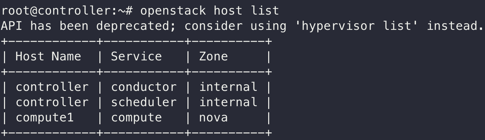
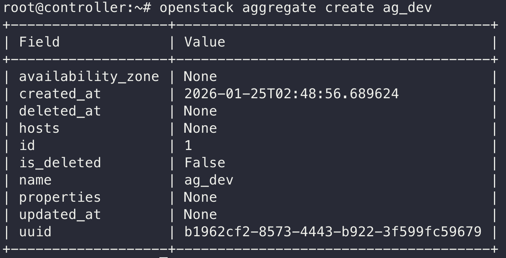
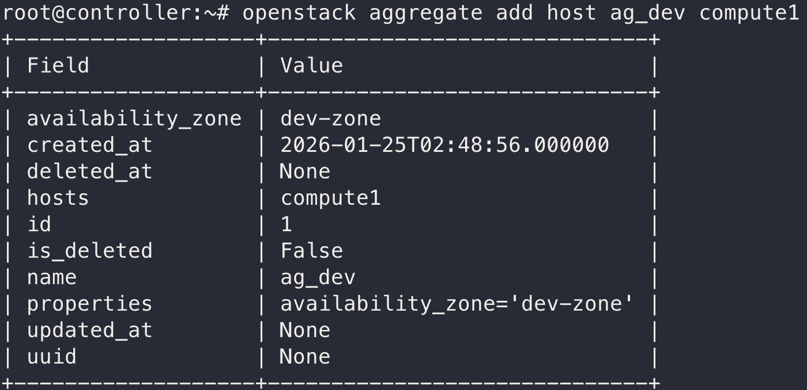
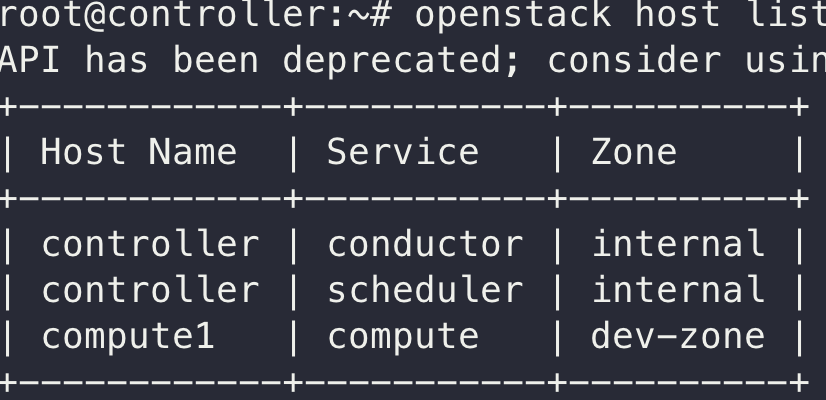
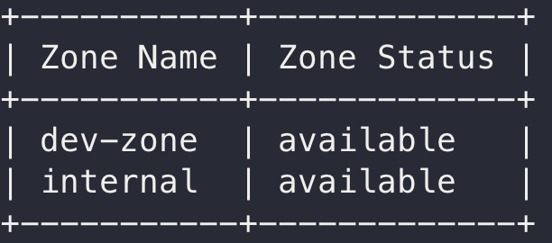
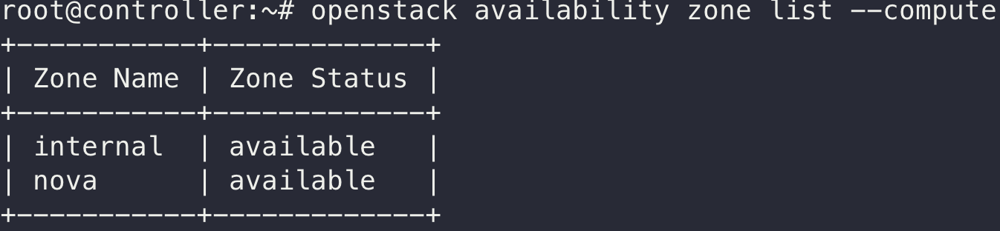

## 학습 목표
- 오픈스택의 핵심 논리/물리 구조인 리전(Region)과 가용 영역(AZ)의 개념을 이해한다.
- HA(고가용성)와 DR(재해 복구) 관점에서 AZ와 리전의 목적과 차이를 구분한다.
- Host Aggregate(호스트 집합)의 개념을 숙지하고, 이를 활용하여 사용자 정의 AZ를 직접 생성해 본다.

## 학습 내용
### 3.1.1 리전 (Region)
리전은 지리적으로 완전히 떨어진 데이터센터를 의미한다.

- **특징**
  - 타 지사와 거리가 멀어 완벽히 격리되어 있으므로, 한 지사에 재난 상황이 발생해도 타 지사는 영향을 받지 않는다.
  - 회원 정보(ID/PW)를 관리하는 Keystone 인증 서비스는 리전 간에 공유한다.
  - Nova, Neutron, Cinder 등의 서비스는 완전히 따로 사용하며, 특정 리전의 네트워크는 타 리전까지 연결되지 않는다.

### 3.1.2 가용 영역 (Availability Zone, AZ)
리전 안에서 전력, 냉방, 네트워크 장비가 물리적으로 분리된 구역(예: 한국 지사 내의 A동 건물 vs B동 건물)을 말한다.

- **특징**
  - 같은 리전 안에 존재하지만 서로 다른 건물로 분리되어 있다.
  - Neutron은 공유되므로 네트워크는 AZ에 갇히지 않고 리전 전체에 넓게 깔려 있다.
  - Nova와 Cinder 서비스는 따로 사용한다.
  - 같은 부지 내에 위치하여 건물 간 네트워크 통신 속도가 매우 빠르다.
  - 사용자가 가상머신(VM)을 생성할 때 특정 구역(예: A동, B동)을 직접 지정할 수 있다.

| **구분** | **리전 (Region) 간** | **AZ (Availability Zone) 간** |
| --- | --- | --- |
| **비유** | 한국 지사 ↔ 미국 지사 | A동 건물 ↔ B동 건물 |
| **API** | **완전 분리** | **공유** (하나의 Controller가 다 관리) |
| **Nova** | 분리 | **분리** |
| **Cinder** | 분리 | **분리** |
| **Neutron** | **분리** (통신 불가) | **연결됨** (같은 사설망 사용 가능) |

### 3.1.3 한 눈에 보는 계층 구조
오픈스택의 물리적/논리적 구조는 다음 순서로 작아진다.

1. **OpenStack Cloud** (전체 시스템): 예) 00회사 프라이빗 클라우드 전체
2. **Region** (지리적 분리): 예) `RegionOne` (기본값), `RegionTwo`
3. **Availability Zone (AZ)** (물리적 인프라 분리): 예) `nova` (기본값), `az-1`, `az-2`
4. **Host Aggregate** (관리자용 그룹): 예) SSD 서버 그룹, GPU 서버 그룹
5. **Compute Node** (실제 서버): 예) `compute1`, `compute2`

### 3.1.4 Region과 AZ의 존재이유 (HA와 DR)
| **구분** | **목적** | **실패 시나리오** |
| --- | --- | --- |
| **AZ (가용 영역)** | **HA (고가용성)** | "전산실 랙 하나의 전원이 나갔어요!" 👉 옆 랙(다른 AZ)에 있는 서버가 대신 작동함. |
| **Region (리전)** | **DR (재해 복구)** | "지진이 나서 데이터센터가 무너졌어요!" 👉 다른 도시(다른 리전)에 있는 센터로 서비스 전환. |

### 3.1.5 실습 환경에서 확인하기
실습 환경의 기본값은 Region: `RegionOne`, AZ: `nova`이다.

```bash
# Controller 노드에서 실행
source ~/admin-openrc.sh
openstack availability zone list --compute
```


{width="100%"}

- **`internal` (관리자 구역):**
    - `nova-scheduler`, `nova-conductor` 같은 **관리용 서비스**들이 모여 있는 곳
    - 사용자가 만드는 가상머신은 이곳에 절대 들어갈 수 없다.
- **`nova` (일반 구역):**
    - 기본값(Default) 가용 영역입니다.
    - 별도로 설정을 안 했으므로, 현재 `compute1` 노드와 `controller` 노드는 모두 이 `nova` 구역에 속해 있다.
    - 사용가 VM을 만들면 무조건 여기에 만들어진다.

### 3.1.6 Host Aggregates (호스트 집합)

오픈스택에는 "AZ 생성" 버튼이 따로 없다. 대신 Host Aggregate(호스트 집합)라는 것을 만들어서 AZ 흉내를 낸다.

### **1. Host Aggregate이란?**

물리적인 서버(Compute Node)들을 논리적인 **그룹**으로 묶어주는 기능

- **용도:**
    - **성능별 구분:** SSD 달린 고성능 서버들끼리 묶음.
    - **위치별 구분:** 1층 전산실 서버들끼리 묶음.

### **2. Aggregate vs AZ**

- **Host Aggregate:** 관리자가 **관리하기 편하려고** 묶은 그룹. (사용자는 모름)
- **Availability Zone (AZ):** 사용자가 **선택할 수 있게** 노출된 그룹.

> Host Aggregate를 만들고, 거기에 ‘이건 AZ야’라는 이름표(Flag)를 붙이면, 그때부터 AZ가 된다.
> 

---

### **[실습] 현재 서버들이 어디 살고 있는지 확인하기**

아래 명령어를 통해 **어떤 노드가 어떤 Zone에 살고 있는지** 정확한 주소지를 확인해 보자

**Controller 노드**에서 입력:

```bash
openstack host list
```

{width="100%"}

### **[실습] 나만의 AZ 만들기 (3단계)**

### **1단계: 호스트 집합(Aggregate) 만들기**

이름은 `ag_dev` 의 관리자용 그룹(껍데기)을 먼저 만든다.

```bash
openstack aggregate create ag_dev
```

{width="100%"}

### **2단계: 이름표 붙이기**

방금 만든 그룹(`ag_dev`)에 ‘이 그룹은 이제부터 `dev-zone`이라는 AZ로 불린다’라는 속성(Property)을 설정

```bash
openstack aggregate set --property availability_zone=dev-zone ag_dev
```

### **3단계: 호스트 이사시키기**

이제 텅 빈 그룹에 `compute1`을 집어넣는다.

```bash
openstack aggregate add host ag_dev compute1
```

{width="70%"}

---

### **[확인] 이사가 잘 되었을까?**

이제 `compute1`의 주소지가 바뀌었는지 확인해 보자.

```bash
openstack host list
```

{width="70%"}

### **[검증] 사용자 눈에도 보일까?**

아까 `host list`는 관리자용 장부였다.
이제 일반 사용자가 ‘나 VM 만들고 싶은데, 어떤 구역(AZ)을 고를 수 있어?’라고 물어볼 때, `dev-zone`이 목록에 뜨는지 확인해야 한다.

**Controller 노드**에서 아래 명령어를 입력해 보자.

```bash
openstack availability zone list --compute
```

{width="100%"}

👉 **결과 화면에서 `Zone Name`에 `dev-zone`이 추가되었다.**

---

이제부터 VM을 만들 때 **옵션**이 생겼다.

1. **과거:** 그냥 만들면 무조건 `nova` 존(compute1)에 만들어짐.
2. **현재:**
    - 사용자가 `-availability-zone dev-zone` 옵션을 주면 👉 `compute1`에 생성됨.
    - 만약 나중에 `compute2`를 사서 `prod-zone`을 만든다면? 👉 옵션만 바꿔서 물리적으로 다른 서버에 VM을 배치할 수 있게 됨.