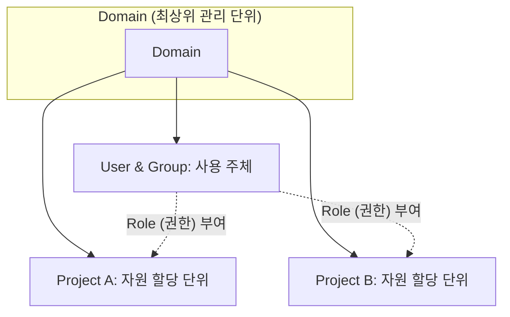
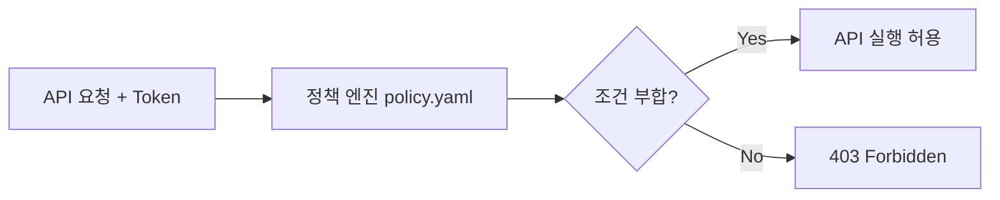

# OpenStack Keystone 객체 구조 및 RBAC 정책 분석

## 1. 요구 사항
* **자원 격리**: 프로젝트 단위의 독립적인 자원 할당 및 접근 통제
* **권한 세분화**: 사용자 역할(Role)에 따른 API 호출 범위 제한
* **관리 효율성**: 그룹(Group) 및 도메인(Domain) 개념을 통한 대규모 조직 관리

## 2. Keystone: ID 관리 및 자원 할당 구조
Keystone은 오픈스택 내 모든 서비스 자원에 접근하기 위한 인증 기관입니다.

### 핵심 논리 객체 (Identity Objects)
* **도메인 (Domain)**: 사용자, 그룹, 프로젝트를 포함하는 최상위 관리 단위
* **프로젝트 (Project)**: 컴퓨팅, 스토리지 등 실제 클라우드 자원이 할당되는 단위
* **사용자 및 그룹 (User & Group)**: API를 호출하고 자원을 사용하는 주체
* **역할 (Role)**: 특정 프로젝트 내에서 사용자가 수행할 수 있는 권한 정의

> *실선: 포함 관계 (Contains) / 점선: 역할 할당 관계 (Role Assignment)*

## 3. RBAC (Role-Based Access Control) 작동 원리
사용자에게 직접 권한을 주는 것이 아니라, **특정 프로젝트 내에서 특정 역할을 수행**함으로써 권한이 완성됩니다.

* **권한 할당 구조**: `Assignment = (User | Group) + Project + Role`
* **스코프 (Scope)**: 사용자는 접속 시 특정 프로젝트를 지정(Scope)해야 하며, 해당 범위 내의 작업만 수행 가능
* **다중 권한**: 동일한 사용자라도 참여하는 프로젝트에 따라 다른 역할 수행 가능

## 4. 정책 파일 (policy.yaml) 및 API 제어
Keystone을 포함한 모든 서비스는 API 호출 시 `policy.yaml`의 정책 엔진을 통해 승인 여부를 결정합니다.

* **기본 구조**: `"Action (API)": "Rule (Condition)"` 형식의 1:1 매핑 구조

### 주요 정책 규칙 예시
1. **`"compute:create_server": "rule:admin_or_owner"`**
   * **Action**: Nova 서비스에 인스턴스 생성 요청 (`compute:create_server`)
   * **Rule**: `rule:` 키워드를 사용하여 파일 내 정의된 `admin_or_owner` 조건을 참조 및 확인
2. **`"identity:get_user": "role:admin and system_scope:all"`**
   * **Action**: Keystone에 특정 사용자 정보 요청 (`identity:get_user`)
   * **Rule**: `role:` 키워드를 통해 토큰에 명시된 역할을 직접 검사 (최고 관리자 권한 요구)

### 인증 흐름 (Authorization Flow)
1. 사용자가 API 요청 시 토큰(Token) 제출
2. 서비스 정책 엔진이 토큰 내 Role과 `policy.yaml` 대조
3. 조건 미달 시 `HTTP 403 Forbidden` 반환 및 요청 차단

## 5. 실무 검증 시나리오
**[가정]** A 프로젝트에 대해 `Reader` 역할만 부여받은 User1이 인스턴스 생성(`server:create`) API를 호출할 경우

1. 서비스 엔진이 `nova-policy.yaml`에서 `server:create` 규칙 조회
2. 해당 규칙이 `"role:admin or role:member"`로 정의되어 있음을 확인
3. User1의 토큰에는 `reader` 역할만 있으므로 조건 미달
4. 시스템은 요청을 거절하고 `Unauthorized / Forbidden` 반환