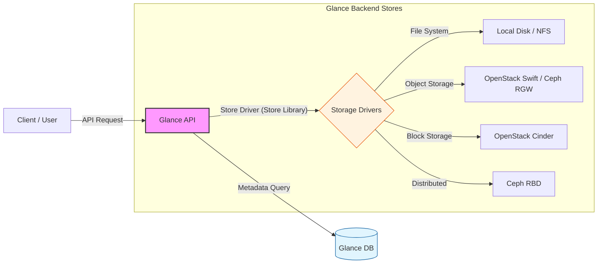

# OpenStack Glance Backend Store 개념 및 구조 분석

OpenStack Glance의 스토리지 아키텍처를 이해할 때, 가장 먼저 짚고 넘어가야 할 부분은 '실제 저장 공간'과 이를 연결하는 '설정 영역'의 차이를 명확히 구분하는 것입니다. 실무 환경에서는 이 두 가지를 혼용해서 부르기 쉽지만, 시스템 상에서는 엄연히 다른 역할을 수행합니다. 

* **Glance Backend Store (물리/논리적 저장소)**: 가상 머신의 이미지가 실제로 보관되는 '물리적 또는 논리적인 저장 공간 그 자체'를 의미합니다. 로컬 서버의 하드디스크(file), 분산 객체 스토리지(swift), 블록 스토리지(cinder 또는 ceph) 등이 여기에 해당하며, 비유하자면 이미지가 쌓이는 '실제 창고'입니다. 
* **[glance_store] (연동 설정 구역)**: Glance 프로그램이 위에서 언급한 창고(Backend Store)들을 찾아가기 위해 사용하는 `glance-api.conf` 파일 내의 설정 섹션입니다. 어떤 드라이버를 로드할지, 저장소의 주소는 어디인지, 인증 계정은 무엇인지를 정의하며, 창고 문을 열기 위한 '내비게이션과 열쇠' 역할을 합니다. 

## 1. Glance Backend Store 구조
아래 다이어그램은 사용자 요청이 Glance API를 거쳐 실제 물리적 저장소인 백엔드 스토어에 도달하는 논리적 흐름을 나타냅니다. 



## 2. 주요 백엔드 스토어 유형 및 특징
Glance는 인프라 환경의 규모와 요구 성능에 따라 다음과 같은 다양한 스토어 타입을 지원합니다. 

| 스토어 타입 | 기술적 특성 | 활용 사례 |
|---|---|---|
| **File (Filesystem)** | 호스트 서버의 로컬 디스크나 NFS(Network File System)를 이용하는 방식입니다. | 단일 노드 테스트 혹은 소규모 환경 |
| **Swift** | OpenStack의 오브젝트 스토리지 서비스인 Swift와 연동하여 데이터를 분산 저장합니다. | 대규모 클라우드 및 고가용성 보장 필요 시 |
| **Ceph (RBD)** | 분산 스토리지 솔루션인 Ceph를 백엔드로 사용하며, 현재 실무에서 가장 많이 선호되는 방식입니다. | 고성능, 확장성 중심의 엔터프라이즈 인프라 |
| **Cinder** | OpenStack의 블록 스토리지인 Cinder를 이미지 저장소로 활용합니다. | 스토리지 인프라를 Cinder로 통합 운영할 경우 |
| **HTTP** | 외부 웹 서버에 있는 읽기 전용 이미지를 가져오는 방식입니다. | 외부 공개 이미지를 직접 배포할 경우 |

## 3. 백엔드 스토어의 동작 원리
사용자가 이미지를 업로드하거나 다운로드할 때 Glance는 다음과 같은 순서로 백엔드 스토어와 상호작용합니다. 

1. **드라이버 호출**: Glance API는 설정 파일(`glance-api.conf`)에 정의된 백엔드 스토어 드라이버를 로드합니다. 
2. **데이터 전달**: 사용자가 전송한 이미지 바이너리 데이터를 선택된 드라이버를 통해 백엔드 저장소로 스트리밍합니다. 
3. **위치 정보(Location URI) 저장**: 업로드가 완료되면, 이미지가 저장된 물리적 위치 주소를 생성하여 Glance DB의 메타데이터 영역에 기록합니다. 

## 4. glance-api.conf 설정 파일과 백엔드 스토어 연동
Glance API와 저장소 간의 통신 로직은, 실제 서버의 `/etc/glance/glance-api.conf` 파일 내 `[glance_store]` 섹션 설정을 통해 제어됩니다. 스토리지 설정의 원리를 가장 직관적으로 이해하기 위해, 성격이 완전히 대비되는 두 가지 방식인 File 스토어(로컬)와 Swift 스토어(외부 네트워크)의 설정 방법을 비교해 보겠습니다. 

* **File과 Swift의 차이**: File 방식은 내 서버의 로컬 하드디스크에 이미지를 저장하므로 단순히 '저장할 폴더 경로'만 알려주면 됩니다. 반면 Swift는 네트워크 너머에 있는 독립된 대규모 객체 스토리지이므로, 단순히 주소뿐만 아니라 "내가 누구인지" 증명하는 인증(Authentication) 정보가 필수적으로 추가되어야 한다는 뚜렷한 구조적 차이가 있습니다. 

### 4.1 File 스토어 설정 예시 (로컬 디스크 기반)
가장 기본적인 형태로, 단일 노드 테스트 환경 등에서 주로 사용됩니다. 

```ini
[glance_store] 
# 사용 가능한 스토어 드라이버 목록 
stores = file, http 
# 이미지를 업로드할 때 사용할 기본 스토어 지정 
default_store = file 
# (File 전용) 이미지가 실제로 저장될 로컬 서버의 절대 경로 
filesystem_store_datadir = /var/lib/glance/images/ 
```

### 4.2 Swift 스토어 설정 예시 (분산 객체 스토리지 연동)
외부 스토리지와 연동해야 하므로, 인증 서버(Keystone)의 주소와 Glance 서비스 계정 정보가 추가로 필요합니다. 

```ini
[glance_store] 
stores = swift, http 
default_store = swift 

# (Swift 전용) 인증을 처리할 Keystone 서버 주소 
swift_store_auth_address = http://controller:5000/v3/ 

# (Swift 전용) Swift에 접근하기 위한 Glance 서비스 계정 이름 및 비밀번호 
swift_store_user = service:glance 
swift_store_key = <GLANCE_PASSWORD> 

# (Swift 전용) 이미지를 담을 Swift 컨테이너(버킷) 명칭 
swift_store_container = glance 
```