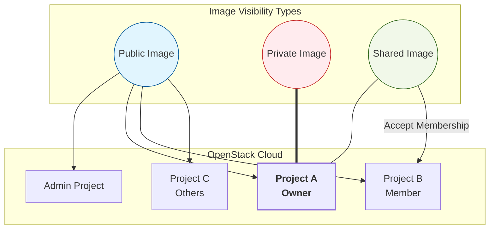

# OpenStack Glance 이미지 공개 범위(Visibility) 및 공유 체계 분석

## 1. 이미지 공개 범위(Visibility) 분류 및 CLI 설정
Glance는 이미지의 용도와 보안 수준에 따라 다음과 같이 세 가지 주요 가시성 등급을 제공합니다.
* **Private (개인)**: 이미지를 생성한 프로젝트 내에서만 사용 가능합니다. (기본값)
* **Public (공용)**: 클라우드 내 모든 프로젝트가 사용 가능합니다. (보안상 최고 관리자 권한 필요)
* **Shared (공유)**: 소유자가 지정한 특정 프로젝트와 공유합니다.

### 1.1 이미지 최초 생성 시 지정 (create)
이미지를 Glance에 최초로 업로드할 때 옵션을 부여하여 가시성을 확정합니다. (미지정 시 기본값은 private으로 들어갑니다.)

```bash
# 1. 프로젝트 전용(Private)으로 생성할 때
openstack image create --private --file ubuntu.qcow2 ubuntu-image

# 2. 클라우드 전체 공개 (Public)로 생성할 때 (최고 관리자 권한 필요)
openstack image create --public --file ubuntu.qcow2 ubuntu-public-image
```

## 2. 운영 중인 이미지의 범위 변경 (set)
이미 등록되어 운영 중인 이미지의 공개 범위를 사후에 변경할 때 사용합니다.

```bash
# 1. 특정 이미지를 소유 프로젝트 전용 (Private)으로 제한할 때
openstack image set --private <Image_ID>

# 2. 특정 이미지를 타 프로젝트와 공유 (Shared) 할 수 있는 상태로 변경할 때
openstack image set --shared <Image_ID>
```

## 3. 상태 전환(Transition) 및 삭제 권한 통제
이미지의 가시성을 변경하거나 완전히 삭제하는 작업은 클라우드 인프라 전체에 영향을 미칠 수 있습니다. 따라서 오픈스택은 이를 엄격한 권한(RBAC) 기반으로 통제합니다.

### 3.1 가시성 상태 전환 통제
* **Private <-> Shared (유연한 전환)**:
  * **권한**: 소유자(Owner)
  * **사유**: 내 자원을 특정 대상에게만 보여주거나 다시 회수하는 것이므로, 소유자 권한 내에서 자유롭게 통제할 수 있습니다.
* **Private / Shared -> Public (승격)**:
  * **권한**: 최고 관리자(Admin) 필수
  * **사유 (보안)**: 일반 사용자가 검증되지 않은 악성 이미지를 마음대로 전체 공개로 올려버리는 것을 막기 위한 보안 통제입니다.
* **Public -> Private (강등)**:
  * **권한**: 최고 관리자(Admin) 필수
  * **사유 (가용성)**: Public 이미지는 이미 다른 수많은 프로젝트에서 믿고 가져다 쓰고 있는 공용 자원입니다. 이를 갑자기 Private으로 숨겨버리면 타 프로젝트의 서비스 가용성에 치명적인 장애를 유발할 수 있습니다.

### 3.2 이미지 삭제 통제
삭제 명령어(`openstack image delete <Image_ID>`)는 단순하지만, 실행 주체에 따라 결과가 완전히 달라집니다.
* **소유자 (Owner)**: 자신이 생성한 Private 및 Shared 이미지만 삭제할 수 있습니다. 공유받은 이미지의 원본이나, 인프라의 Public 이미지는 삭제할 수 없습니다.
* **시스템 관리자 (Admin)**: 스토리지 용량을 갉아먹는 좀비 자원을 회수하거나 악성 이미지를 격리하기 위해, 가시성이나 소유권에 상관없이 인프라 내의 모든 이미지를 강제로 삭제할 수 있는 권한을 가집니다.

## 4. 타 프로젝트와의 이미지 공유
OpenStack에서 이미지를 타 프로젝트와 공유하는 과정은 일반적인 클라우드 드라이브의 단방향 통보 방식과 다릅니다. 반드시 '제공자의 할당(Add)'과 '수신자의 수락(Accept)'이라는 양방향 합의 구조를 거치며, 이는 인프라 운영 및 보안 측면에서 두 가지 중요한 목적을 가집니다.

* **자원 관리**: 수많은 부서가 쏟아내는 이미지들로 인해 내 프로젝트의 대시보드가 어지럽혀지는 것을 막고, 꼭 필요한 '표준 이미지'만 선별하여 구독할 수 있게 합니다.
* **보안 및 스팸 방지**: 악의적인 사용자나 타 부서가 검증되지 않은 대용량 이미지를 내 프로젝트에 무단으로 Spamming하여 스토리지 할당량을 소진시키거나, 보안 위협을 일으키는 것을 원천적으로 차단합니다.

실제 공유 절차는 제공자와 수신자의 역할로 나뉘어 진행됩니다.

### 4.1 공유 멤버 추가 (제공자 측면)
원본 이미지의 소유자는 자신이 만든 이미지를 사용할 대상 프로젝트(Target Project)를 지정하여 권한을 부여합니다.

```bash
# 특정 프로젝트를 이미지 사용 멤버로 추가
openstack image add project <공유할_Image_ID> <대상_Project_ID>
```

### 4.2 대기 상태 (Pending)
제공자가 멤버를 추가하더라도, 대상 프로젝트의 이미지 목록에는 즉시 나타나지 않으며 숨겨진(대기) 상태로 머물게 됩니다. 이는 원치 않는 이미지가 대상 프로젝트의 리스트를 어지럽히는 것을 방지하는 1차 방어선입니다.

### 4.3 검증 및 수락/거절 (수신자 측면)
공유받은 프로젝트의 관리자는 해당 이미지가 안전하고 실제 업무에 필요한 자원인지 확인한 후, 수락해야만 자신의 이미지 목록에 활성화되어 가상 머신 생성에 활용할 수 있습니다.

```bash
# 공유받은 이미지를 내 프로젝트에 활성화(수락)
openstack image set --accept <공유받은_Image_ID>

# (참고) 원치 않거나 의심스러운 이미지일 경우 거절하여 목록에서 영구 배제
openstack image set --reject <공유받은_Image_ID>
```

## 5. 이미지 공개 범위 논리 구조

아래 다이어그램은 각 공개 범위 설정에 따라 이미지에 접근할 수 있는 프로젝트의 범위를 보여줍니다.

