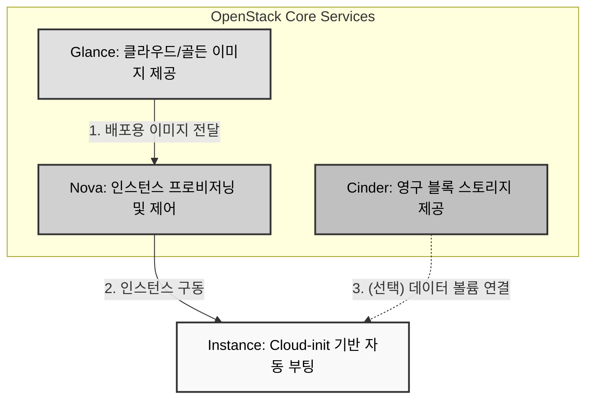
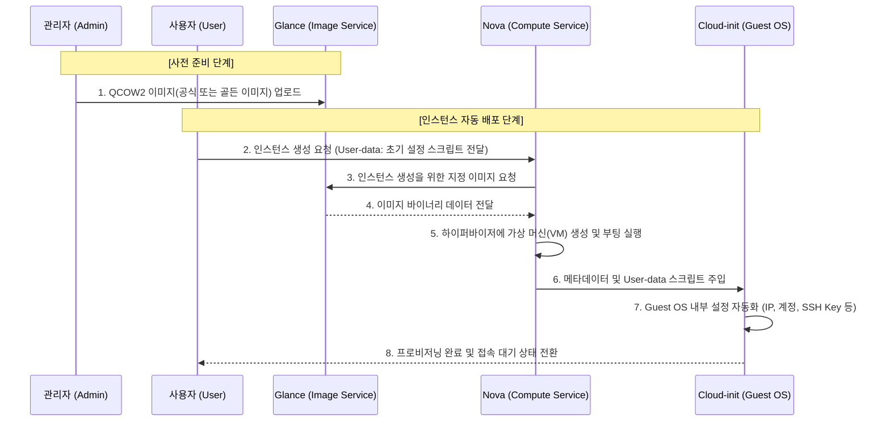

# OpenStack 클라우드 이미지 배포 및 골든 이미지 제작 가이드

## 1. 클라우드 환경의 이미지 운영
전통적인 PC 가상화 환경(VMware, VirtualBox 등)에서는 빈 가상 머신에 ISO(CD)를 삽입하고 관리자가 콘솔 화면을 보며 수동으로 OS를 설치합니다. 하지만 수십, 수백 대의 서버를 즉각적으로(수초 이내에) 확장해야 하는 클라우드 환경에서는 이러한 수동 설치 방식이 적합하지 않습니다. 또한, OpenStack 자체는 인프라 플랫폼일 뿐 운영체제 이미지를 내장하여 제공하지 않습니다. 따라서 실무 환경에서는 Ubuntu (Canonical), CentOS 등 각 OS 벤더사에서 클라우드 환경에 맞게 사전 구성하여 배포하는 '공식 클라우드 이미지(Cloud Image, 주로 QCOW2 포맷)'를 다운로드하여 사용하거나, 보안 및 사내 표준에 맞춰 완벽하게 세팅을 끝낸 '골든 이미지(Golden Image)'를 직접 제작하여 인스턴스를 자동 배포합니다. 

## 2. 관련 서비스 및 상호작용
* **Glance (Image Service)**: 단순한 ISO 미디어뿐만 아니라, QCOW2, RAW, VMDK 등 인스턴스 구동에 필요한 다양한 형태의 가상 머신 이미지와 메타데이터를 통합 보관하고 제공합니다. 
* **Nova (Compute)**: 사용자의 생성 요청을 받아 Glance로부터 적절한 이미지를 가져오고, 하이퍼바이저를 제어하여 실제 인스턴스(가상 머신)를 프로비저닝하고 구동합니다. 
* **Cinder (Block Storage)**: 인스턴스에 영구적으로 연결할 수 있는 데이터 볼륨을 제공합니다. (골든 이미지를 수동으로 제작할 때, OS가 설치될 베이스 볼륨 역할도 수행합니다.) 



## 3. Glance의 역할과 지원 포맷 확장
Glance는 단순한 ISO 설치 미디어 저장소가 아닙니다. 클라우드 인스턴스 구동에 필요한 다양한 형태의 가상 머신 디스크 이미지를 종합적으로 보관하고 관리하는 핵심 레지스트리입니다. 
* **지원 포맷**: qcow2(KVM/QEMU 기본, 가장 널리 사용), raw(비압축 고성능), iso(설치 미디어 및 복구용), vmdk(VMware 호환) 등 

## 4. 공식 클라우드 이미지 다운로드 및 등록 가이드
가장 대중적인 Ubuntu 24.04 LTS 버전을 기준으로, 벤더사가 제공하는 클라우드 이미지를 Glance에 등록하는 절차입니다. 

### 4.1 공식 이미지 다운로드
* Ubuntu 공식 클라우드 이미지 저장소([https://cloud-images.ubuntu.com/)에서](https://cloud-images.ubuntu.com/)에서) `.img` 또는 `.qcow2` 확장자를 가진 최신 클라우드 이미지를 다운로드합니다. (예: `ubuntu-24.04-server-cloudimg-amd64.img`) 

### 4.2 Glance에 이미지 등록 (CLI 방식)
터미널에서 아래 명령어를 통해 다운로드한 QCOW2 이미지를 Glance에 업로드합니다. 

```bash
openstack image create "Ubuntu-24.04-Cloud" \
  --file ./ubuntu-24.04-server-cloudimg-amd64.img \
  --disk-format qcow2 \
  --container-format bare \
  --public
```

> **(참고) Horizon 대시보드 등록 방식**: 웹 UI 환경에서는 [프로젝트] -> [Compute] -> [이미지] -> [이미지 생성] 메뉴로 진입하여, 다운로드한 파일을 업로드하고 포맷을 QCOW2로 지정하여 생성할 수 있습니다. 

## 5. 클라우드 네이티브 인스턴스 자동 배포 (Cloud-init)
클라우드 이미지를 사용하면 콘솔(VNC) 화면을 열어 마우스로 클릭할 필요가 없습니다. 인스턴스 생성 시 `cloud-init` 이라는 클라우드 자동화 스크립트를 주입(User-Data)하여 모든 초기 설정을 자동화합니다. 
* **자동화 요소**: IP 주소 할당, 호스트 네임(Hostname) 설정, 기본 패스워드 지정, SSH Key-pair 주입, 초기 필수 패키지 설치 등 
* **결과**: 사용자의 개입 없이, 생성 명령 즉시 부팅 및 접속이 가능한 완성된 서버가 제공됩니다. 

## 6. ISO를 활용한 '골든 이미지(Golden Image)' 제작
클라우드 환경에서 일반적인 인스턴스 생성은 벤더사가 제공하는 공식 QCOW2 이미지를 사용하지만, ISO 파일이 전혀 사용되지 않는 것은 아닙니다. 공식 배포 이미지만으로는 사내 보안 규정(특정 파티션 분리, 커스텀 커널 적용 등)을 충족하기 어려울 때, 사용자가 직접 ISO를 이용해 OS를 설치하고 설정을 마친 원본 이미지를 제작해야 합니다. 이렇게 세팅이 완료된 커스텀 마스터 이미지를 실무에서는 '골든 이미지'라고 부르며, 다음의 과정을 거쳐 제작됩니다. 

1. **ISO 기반 수동 설치**: Glance에 ISO 파일을 업로드한 후, 이를 부팅 소스로 삼아 인스턴스를 생성합니다. 관리자는 VNC 콘솔에 접속하여 파티션 설정 및 OS 설치를 수동으로 진행합니다. 
2. **패키지 및 보안 설정**: OS 설치가 완료되면, 운영에 필요한 필수 패키지 설치, 방화벽 설정, 사내 보안 정책 등을 적용합니다. 
3. **시스템 초기화**: 생성될 이미지가 다른 인스턴스에 복제될 때 충돌이 발생하지 않도록, 기존 인스턴스에 종속된 고유 정보(MAC 주소, SSH 호스트 키, 로그 파일 등)를 삭제하고 초기화합니다. 
4. **스냅샷 생성 및 등록**: 모든 준비가 완료된 인스턴스의 스냅샷을 생성합니다. 이 스냅샷은 새로운 QCOW2 포맷의 이미지로 추출되어 Glance에 등록되며, 이후부터는 ISO 수동 설치 과정을 생략하고 이 골든 이미지를 바탕으로 다수의 인스턴스를 자동 생성하게 됩니다. 

## 7. 전체 인스턴스 생성 시퀀스 흐름도

