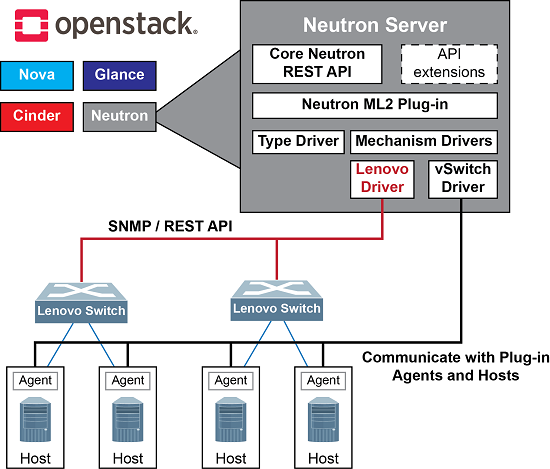

## 학습 목표
- Neutron의 역할과 Plugin/ML2의 관계를 설명할 수 있다.
- Type Driver, Mechanism Driver, Extension Driver의 차이를 구분할 수 있다.
- 네트워크 생성부터 포트 바인딩, Agent 동작까지 흐름을 단계별로 이해할 수 있다.

## 학습 내용
### 6.6.1 Neutron이 하는 일
Neutron은 OpenStack에서 네트워크 기능을 담당하는 서비스이며, 핵심적으로 네트워크 기능을 API로 제공한다.

주요 기능:

- 네트워크(Network), 서브넷(Subnet), 포트(Port) 생성/삭제
- 라우터(Router), Floating IP, NAT
- 보안그룹(Security Group) / 방화벽 규칙
- (환경에 따라) LBaaS, VPNaaS 등 확장 기능

핵심 포인트:

1. 사용자는 항상 같은 OpenStack 명령을 쓴다.
2. Neutron은 그 요청을 받는다.
3. Plugin이 현재 백엔드(OVS/LinuxBridge/SDN)에 맞게 실제 동작으로 번역한다.
그래서 특정 구현에 묶이지 않고, 백엔드를 바꿔도 사용자 입장에서는 사용법이 거의 같다.

즉, Neutron은 네트워크 API를 표준화하고, Plugin은 그 API 요청을 실제 네트워크 기술(OVS, Linux Bridge, SDN, 하드웨어 스위치)로 번역해 실행한다.

### 6.6.2 Neutron Plugin이란?
Plugin은 Neutron API 요청을 실제 네트워크 동작으로 연결하는 번역 계층이다.

동작 관점:

- Neutron-server
  - REST API 처리
  - 정책/인증
  - DB 상태 기록
  - [RPC(1)](#term-rpc) 호출 중심 처리
- Plugin
  - Neutron 내부 네트워크 모델(네트워크/포트/보안그룹 등)과
  - 실제 L2/L3 데이터플레인 구현을 연결

즉, Plugin은 Neutron 논리 모델과 실제 네트워크 구현 사이의 접착제 역할을 한다.

### 6.6.3 ML2 Plugin이 필요한 이유
데이터센터/실습 환경마다 네트워크 구현 방식이 다르기 때문에, 공통 API를 유지하면서도 구현을 유연하게 조합할 수 있어야 한다.

ML2의 핵심 아이디어:

- 네트워크 타입(L2 세그먼트 방식: VLAN/VXLAN/Geneve 등)
- 구현 메커니즘(OVS/Linux Bridge/SDN/HW switch 등)

위 두 영역을 분리해 모듈식으로 조합 가능하게 만든다.

### 6.6.4 ML2의 3가지 핵심 드라이버
#### 1) Type Driver
네트워크의 L2 세그먼트 방식을 정의한다.

예시:

- flat
- vlan
- vxlan
- geneve

또한 VLAN ID/VNI 같은 식별자 풀을 관리한다.

#### 2) Mechanism Driver
포트가 특정 호스트에 붙을 때 실제 연결 방식을 결정한다.

예시:

- openvswitch
- linuxbridge
- sriovnicswitch
- ovn
- vendor driver

핵심 역할:

- 포트 바인딩(port binding) 결정
- vif_type, vif_details 산출
- 호스트/네트워크 타입 지원 가능 여부 판단

#### 3) Extension Driver
Neutron 리소스에 확장 속성을 붙이는 드라이버다.

예시:

- QoS 정책 연동
- Port Security 속성
- DHCP 옵션 확장

드라이버 비교표:

| 드라이버 | 의미 | 실제로 정하는 것 | 예시 | 최종 결과 |
| --- | --- | --- | --- | --- |
| Type Driver | 네트워크 종류를 정한다 | VLAN/VXLAN/Geneve 같은 분리 방식과 ID(VLAN ID/VNI) | `flat`, `vlan`, `vxlan`, `geneve` | `이 네트워크는 VXLAN, VNI=5001` 같은 정보 확정 |
| Mechanism Driver | 호스트에서 붙이는 방법을 정한다 | 해당 compute에서 어떤 방식으로 포트를 연결할지(`vif_type`, `vif_details`) | `openvswitch`, `linuxbridge`, `ovn`, `sriovnicswitch` | 포트 바인딩 방식과 Agent 작업 대상 확정 |
| Extension Driver | 추가 옵션을 붙인다 | QoS, Port Security, DHCP 옵션 같은 확장 속성 | QoS/Port Security 관련 확장 드라이버 | 포트/네트워크에 정책 속성 저장 및 연동 |

### 6.6.5 네트워크 생성 -> VM 연결

#### 1) 네트워크 생성
1. 사용자/오케스트레이터가 Neutron API 호출(`network create`)
2. Neutron-server가 DB에 리소스 생성
3. ML2 Type Driver가 세그먼트 정보(예: VXLAN VNI) 결정
4. 네트워크 타입/세그먼트 정보가 DB에 기록

#### 2) 포트 생성
1. Nova가 VM 생성 과정에서 Neutron에 포트 생성 요청
2. Neutron-server가 DB에 포트 생성
3. VM 스케줄링 호스트 정보와 함께 바인딩 단계로 진행

#### 3) 포트 바인딩
1. Nova가 VM 배치 호스트 결정
2. Neutron에 `host=compute-X` 정보 전달
3. ML2 Mechanism Driver가 바인딩 가능 여부 및 VIF 방식 판단
4. 바인딩 성공 시 해당 호스트 Agent에 RPC로 구성 지시

#### 4) Agent의 실제 데이터플레인 구성
OVS 기반에서는 다음 작업이 수행된다.  
- br-int 연결  
- br-tun 구성(오버레이)  
- OpenFlow 룰 설치  
- 보안그룹/안티스푸핑 룰 반영    
즉, VM 포트를 스위치에 붙이고(br-int), 서버 간 터널 경로를 만들고(br-tun), 패킷 전달 규칙(OpenFlow)과 보안 규칙을 적용해서 실제 통신이 되게 만든다.  
요약:

| 단계 | 주요 주체 | 핵심 결과 |
| --- | --- | --- |
| 네트워크 생성 | 사용자, Neutron-server, ML2 Type Driver | 네트워크 세그먼트 정보(예: VNI) DB 확정 |
| 포트 생성 | Nova, Neutron-server | VM NIC 연결점(Port) 생성 |
| 포트 바인딩 | Nova, ML2 Mechanism Driver | `host`, `vif_type`, `vif_details` 결정 |
| 데이터플레인 구성 | L2/L3 Agent | 브릿지/터널/룰/네임스페이스 구성 |

### 6.6.6 ML2와 Agent의 역할 분리
ML2는 Neutron-server 내부 플러그인 구조이며, 실제 호스트 네트워크 작업은 Agent가 수행한다.

대표 Agent:

- L2 Agent: openvswitch-agent, linuxbridge-agent
- L3 Agent: 라우터 네임스페이스/NAT
- DHCP Agent: DHCP 네임스페이스/dnsmasq
- Metadata Agent: 인스턴스 메타데이터 프록시

정리:

- ML2: 무엇을/어떻게 붙일지 결정
- Agent: 실제 브릿지/터널/룰 생성

ML2 vs Agent 역할 분리 요약:

| ML2가 결정하는 것 | Agent가 수행하는 것 |
| --- | --- |
| 네트워크 타입/세그먼트(`vlan`, `vxlan`, VNI 등) | 브릿지 생성(`br-int`, `br-tun`) |
| 포트 바인딩 대상 호스트 및 방식 | 터널 생성(VXLAN/Geneve 등) |
| `vif_type`, `vif_details` | OpenFlow/iptables/보안그룹 규칙 반영 |
| RPC 지시를 위한 논리 상태 | 네임스페이스/NAT/DHCP/metadata 실제 구성 |

### 6.6.7 자주 헷갈리는 포인트
#### Type Driver vs Mechanism Driver
- Type Driver: 네트워크 세그먼트 방식(VLAN/VXLAN/GENEVE/FLAT)
- Mechanism Driver: 구현 방식(OVS/LinuxBridge/OVN/HW switch)

#### 네트워크 생성 시점에 실제 구성이 모두 끝나는가?
- 네트워크 생성만으로 호스트 구성이 즉시 완료되지 않을 수 있다.
- 실제 구성은 포트가 호스트에 바인딩될 때 구체화된다.

#### ML2가 L3까지 담당하는가?
- ML2는 L2 중심 모듈이다.
- 라우팅/NAT 같은 L3는 L3 Agent(또는 OVN 등 백엔드)가 담당한다.

### 6.6.8 Neutron 전체 그림
{width="75%" fig-align="center"}

```bash
+-----------------------------+
|        User / Nova          |
|  (openstack / REST API)     |
+--------------+--------------+
               |
               v
+-----------------------------+
|        Neutron-server       |
|-----------------------------|
| API / Policy / Auth         |
| DB Access                   |
| RPC Dispatcher              |
|                             |
|  +-----------------------+  |
|  |      ML2 Plugin       |  |
|  |-----------------------|  |
|  | Type Drivers          |  |
|  | Mechanism Drivers     |  |
|  | Extension Drivers     |  |
|  +-----------------------+  |
+--------------+--------------+
               |
        RPC / Messaging
               |
   +-----------+-----------+
   |                       |
   v                       v
+---------+           +---------+
| L2Agent |           | L3Agent |
| (OVS,   |           | Router) |
| Bridge) |           +---------+
+---------+
```

- Neutron-server는 두뇌
- ML2 Plugin은 설계/판별 계층
- Agent는 실제 작업 수행 계층

### 6.6.9 ML2 내부 구조
```bash
          ML2 Plugin (Neutron-server 내부)
+--------------------------------------------------+
|                                                  |
|  +------------------+   +--------------------+  |
|  |   Type Drivers   |   | Mechanism Drivers  |  |
|  |------------------|   |--------------------|  |
|  | flat             |   | openvswitch        |  |
|  | vlan             |   | linuxbridge        |  |
|  | vxlan            |   | ovn                |  |
|  | geneve           |   | sriov              |  |
|  +------------------+   +--------------------+  |
|                                                  |
|  +--------------------------------------------+  |
|  |           Extension Drivers                |  |
|  |  (QoS, Port Security, DHCP opts, etc.)     |  |
|  +--------------------------------------------+  |
+--------------------------------------------------+
```

역할 분리 원칙:

- Type Driver: 네트워크 L2 격리 방식과 ID(VLAN ID/VNI) 관리
- Mechanism Driver: 호스트별 포트 연결 방식 및 구현 가능성 판단
- Extension Driver: QoS/보안/옵션 등 기능 확장

### 6.6.10 네트워크 생성 시 내부 흐름(Type Driver 중심)
```bash
User
 |
 |  network create (vxlan)
 v
Neutron API
 |
 v
ML2 Plugin
 |
 |--> Type Driver (vxlan)
 |      - VNI 할당
 |      - network_segments 생성
 |
 v
Neutron DB
```

이 시점에는 호스트 구성 이전 단계이며, 네트워크 타입과 식별자 같은 논리 정보가 우선 확정된다.

### 6.6.11 포트 바인딩 구조(ML2 핵심)
```bash
Nova (VM scheduling)
 |
 |  "이 VM은 compute-1"
 v
Neutron-server
 |
 v
ML2 Plugin
 |
 |  iterate Mechanism Drivers
 |--------------------------------------+
 |  OVS driver:                          |
 |   - compute-1 지원 가능? YES         |
 |   - vxlan 지원? YES                  |
 |   - vif_type = ovs                   |
 |   - vif_details = {...}              |
 |--------------------------------------+
 |
 v
Port Binding 확정
 |
 v
RPC to compute-1
```

여기서 결정되는 핵심:

- 어느 호스트에 포트를 붙일지
- 어떤 방식(vif_type)으로 붙일지
- 어떤 상세 파라미터(vif_details)가 필요한지

### 6.6.12 VXLAN + OVS 데이터플레인 예시
```bash
[ VM ]
  |
  | vNIC
  v
+-------------------+
| br-int            |  (integration bridge)
|  - VM ports       |
|  - local switching|
+---------+---------+
          |
          | patch port
          v
+-------------------+
| br-tun            |  (tunnel bridge)
|  - VXLAN encap    |
+---------+---------+
          |
      VXLAN Tunnel
          |
+---------+---------+
| br-tun            |  (remote compute)
+---------+---------+
          |
+---------+---------+
| br-int            |
+---------+---------+
          |
        [ VM ]
```

- ML2는 데이터플레인 구성 작업을 직접 수행하지 않는다.
- OVS Agent가 브릿지/터널/룰을 구성한다.
- ML2는 사용할 네트워크 방식과 바인딩 조건을 결정한다.

### 6.6.13 VXLAN vs VLAN
| 항목 | VXLAN | VLAN |
| --- | --- | --- |
| 격리 방식 | 오버레이 | 물리 태깅 |
| 물리 스위치 의존성 | 상대적으로 낮음 | 상대적으로 높음 |
| 확장성 | 큼 | 제한적 |

### 6.6.14 실습 확인 명령어
아래 명령어로 ML2 관련 리소스 상태를 빠르게 확인할 수 있다.

```bash
# 네트워크 상세 확인
openstack network show <NETWORK_NAME_OR_ID>

# 포트 상세 확인 (바인딩 정보 포함)
openstack port show <PORT_ID>

# Neutron Agent 상태 확인
openstack network agent list
```

## 용어 정리
### (1) RPC (Remote Procedure Call) {#term-rpc}
- 네트워크를 통해 다른 프로세스/서버의 기능을 호출하듯 요청-응답하는 통신 방식이다.
- Neutron 문맥에서는 `neutron-server`가 Agent에게 포트/네트워크 설정 지시를 전달할 때 쓰인다.

### (2) QoS (Quality of Service)
- 네트워크 트래픽 품질을 제어하기 위한 정책이다.
- 대역폭 제한, 우선순위, 지연 특성 같은 통신 품질 기준을 리소스에 적용할 때 사용한다.
- Neutron에서는 포트/네트워크에 QoS 정책을 연결해 트래픽 동작을 제어할 수 있다.

### (3) VIF (Virtual Interface)
- 가상머신(인스턴스)에 연결되는 가상 네트워크 인터페이스를 뜻한다.
- 포트 바인딩 시 Mechanism Driver가 `vif_type`과 `vif_details`를 결정하는데, 이 값이 VIF 연결 방식을 정의한다.
- 예를 들어 OVS 기반 환경에서는 VIF가 OVS 브릿지에 연결되도록 구성된다.

## 참고 자료
- [OpenStack Neutron ML2 공식 문서](https://docs.openstack.org/neutron/latest/admin/config-ml2.html)
