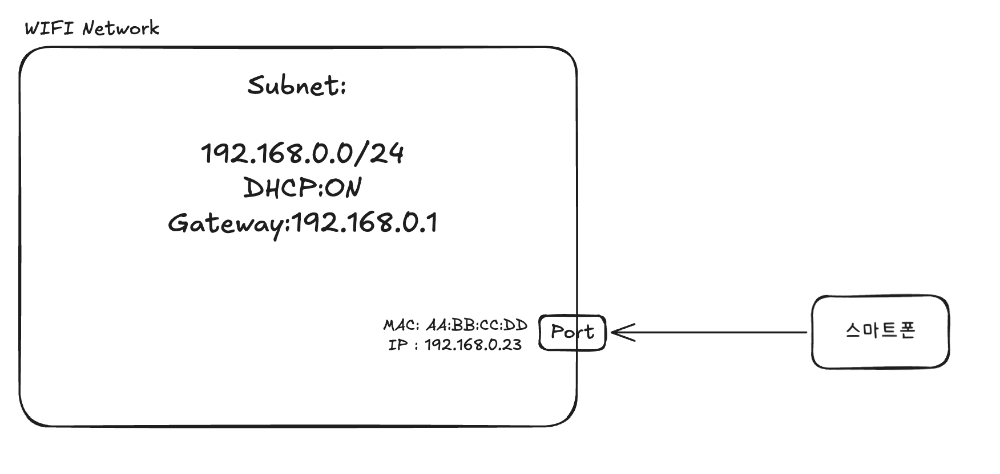

여기서 말하는 Network, Subnet, Port는 **OpenStack Neutron**의 객체를 기준으로 설명합니다.

## [6-3-1] Network

### 정의

**Network는 동일한 L2 브로드캐스트 도메인을 표현하는 논리적 네트워크 객체입니다.**

### 정확한 의미

동일 Network에 연결된 Port들은 다음과 같이 동작합니다.

- 같은 Ethernet 세그먼트에 있는 것처럼 동작합니다.
- ARP 브로드캐스트가 서로 도달합니다.

즉, Network는 “어디까지가 같은 L2 네트워크인가”를 정의하는 L2 연결 범위 객체입니다.

## [6-3-2] Subnet

### 정의

**Subnet은 특정 Network에 적용되는 L3(IP) 주소 체계와 관련 설정을 정의하는 객체입니다.**

### 정확한 의미

- Subnet은 다음 정보를 **정의만** 합니다
    - IP CIDR (`192.168.0.0/24`)
    - 게이트웨이
    - DHCP 설정
    - DNS 설정

중요한 점은 다음과 같습니다.

- Subnet은 IP를 **소유하지 않습니다.**
- Subnet은 트래픽을 **직접 처리하지 않습니다.**

Subnet은 단지 “이 Network에서 사용할 수 있는 IP 범위와 설정은 무엇인가”를 정의할 뿐이고, 실제 IP 할당과 트래픽은 다른 객체가 담당합니다.

즉, Subnet은 Network에 적용되는 **IP 규칙 정의 객체**입니다.

## [6-3-3] Port

### 정의

**Port는 Network에 연결되는 L2/L3 엔드포인트를 표현하는 객체이며, Neutron에서 IP·보안·연결의 최소 단위입니다.**

### 정확한 의미

Port는 다음과 같은 정보를 **실제 소유**합니다.

- MAC 주소
- IP 주소(들)
- Security Group(보안 규칙)
- 해당 엔드포인트로 드나드는 실제 네트워크 트래픽

Neutron에서 Port는 기본적으로 L2 관점의 “네트워크 인터페이스”에 해당하는 객체이고, 여기에 L3 주소(IP)와 보안 설정(Security Group)을 **붙여서 관리하는 단위**라고 볼 수 있습니다.

Port는 VM, Router, Load Balancer 등과 1:1로 연결됩니다.

Neutron 안에서 네트워크 트래픽은 항상 어떤 Port를 통해 드나듭니다.

## [6-3-4] 다시 한 번 정리

Neutron에서 “연결”이란 Port를 생성해 Network에 붙이는 행위를 의미합니다.

그래서 “VM이 Network에 직접 붙는다”라고 말하는 것은 엄밀하지 않고, 보다 정확한 표현은 다음과 같습니다.

- VM이 Port를 통해 Network에 연결됩니다.

즉, Port는 실제 트래픽과 IP가 존재하는 **연결의 최소 단위**입니다.

### 핵심 사실

> **Neutron에서 “연결”이란 Port를 생성하는 행위입니다.**
>

VM이 Network에 붙는다는 말은 정확하지 않습니다.

정확한 표현은:

> **VM이 Port를 통해 Network에 연결됩니다.**
>

즉 Port = 실제 트래픽과 IP가 존재하는 연결 단위입니다.


## [6-3-5] 예시와 함께 이해

기본적인 개념 정리는 끝이 났고 예시와 함께 개념을 더 명확히 이해해봅시다.

{width="70%" fig-align="left"}

네트워크를 현실 생활에 연관 지어보자면, Wi-Fi를 생각하면 됩니다.

집에 들어오면 우리 모두 보통 Wi-Fi를 연결해서 사용합니다.

이때 Wi-Fi가 닿는 영역을 하나의 **네트워크**라고 생각해볼 수 있습니다.

이 네트워크 안에 있는 기기들은 서로 브로드캐스트를 받을 수 있고,

ARP 요청이 도달하며, 마치 같은 Ethernet 세그먼트에 있는 것처럼 동작합니다.

즉, 이 단계에서의 네트워크는 “어디까지가 같은 L2 네트워크인가”를 정의하는 영역입니다.

이제 조금 더 자세히 생각을 넓혀봅시다.

휴대폰이 Wi-Fi에 연결되는 순간 사실 내부적으로는 IP 주소가 하나 할당됩니다.

공유기 안에는 이미 이런 설정이 있을 겁니다.

```text
192.168.0.0/24
DHCP:ON
Gateway:192.168.0.1
```

이 설정은 특정 기기에 붙어 있지 않습니다. “이 Wi-Fi에서는 이런 IP 규칙을 쓴다”라고 정의되어 있는 것 입니다.

이것이 **Subnet** 입니다. Subnet은 이 시점에 이렇게 행동한다고 보면 됩니다.

> 이 Network에 붙는 애들은 192.168.0.0/24 범위 안에서 IP를 씁니다.
>

중요한 점은, Subnet은 IP를 **가지지 않는다**는 것 입니다.

Subnet은 IP를 **직접 쓰지도 않습니다**. 그저 IP를 어떻게 써야 하는지에 대한 **규칙만 제공합니다**.


그렇다면 실제로 IP를 가지는 객체는 무엇일까요?

바로 휴대폰의 **Wi-Fi 네트워크 인터페이스**입니다. MAC 주소를 가지고 있고, 실제로 패킷을 송수신하는 실질적인 존재가 바로 **Port**입니다.

Port는 지금 이 모든 걸 갖고 있습니다

- MAC 주소
- IP 주소 (예: 192.168.0.23)
- 방화벽 규칙
- 실제 네트워크 트래픽

Subnet은 규칙을 줬을 뿐이고, 그 규칙을 실제로 적용하고 동작시키는 건 **Port** 입니다.

즉, Port가 Subnet의 규칙을 **실체화**합니다.

즉 간단하게 정리하자면,

- Network: 같은 L2 브로드캐스트 도메인, 즉 “같이 브로드캐스트가 도달하는 L2 네트워크 범위”
- Subnet: 그 Network에서 사용할 **IP 주소 범위, 게이트웨이, DHCP, DNS 등 L3 규칙 세트**
- Port: 실제 MAC·IP를 가지고 트래픽이 오가는 **엔드포인트(네트워크 인터페이스) 단위**

그리고 마지막으로 가장 중요한 관점을 다시 한 번 정리하면:

> 기기가 네트워크에 직접 연결되는 것이 아니라, 기기의 네트워크 인터페이스(Port)가 Network에 연결됩니다.
>

## [6-3-6] Neutron 객체 목록/내용 조회 실습

개념을 머리로 이해했다면, 이제는 CLI로 **Network / Subnet / Port를 직접 조회하는 걸 진행해봅시다.**

> 아래 예시는 **OpenStackClient(= `openstack` CLI)** 를 기준으로 작성했습니다.

다음과 같은 시나리오로 검색합니다.
>
>
> **시나리오 1)** 특정 **서브넷/네트워크**에서 실제로 사용 중인 **Port 목록 조회**
>
> **시나리오 2)** 특정 **인스턴스(Server)** 에 연결된 **Port(네트워크 인터페이스) 목록 조회**
>

## [6-3-6-1] 기본 목록/상세 조회

### Network 목록

```bash
openstack network list
```

- Neutron에 존재하는 **Network 목록**(ID/이름 등)을 조회합니다.

**예시 출력(포맷)**

```text
+--------------------------------------+--------------+--------------------------------------+
| ID                                   | Name         | Subnets                              |
+--------------------------------------+--------------+--------------------------------------+
| 11111111-1111-1111-1111-111111111111 | wifi-network | 22222222-2222-2222-2222-222222222222 |
+--------------------------------------+--------------+--------------------------------------+
```

---

### Network 상세

```bash
openstack network show <network-id-or-name>
```

- 특정 **Network 객체의 상세 속성**을 조회합니다.
- `<network-id-or-name>`: 조회할 Network의 **ID(UUID)** 또는 **Name** (`openstack network list`에서 확인)

**예시 출력(포맷)**

```text
+---------------------------+--------------------------------------+
| Field                     | Value                                |
+---------------------------+--------------------------------------+
| id                        | 11111111-1111-1111-1111-111111111111 |
| name                      | wifi-network                          |
| status                    | ACTIVE                                |
| subnets                   | 22222222-2222-2222-2222-222222222222 |
| router:external           | Internal                              |
| mtu                       | 1450                                  |
+---------------------------+--------------------------------------+
```

---

### Subnet 목록

```bash
openstack subnet list
```

- Neutron에 존재하는 **Subnet 목록**(ID/이름/CIDR 등)을 조회합니다.

**예시 출력(포맷)**

```text
+--------------------------------------+--------------+--------------------------------------+--------------+
| ID                                   | Name         | Network                              | Subnet       |
+--------------------------------------+--------------+--------------------------------------+--------------+
| 22222222-2222-2222-2222-222222222222 | wifi-subnet  | 11111111-1111-1111-1111-111111111111 | 192.168.0.0/24 |
+--------------------------------------+--------------+--------------------------------------+--------------+
```

---

### Subnet 상세

```bash
openstack subnet show <subnet-id-or-name>
```

- 특정 **Subnet 객체의 상세 속성**(CIDR, gateway, DHCP 등)을 조회합니다.
- `<subnet-id-or-name>`: 조회할 Subnet의 **ID(UUID)** 또는 **Name** (`openstack subnet list`에서 확인)

**예시 출력(포맷)**

(그림의 Subnet 값 반영: `192.168.0.0/24`, `DHCP:ON`, `Gateway:192.168.0.1`)

```text
+----------------------+--------------------------------------+
| Field                | Value                                |
+----------------------+--------------------------------------+
| id                   | 22222222-2222-2222-2222-222222222222 |
| name                 | wifi-subnet                           |
| network_id           | 11111111-1111-1111-1111-111111111111 |
| cidr                 | 192.168.0.0/24                        |
| enable_dhcp          | True                                  |
| gateway_ip           | 192.168.0.1                           |
| allocation_pools     | 192.168.0.2-192.168.0.254             |
+----------------------+--------------------------------------+
```

---

### Port 목록

```bash
openstack port list
```

- Neutron에 존재하는 **Port 목록**(ID/이름/MAC/Fixed IP 등)을 조회합니다.

**예시 출력(포맷)**

(그림의 Port 값 반영: `MAC=AA:BB:CC:DD`, `IP=192.168.0.23`)

```text
+--------------------------------------+-----------+-------------------+------------------------------------------------------------------------------+--------+
| ID                                   | Name      | MAC Address       | Fixed IP Addresses                                                           | Status |
+--------------------------------------+-----------+-------------------+------------------------------------------------------------------------------+--------+
| 33333333-3333-3333-3333-333333333333 | wifi-port | AA:BB:CC:DD        | ip_address='192.168.0.23', subnet_id='22222222-2222-2222-2222-222222222222' | ACTIVE |
+--------------------------------------+-----------+-------------------+------------------------------------------------------------------------------+--------+
```

---

### Port 상세

```bash
openstack port show <port-id-or-name>
```

- 특정 **Port 객체의 상세 속성**(MAC, fixed_ips, security groups, device_owner/device_id 등)을 조회합니다.
- `<port-id-or-name>`: 조회할 Port의 **ID(UUID)** 또는 **Name** (`openstack port list`에서 확인)

**예시 출력(포맷)**

(그림의 Port 값 반영: `MAC=AA:BB:CC:DD`, `IP=192.168.0.23`)

```text
+-------------------------+----------------------------------------------------------------------------------+
| Field                   | Value                                                                            |
+-------------------------+----------------------------------------------------------------------------------+
| id                      | 33333333-3333-3333-3333-333333333333                                             |
| name                    | wifi-port                                                                        |
| network_id              | 11111111-1111-1111-1111-111111111111                                             |
| mac_address             | AA:BB:CC:DD                                                                      |
| fixed_ips               | ip_address='192.168.0.23', subnet_id='22222222-2222-2222-2222-222222222222'     |
| status                  | ACTIVE                                                                           |
| admin_state_up          | UP                                                                               |
| device_owner            | compute:nova                                                                     |
| device_id               | 44444444-4444-4444-4444-444444444444                                             |
+-------------------------+----------------------------------------------------------------------------------+
```

---

## [6-3-6-2] 시나리오 1) 특정 서브넷/네트워크에서 사용하는 포트 목록 조회

### 1-A) 특정 네트워크에서 사용하는 포트 목록

```bash
openstack port list --network <network-id-or-name>
```

- 지정한 **Network에 연결된 Port 목록**을 조회합니다.
- `-network <network-id-or-name>`: 조회 범위를 **해당 Network에 속한 Port**로 제한합니다.
- `<network-id-or-name>`: 대상 Network의 **ID(UUID)** 또는 **Name** (`openstack network list`에서 확인)

**예시 출력(포맷)**

```text
+--------------------------------------+-----------+-------------------+------------------------------------------------------------------------------+--------+
| ID                                   | Name      | MAC Address       | Fixed IP Addresses                                                           | Status |
+--------------------------------------+-----------+-------------------+------------------------------------------------------------------------------+--------+
| 33333333-3333-3333-3333-333333333333 | wifi-port | AA:BB:CC:DD        | ip_address='192.168.0.23', subnet_id='22222222-2222-2222-2222-222222222222' | ACTIVE |
+--------------------------------------+-----------+-------------------+------------------------------------------------------------------------------+--------+
```

---

### 1-B) 특정 서브넷에서 사용하는 포트 목록

```bash
openstack port list --fixed-ip subnet=<subnet-id-or-name>
```

- 지정한 **Subnet의 IP를 사용하는 Port 목록**(해당 서브넷의 fixed IP가 할당된 포트들)을 조회합니다.
- `-fixed-ip subnet=<subnet-id-or-name>`: Port의 **fixed IP 정보** 기준으로 필터를 적용합니다.
- `subnet=<subnet-id-or-name>`: fixed IP들 중 **해당 Subnet에 속한 IP를 가진 Port**를 대상으로 합니다.
- `<subnet-id-or-name>`: 대상 Subnet의 **ID(UUID)** 또는 **Name** (`openstack subnet list`에서 확인)

**예시 출력(포맷)**

```text
+--------------------------------------+-----------+-------------------+------------------------------------------------------------------------------+--------+
| ID                                   | Name      | MAC Address       | Fixed IP Addresses                                                           | Status |
+--------------------------------------+-----------+-------------------+------------------------------------------------------------------------------+--------+
| 33333333-3333-3333-3333-333333333333 | wifi-port | AA:BB:CC:DD        | ip_address='192.168.0.23', subnet_id='22222222-2222-2222-2222-222222222222' | ACTIVE |
+--------------------------------------+-----------+-------------------+------------------------------------------------------------------------------+--------+
```

---

## [6-3-6-3] 시나리오 2) 인스턴스에 연결된 포트 목록 조회

### 2-A) 인스턴스(서버)에 연결된 포트 목록 (Port 기준)

```bash
openstack port list --server <server-id-or-name>
```

- 지정한 **인스턴스에 연결된 Neutron Port 목록**을 조회합니다.
- `-server <server-id-or-name>`: 조회 범위를 **해당 Server(인스턴스)에 연결된 Port**로 제한합니다.
- `<server-id-or-name>`: 대상 Server의 **ID(UUID)** 또는 **Name** (`openstack server list`에서 확인)

**예시 출력(포맷)**

(서버가 “스마트폰(=기기/VM)”에 해당한다고 보면 됨)

```text
+--------------------------------------+-----------+-------------------+------------------------------------------------------------------------------+--------+
| ID                                   | Name      | MAC Address       | Fixed IP Addresses                                                           | Status |
+--------------------------------------+-----------+-------------------+------------------------------------------------------------------------------+--------+
| 33333333-3333-3333-3333-333333333333 | wifi-port | AA:BB:CC:DD        | ip_address='192.168.0.23', subnet_id='22222222-2222-2222-2222-222222222222' | ACTIVE |
+--------------------------------------+-----------+-------------------+------------------------------------------------------------------------------+--------+
```

---

### 2-B) 인스턴스의 네트워크 인터페이스 목록 (서버 인터페이스 기준)

```bash
openstack server interface list <server-id-or-name>
```

- 지정한 인스턴스의 **네트워크 인터페이스(= 연결된 포트) 목록**을 조회합니다.
- (보통 Port ID, MAC, Fixed IP, Network 정보가 함께 나옵니다.)
- `<server-id-or-name>`: 대상 Server의 **ID(UUID)** 또는 **Name** (`openstack server list`에서 확인)

**예시 출력(포맷)**

(환경/클라이언트 버전에 따라 컬럼명은 조금 다를 수 있지만 보통 이런 형태)

```text
+--------------------------------------+--------------------------------------+-------------------+--------------+
| Port ID                              | Network ID                            | MAC Address       | Fixed IPs    |
+--------------------------------------+--------------------------------------+-------------------+--------------+
| 33333333-3333-3333-3333-333333333333 | 11111111-1111-1111-1111-111111111111 | AA:BB:CC:DD        | 192.168.0.23 |
+--------------------------------------+--------------------------------------+-------------------+--------------+
```

## [6-3-7] 참조

[OpenStack Liberty 설치 가이드의 Neutron 개념 설명 문서](https://docs.openstack.org/liberty/ko_KR/install-guide-obs/neutron-concepts.html)
