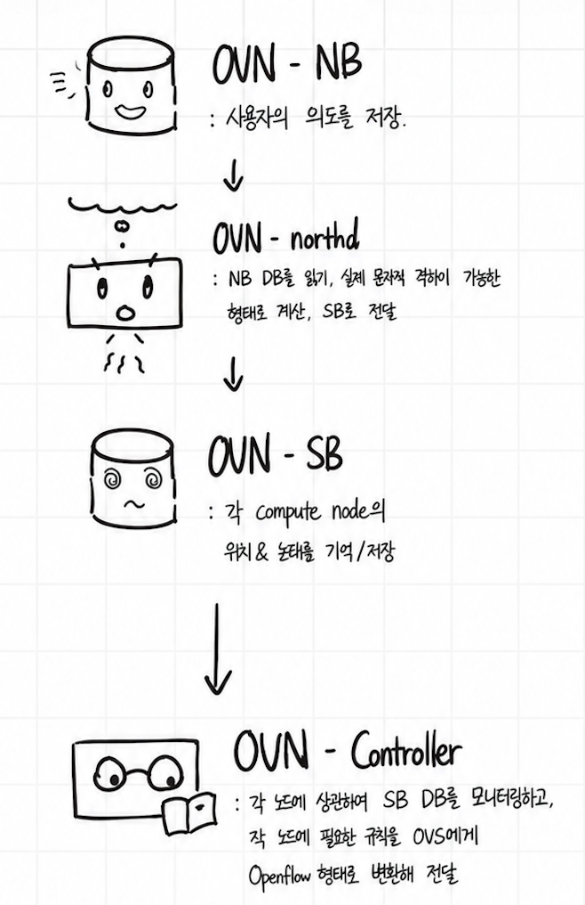

# [6-5-0] 여는 글

Openstack에서는 네트워크를 제공하는 Neutron 컴포넌트가 있습니다.

Neutron은 웹 상에서 제어를 용이하게 하기 위한 API 엔드포인트에 불과하므로, 이를 지탱하는 백엔드 서비스로 OVS, OVN 등 여러 선택지를 제공하여 여러 가상화 백엔드를 연결할 수 있도록 지원합니다.

본 문서에서는 이 백엔드 level에 주목하여 OVS와 OVN의 기술적 바탕을 알아보고, 각각을 Openstack 연동 시 어떤 차이가 있는지 알아봅니다.

# [6-5-1] OVS의 문제점

OVN을 소개하기에 앞서, OVS가 가지고 있는 문제점들에 대해 정리해 볼 필요가 있습니다.

[이전문서]()에서 언급된 바와 같이, OVS는 가상 스위치를 만들어주는 오픈소스 소프트웨어로, OpenStack에서는 KVM 등을 통해 생성된 가상머신들을 연결하는 가상 네트워크를 구축하기위한 용도로 사용됩니다.

HW 스위치처럼 동작하지만 SW로 구현되어있어 수정 등에 용이하고, 상대적으로 환경구성이 간편(?)해 많이 사용되지만,
아래와 같은 문제점들을 가집니다:

- 라우팅, NAT, DHCP 서비스가 모두 Network Node에 몰려있습니다
  
  => Network Node가 전체 클라우드 인프라의 병목지점이 됩니다
  
  => 적절한 조치가 없다면, 장애가 발생하는 경우 단일 실패 지점 (SPOF)이 됩니다
  
  => 분산라우팅을 할 수 있도록 설정할 수 있지만, 그 방법이 매우 복잡하고 불안정합니다

- 네트워크를 제어하기 위해, Neutron이 여러 Python 프로세스에 명령을 하달해야 합니다
  
  => 요청이 한 곳에서라도 꼬이면 전체 네트워크에 장애가 발생합니다 (특히 라우팅)
  
  => 대규모 클러스터에서는 이 메세지가 이동하는 메시지큐에 부하가 가중됩니다

- OVS를 단독으로 사용 시 여러 네트워크 서비스들을 외부서비스들에 의존해야 합니다
  
  => L3나 DHCP의 처리를 위해 별도 프로세스가 필요합니다
  
  => 특히 '보안그룹'을 구성 시 Linux Bridge를 통해 패킷이 통하도록 설계되어 CPU 부하가 발생합니다

# [6-5-2] OVN의 등장: '두뇌'와 '근육'의 분리

OVN(Open Virtual Network)은 이러한 위 문제들을 해결할 수 있도록 하기 위해 고안된 OVS 프로젝트의 공식 서브 프로젝트입니다. 

OVS가 단순히 개별 호스트에서 작동하는 가상 스위치라면, OVN은 가상 스위치에 들어가는 설정들을 중앙에서 관리해 그 효율성을 높여주는 역할을 합니다.

기존 OVS가 Neutron으로부터 명령을 바로 전달받던 방식과 달리, OVN은 상태 정보와 설정 정보를 DB에 저장하고, 이를 Controller가 계속 관찰하도록 해 '필요한 정보만 가져가는' 방식을 취합니다:

- **Northbound DB (NB):** CMS(OpenStack 등)로부터 요청받은 논리적인 네트워크 설정(논리 스위치, 라우터, 방화벽 등)을 저장합니다.

- **ovn-northd:** NB DB에 저장된 고수준의 논리 설정을 SB DB가 이해할 수 있는 저수준의 논리 흐름(Logical Flow)으로 변환하는 번역기 역할을 합니다.

- **Southbound DB (SB):** 실제 섀시(Chassis, 각 서버)의 위치 정보와 바인딩된 포트 정보, 논리적 흐름 정보를 담고 있습니다.

- **OVN-Controller:** 각 Compute Node(컴퓨트 노드)에서 실행되는 에이전트입니다. SB DB를 실시간으로 감시하다가 **내 서버와 관련된 변경 사항만** OVS에게 전달하여 노드에 흐름을 적용합니다.

# [6-5-3] OVN이 문제를 해결하는 방식

OVN을 도입하면 위에서 언급한 기존 OVS환경에서의 문제들이 아래와 같이 해결됩니다:

- **1. 분산 라우팅 (DVR) 및 분산 서비스의 기본화**
  - 기존에는 모든 트래픽이 Network Node를 거쳐야 했으나, OVN은 **분산 라우팅(Distributed Routing)**을 기본으로 제공합니다.
  - L3 라우팅과 NAT 처리가 각 컴퓨트 노드에서 직접 수행되므로, 네트워크 노드의 병목 현상이 사라지고 가용성이 비약적으로 상승합니다.

- **2. 가벼워진 프로세스와 "Native" 서비스**
  - OVN은 논리적 흐름(Flow) 자체에서 DHCP 응답이나 ARP 응답을 처리하는 **Native DHCP/L3** 방식을 사용합니다. 
  - 덕분에 컴퓨트 노드의 리소스 소모가 줄어듭니다.

- **3. 리눅스 브릿지의 제거 (Performance)**
  - OVN은 OVS의 **Conntrack(연결 추적)** 기능을 직접 활용하여 보안그룹을 구현하므로, 리눅스 브릿지를 걷어내고 패킷 경로를 단순화하여 성능을 최적화합니다.

# [6-5-4] OpenStack Neutron과의 연동

OpenStack에서 OVN을 백엔드로 선택하면, Neutron은 더 이상 직접 에이전트들과 통신하지 않습니다. 대신 `networking-ovn` 드라이버를 통해 **OVN Northbound DB에 설정값을 기록**하기만 하면 됩니다. 

| 비교 항목 | Legacy OVS (ML2/OVS) | OVN (ML2/OVN) |
| :--- | :--- | :--- |
| 중앙 집중형 서비스 | Network Node (SPOF 위험) | 없음 (완전 분산) |
| 에이전트 통신 | RabbitMQ (메시지 큐) | OVSDB 프로토콜 |
| DHCP 처리 | 별도 dnsmasq 프로세스 | OVN 내부 논리 Flow 처리 |
| 보안 그룹 | 리눅스 브릿지 사용 (Iptables) | OVS Conntrack 직접 사용 |
| 복잡도 | 노드별 네임스페이스 관리 복잡 | DB 기반 자동 동기화로 단순화 |

