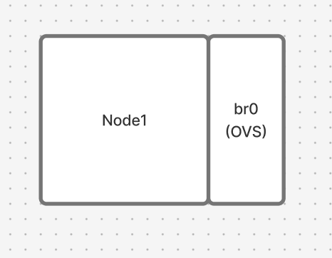
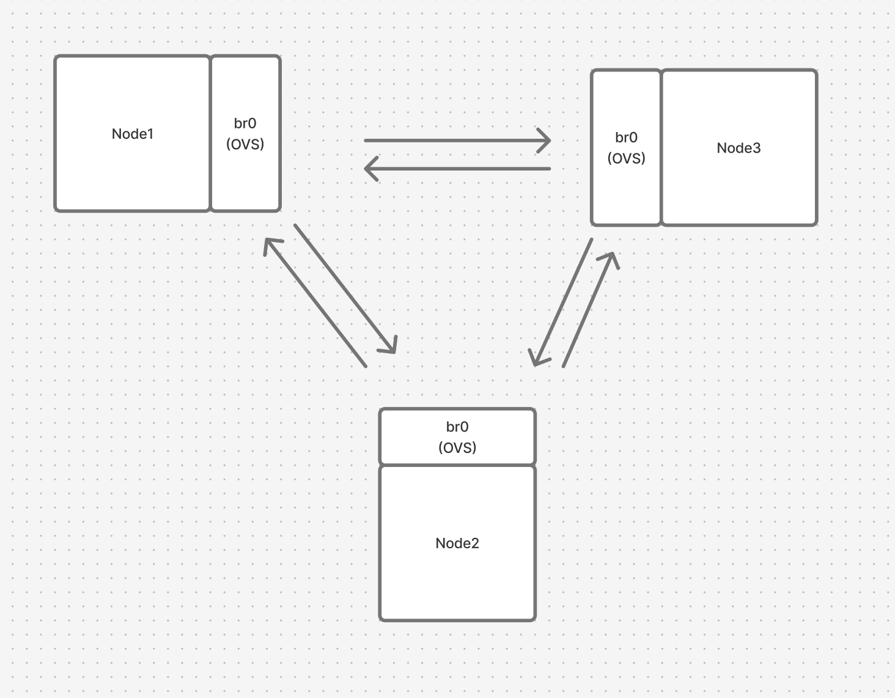
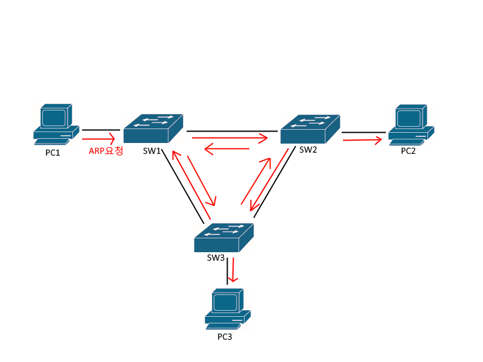
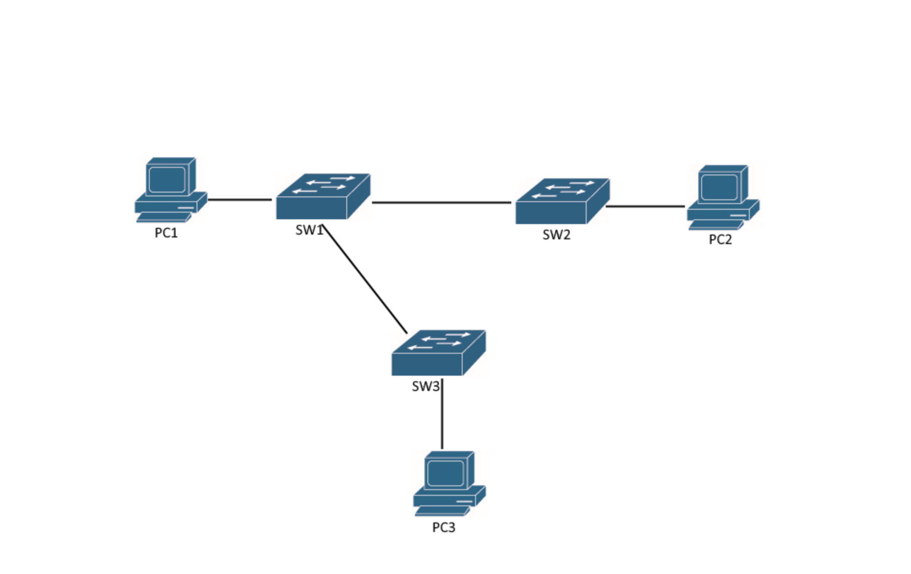
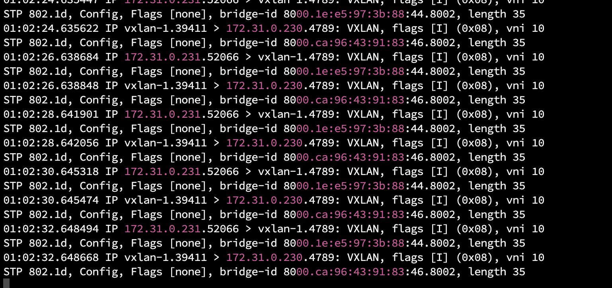
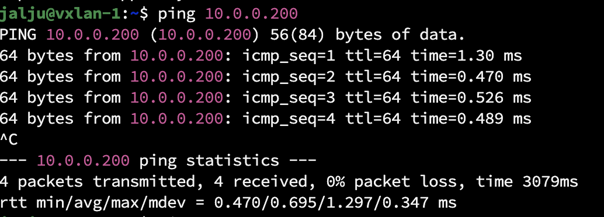
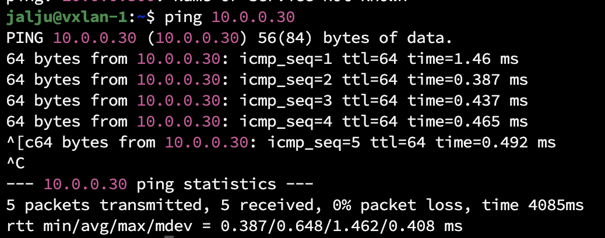
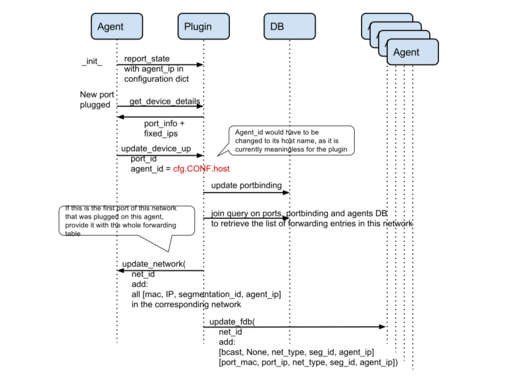
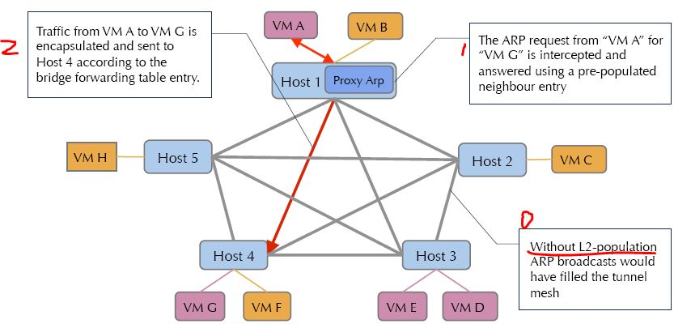
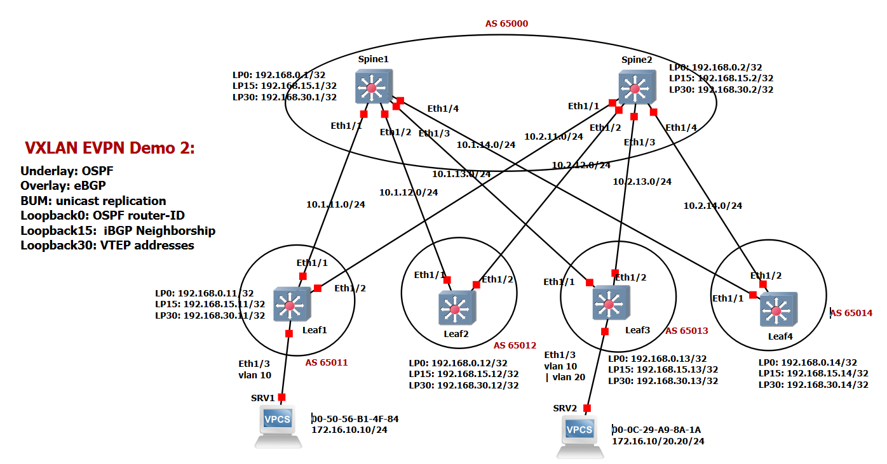

# [6-15-1] 요구사항

- VM 세 개를 만들어서 각각 가상 NIC를 100,200,300으로 만들어서 OVS를 설치하고 host에서 ping으로
    - 가상 네트워크에다가 ping이 가도록.
    - 가상 NIC끼리 서로 통신이 되도록 만드는 것.

⇒ OVS로 VPN 서비스를 만든다(VXLAN으로).

**VM 3개를 만들고 OVS와 VXLAN으로 VPN 같은 가상 네트워크를 만들어 보기**

# [6-15-2] 구축

```bash
sudo apt update
sudo apt install -y openvswitch-switch

sudo systemctl status openvswitch-switch
```

각 노드마다 아래의 명령어를 실행해줍니다.



```bash
sudo ovs-vsctl add-br br0
```

`br0`라는 이름의 가상 브릿지(가상 스위치)를 하나 만듭니다.

```bash
sudo ip addr add 10.0.0.100/24 dev br0
```

생성한 가상 스위치(`br0`) 자체에 `10.0.0.100`이라는 관리용 IP 주소를 부여합니다.

```bash
sudo ip link set br0 up
```

가상 스위치(`br0`)를 활성화(ON) 상태로 바꿉니다. 

```bash
sudo ovs-vsctl add-port br0 vx-vm2 -- set interface vx-vm2 type=vxlan options:remote_ip=172.31.0.230 options:key=10
sudo ovs-vsctl add-port br0 vx-vm3 -- set interface vx-vm3 type=vxlan options:remote_ip=172.31.0.231 options:key=10
```

물리적으로 떨어져 있는 호스트들을 가상의 터널로 잇는 과정입니다.

- **`add-port br0 vx-vm2`**: `br0` 스위치에 `vx-vm2`라는 가상의 포트(구멍)를 하나 뚫습니다.
- **`type=vxlan`**: 이 포트에 꽂을 케이블의 종류를 **VXLAN**이라는 가상 터널 기술로 지정합니다.

**`options:remote_ip=172.31.0.230`**

- 이 터널 케이블의 반대쪽 끝이 연결된 **물리적인 상대방 주소**입니다.
- 실제 연결하고자 하는 노드의 IP를 의미합니다.

**`options:key=10`**

- VXLAN의 **VNI(Virtual Network Identifier)** 값입니다.
- 일종의 '채널 번호'입니다. 상대방과 내가 똑같이 `key=10`으로 맞춰야만 같은 네트워크로 인식합니다. 만약 다른 팀이 `key=20`을 쓰고 있다면, 같은 선을 공유하더라도 서로 데이터를 볼 수 없습니다

위와 같이 구성을 진행하시면 아래 그림처럼 연결됩니다.

- Full Mesh 구조입니다



# [6-15-3] 트러블 슈팅

위의 구조에서 Node1 → Node2로 설정한 IP인 10.0.0.200/24로 핑을 날렸을 때 문제가 발생했습니다.

방화벽이나 네트워크 설정이 의도한 대로 이미 잘 되어 있는 것을 확인했고, 그럼에도 되지 않아 네트워크를 구성할 때부터 문제가 생겼음을 알 수 있었습니다.

다음 명령어를 통해 어떤 문제가 발생했는지를 살펴봅니다.

```bash
sudo tcpdump -i ens18 udp port 4789
```

- VXLAN에서는 4789 포트에서 터널링을 위한 처리가 이뤄지고 UDP로 감싸진 채로 처리됩니다.

다음과 같이 ARP Flood가 일어나고 있음을 볼 수 있었습니다

```bash
ARP, Reply vxlan-2 is-at 5a:49:50:c8:7d:4f (oui Unknown), length 28

23:51:51.818049 IP 172.31.0.229.40188 > vxlan-2.4789: VXLAN, flags [I] (0x08), vni 10

ARP, Reply vxlan-2 is-at 5a:49:50:c8:7d:4f (oui Unknown), length 28

23:51:51.818049 IP 172.31.0.229.40188 > vxlan-2.4789: VXLAN, flags [I] (0x08), vni 10

ARP, Reply vxlan-2 is-at 5a:49:50:c8:7d:4f (oui Unknown), length 28

23:51:51.818049 IP 172.31.0.229.40188 > vxlan-2.4789: VXLAN, flags [I] (0x08), vni 10

ARP, Reply vxlan-2 is-at 5a:49:50:c8:7d:4f (oui Unknown), length 28

23:51:51.818068 IP 172.31.0.229.40188 > vxlan-2.4789: VXLAN, flags [I] (0x08), vni 10

ARP, Reply vxlan-2 is-at 5a:49:50:c8:7d:4f (oui Unknown), length 28
```

ARP Flood가 왜 일어날까요?



1. VM-A가 동일한 VNI(VXLAN Network Identifier)에 있는 VM-B와 통신하고 싶어 합니다. 하지만 VM-B의 MAC 주소를 모르기 때문에 **ARP Request**를 보냅니다.
2. ARP Request는 브로드캐스트 패킷입니다. VXLAN에서 브로드캐스트, 멀티캐스트, 알 수 없는 유니캐스트(BUM)는 모든 목적지에 전달되어야 합니다.
3. Full-mesh 구조에서 특정 VTEP은 자신이 알고 있는 모든 상대방 VTEP(Peer) 목록을 가지고 있습니다.
- 브로드캐스트 패킷이 들어오면, VTEP은 이 패킷을 **복제**하여 리스트에 있는 **모든 VTEP에게 유니캐스트로 쏩니다.**
- 참여하는 VTEP 노드가 많아질수록 단 하나의 ARP 요청이 수많은 복제 패킷을 만들어 네트워크 전체에 뿌려지게 됩니다. → Flood가 발생합니다

```bash
sudo ovs-vsctl set bridge br0 stp_enable=true
```

이를 해결하기 위해서 stp 설정을 각 노드에서 진행해줍니다.

- **`stp_enable=true`**는 **Spanning Tree Protocol을 활성화**하겠다는 뜻입니다.

**Spanning Tree Protocol는 뭘까요?**



- STP의 역할은 루프 방지입니다. 네트워크에 경로가 여러 개 있을 때, 패킷이 한 방향으로 가지 않고 뱅글뱅글 도는 '루프' 현상이 발생하면 네트워크는 즉시 마비됩니다.
- STP는 이 루프를 감지해서 특정 경로를 논리적으로 차단(Blocking)했다가, 주 경로가 끊기면 다시 여는 역할을 합니다.
    - STP가 동작하면 위와 같이 물리적으로 루프 구조인 네트워크에서 특정 포트를 차단 상태로 바꾸어 논리적으로 루프가 발생하지 않게 됩니다.

설정 후 들어오는 트래픽에 대해서도 확인해 보면 VNI 10으로 설정한 경우 정상적으로 오고 갑니다.

```bash
sudo tcpdump -i ens18 udp port 4789
```







잘 보내집니다.

# [6-15-4] 생각해볼 부분들

**stp 말고는 ARP Flood를 막을 수 있는 방법이 없는가?**

- stp는 BPDUs 패킷을 주고받아 루프를 감지하고 특정 포트를 **물리적으로 차단하는 방식이므로 대역폭을 낭비할 수 있고, 장애 시 재계산 시간 필요합니다.**

→ OVS Group Table (all type)로 처리도 가능

- 트래픽을 복제할 대상을 미리 정해두고, **논리적으로 지정된 곳으로만 전송합니다**
- Group Table은 애초에 **'들어온 포트로 다시 나가지 않게'** 하거나 **'허가된 터널로만 나가게'** 설계하므로 논리적인 루프 자체가 발생하지 않도록 제어합니다.

**full mesh를 기반으로해서 구현하는 것이 올바른가?**

작은 규모라면 상관 없지만, 규모가 커지면 관리가 어려운 것이 사실입니다

그래서 Full-mesh의 flooding 오버헤드를 피하기 위해 L2Pop과 EVPN-VXLAN 같은 컨트롤 플레인 기반 방식도 쓴다고 합니다.

## L2 Population (L2Pop)





- Neutron ML2 플러그인 + OVS에서 쓰는 메커니즘 드라이버로, 중앙 Neutron 서버가 VM의 MAC/IP 위치를 모든 노드에 RPC로 미리 푸시합니다.
- BUM(Broadcast/Unknown/Multicast) 트래픽을 **unicast source replication**으로 바꿔 전체 flooding 대신 "대상 노드 하나로만" 패킷 전송.
- ARP responder도 추가해 로컬에서 ARP reply 생성, 브로드캐스트를 아예 막음. OVS flow 테이블에 prepopulate.

## EVPN-VXLAN (BGP EVPN)



- BGP EVPN 컨트롤 플레인으로 VTEP(Leaf 스위치 등) 간 MAC/IP 정보를 자동 동기화합니다. Type-2 route로 엔드포인트 학습합니다.
- **ARP Suppression**: VTEP이 이미 BGP에서 알던 MAC/IP로 ARP request를 로컬 proxy reply. Flooding 최소화.
- Scale-out 강점: 노드 추가 시 BGP가 자동 피어링·라우팅 업데이트. 멀티테넌트 VNI별 관리 쉬움.

라고 설명하는데, 개념이 다소 어렵게 느껴질 수 있습니다. 아래 내용은 제미나이에게 질의하여 보다 이해하기 쉽게 정리한 예시입니다.

VM-B가 `VTEP-2`에 생성되자마자, `VTEP-2`는 중앙 전산소인 **RR**에게 이 소식을 알립니다.

```yaml
[ VM-B (10.0.1.2) ] ----> [ VTEP-2 ] ----------------> [ BGP RR (전산소) ]
      (이사 완료)         (우체국2)    "신규 입주 신고!"      (정보 수집)
                                     (BGP Update)
```

- **VTEP-2의 메시지:** "전산소님, 제 아래에 IP `10.0.1.2`, MAC `BB:BB`를 가진 VM-B가 들어왔습니다!"

중앙 전산소(RR)는 받은 정보를 데이터베이스에 저장하고, 자신에게 연결된 모든 Client(우체국들)에게 이 정보를 **반사(Reflection)**합니다.

```yaml
		 [ BGP RR (전산소) ]
          /      |       \
 (반사)  /        |        \  (반사)
       v         v          v
  [ VTEP-1 ]  [ VTEP-2 ]  [ VTEP-3 ]`
```

- **RR의 방송:** "모두 주목! 이제부터 `10.0.1.2`로 가는 편지는 `VTEP-2`(우체국2)로 보내면 된다. 다들 자기 수첩에 적어놔!"
- **결과:** 모든 VTEP은 통신이 시작되기도 전에 **VM-B의 위치를 이미 알게 됩니다.** (Control Plane Learning)

이제 VM-A가 VM-B에게 처음으로 데이터를 보냅니다. 예전 같으면 "누가 VM-B야?"라고 소리를 질렀겠지만, 이제는 다릅니다.

```yaml
1. [ VM-A ] ----> "10.0.1.2(VM-B) 누구야?" (ARP Request) ----> [ VTEP-1 ]

2. [ VTEP-1 ] (수첩 확인): 
   "잠깐, 소리 지를 필요 없어! 전산소에서 아까 말해줬지. 
    10.0.1.2는 우체국2(VTEP-2)에 있고, MAC은 BB:BB야." [ARP Suppression]

3. [ VTEP-1 ] ---- (VXLAN 터널) ----> [ VTEP-2 ] ----> [ VM-B ]
```

- **VTEP-1**은 ARP 요청을 네트워크 전체에 뿌리지(Flood) 않고, 자기가 알고 있는 정보로 VM-A에게 바로 답장해 줍니다.
- 데이터 패킷은 정확히 **VTEP-2로만 1:1 유니캐스트**로 전달됩니다.

**즉 두 가지 방식 모두 하나의 큰 소프트웨어를 두고,
특정 VTEP이 생성됐을 때 이를 감지하고 이 VTEP에 대한 네트워크 정보를 나눠 주는 주체를 두어 처리한다는 점이 동일한 것 같습니다.**

- **"중앙에서 정보를 관리하고 배포하는 주체"**를 둬서, 전통적인 이더넷의 **"소문내서 찾기(Flood & Learn)"** 방식을 **"미리 알고 알려주기(Push & Direct)"** 방식으로 변경

# 참조

[STP(Spanning Tree Protocol) 기본 개념과 사용 이유 정리 글](https://kujung.tistory.com/entry/STP%EC%8A%A4%ED%8C%A8%EB%8B%9D-%ED%8A%B8%EB%A6%AC-%ED%94%84%EB%A1%9C%ED%86%A0%EC%BD%9C%EC%9D%98-%EA%B8%B0%EB%B3%B8-%EA%B0%9C%EB%85%90%EA%B3%BC-%EC%82%AC%EC%9A%A9-%EC%9D%B4%EC%9C%A0#google_vignette)

[OVS/VXLAN 및 STP 관련 추가 설명 블로그 글](https://blog.innern.net/40)