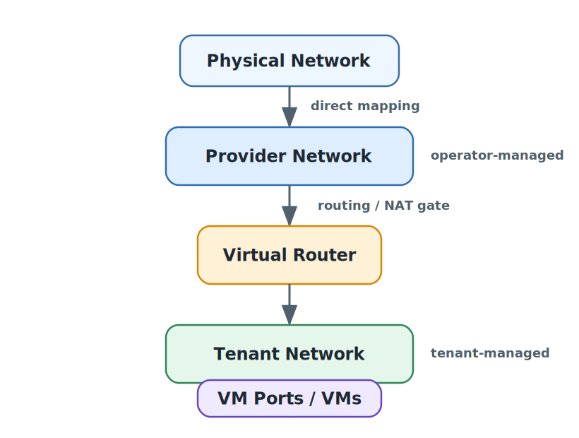
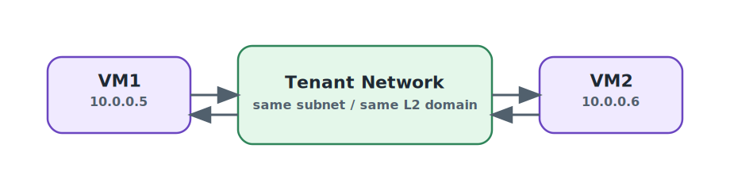
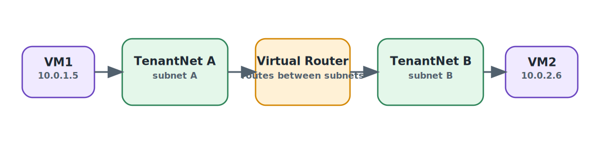
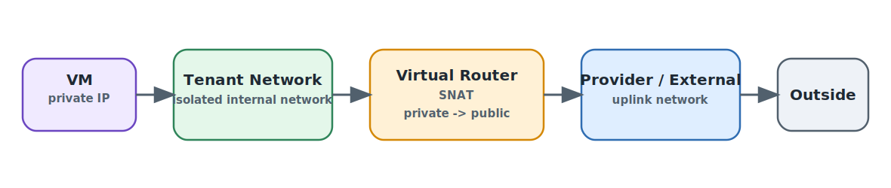
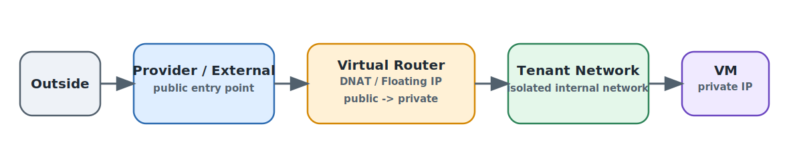

# [6-2-1] 해당 개념들이 생기게 된 이유

클라우드는 보통 **여러 사용자(테넌트)**가 **같은 물리 인프라(서버/스위치/회선)**를 공유합니다. 이때 네트워크에서 동시에 만족해야 하는 요구가 두 가지입니다.

1. **운영자 관점(Provider)**
    - 데이터센터 물리 네트워크(스위치/라우터/사내망/인터넷)와 안전하게 연결
    - 장애/보안/성능/정책을 중앙에서 통제
2. **사용자 관점(Tenant)**
    - 각 팀/프로젝트가 VM들을 위해 네트워크를 “스스로” 만들고 지울 수 있어야 함
    - 다른 팀/프로젝트와 트래픽이 섞이면 안 됨(격리)

이 두 요구를 깔끔하게 분리한 결과가 보통:

- **Provider network** = “운영자가 물리망과 연결해둔 기반 네트워크”
- **Tenant network** = “테넌트가 VM용으로 만드는 격리된 논리 네트워크”

입니다.

# [6-2-2] Provider Network란?

### 정의(핵심)

**Provider network**는 보통 “클라우드 네트워크가 물리 네트워크와 만나는 지점”에 있는 네트워크입니다.

즉, **물리 스위치/라우터의 특정 네트워크(VLAN 등)와 직접 매핑**되거나, 최소한 강하게 연결됩니다.

### 누가 만들고 관리하나

- 대부분 환경에서 **운영자(Admin)**가 생성/관리
- 이유: 물리망 연결은 잘못 건드리면 전체 장애/보안 이슈로 직결

### 어떤 형태가 흔한가(대표)

환경에 따라 다르지만, 전형적인 분류는 이런 느낌입니다.

- **Flat(untagged)**: VLAN 태그 없이 특정 물리 네트워크에 바로 붙는 형태
- **VLAN 기반**: 물리 스위치에서 VLAN으로 분리된 네트워크에 매핑

(※ OpenStack Neutron에선 provider network가 `flat` 또는 `vlan`로 많이 구성됩니다.)

### 주 역할

- **외부망(External)** 제공: 인터넷/사내망 등 “클라우드 밖”으로 나가는 출구/입구 역할
- 데이터센터 내부의 특정 물리망(예: 관리망, 스토리지망, DMZ망 등)과 연결되는 통로 역할

# [6-2-3] Tenant Network란?

### 정의(핵심)

**Tenant network**는 테넌트(프로젝트/사용자)가 VM들을 붙이기 위해 만드는 네트워크입니다.

특징은 **다른 테넌트와 논리적으로 격리**된다는 점입니다.

### 누가 만들고 관리하나

- 보통 **테넌트(프로젝트 사용자)**가 직접 생성(Self-service)
- 네트워크/서브넷/라우터를 UI/CLI로 만들고 VM을 붙이는 형태

### 격리는 어떻게 하냐(개념 수준)

테넌트 네트워크는 물리 케이블을 새로 까는 게 아니라, **가상화 계층에서 분리**합니다. 대표적으로:

- **오버레이(Overlay)**: VXLAN/Geneve/GRE 같은 캡슐화로 논리 네트워크를 분리

    → 여러 테넌트가 같은 물리망을 공유해도 “논리적으로 서로 다른 L2”처럼 보이게 함

### 주요 특징

- 테넌트 간 **트래픽 분리**가 기본값
- 서로 다른 테넌트가 **같은 IP 대역**(예: 둘 다 10.0.0.0/24)을 써도 공존 가능(격리되어 있으니까)
- 외부 연결은 기본적으로 바로 열려 있지 않습니다

    → 라우터/NAT/보안그룹 등을 통해 열어야 외부 통신이 됩니다

# [6-2-4] 전체 레이어

# [6-2-5] 트래픽 흐름 3가지로 이해하기

## 테넌트 내부 통신(East-West)

같은 tenant network에 붙은 VM끼리는 그냥 L2/L3로 통신합니다.

다른 tenant network라면(서브넷이 다르면) 라우터가 필요합니다.

---

## VM이 외부로 나감(Egress, 보통 SNAT)

많은 클라우드에서 기본은:

- VM은 사설 IP
- 외부로 나갈 때 라우터가 **SNAT**를 수행

---

## 외부에서 VM으로 들어옴(Ingress, 보통 DNAT/매핑 필요)

기본적으로 tenant network는 외부에서 바로 접근이 안 됩니다. 들어오려면 보통:

- **Floating IP(공인 IP를 VM에 매핑)** 또는
- 포트포워딩 같은 DNAT 설정
- 보안그룹/방화벽 허용

이런 “열어주는 작업”이 필요합니다.

---

# [6-2-6] Provider vs Tenant 차이 정리

| 구분 | Provider Network | Tenant Network |
| --- | --- | --- |
| 주 사용자 | 운영자(Admin) | 테넌트(프로젝트/사용자) |
| 목적 | 물리망/외부망과 연결되는 기반 제공 | VM용 내부망 제공, 테넌트 간 격리 |
| 물리망과 관계 | 직접 매핑/연결(Flat/VLAN 등) | 논리망(오버레이 등으로 분리)인 경우가 많음 |
| IP 성격 | 공인/사내 대역 등 “외부에 의미 있는” 대역일 수 있음 | 보통 사설 IP 대역(중복 가능) |
| 외부 접근성 | 외부망 역할이면 접근성 높음(정책에 따름) | 기본은 외부에서 직접 접근 어려움 |
| 성능/MTU 이슈 | 상대적으로 단순(캡슐화 없음) | 오버레이면 캡슐화 오버헤드/MTU 고려 필요 |
| 운영 리스크 | 잘못 설정하면 전체 장애/보안 영향 큼 | 특정 프로젝트 범위 영향이 대부분 |

---

# [6-2-7] 흔한 오해 정리

- **“Provider network = 무조건 인터넷망”**

    → 외부망일 수도 있고, 데이터센터 내부의 특정 물리망(VLAN)일 수도 있습니다

- **“Tenant network = 무조건 완전 내부만”**

    → 기본은 내부로 쓰지만, 라우터/NAT/Floating IP 등으로 외부와 연결 가능합니다

- **“Tenant network는 물리적으로 따로 깔린 네트워크”**

    → 보통은 물리적으로 새로 까는 게 아니라, **논리적으로 분리**하는 방식(오버레이/VLAN 등) 입니다

---

# [6-2-8] 결론

- **Provider network**: 운영자가 **물리망/외부망과 연결해 둔 기반 네트워크**
- **Tenant network**: 테넌트가 **VM을 붙이고 서비스 구성하려고 만드는 격리된 논리 네트워크**

# 참조

[# OpenStack OVN provider network 아키텍처를 설명하는 공식 관리자 문서](https://docs.openstack.org/neutron/2024.2/admin/ovn/refarch/provider-networks.html)

[# OpenStack self-service network와 라우터 연결 흐름을 설명하는 공식 설치 가이드](https://docs.openstack.org/install-guide/launch-instance-networks-selfservice.html)
