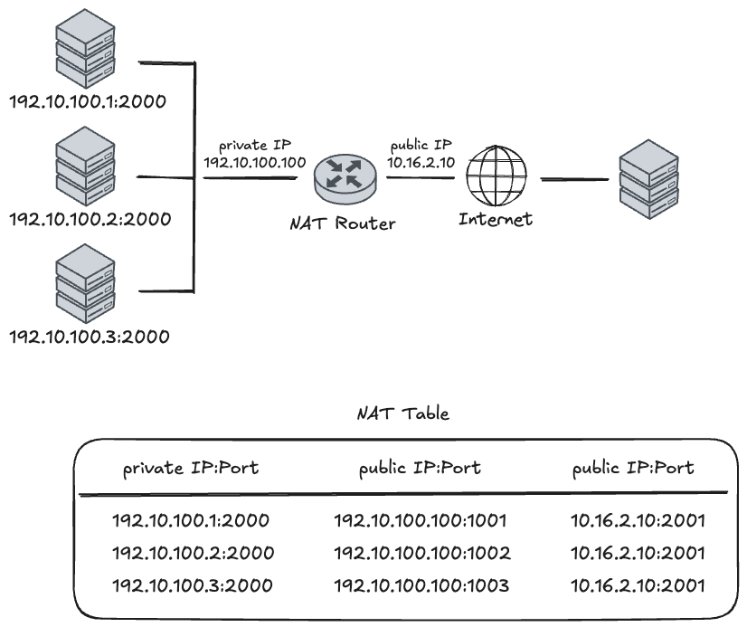
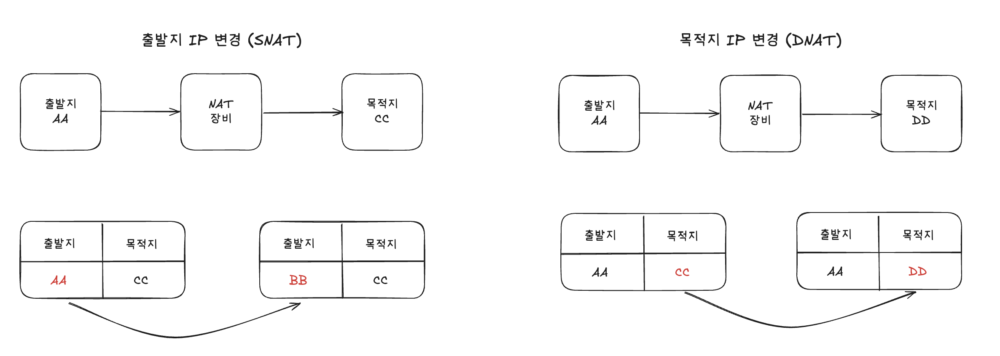

# SNAT, DNAT 개념

작성시간 - origin: 2026년 1월 19일 오후 4:20
작성시간 - 속성수정: 2026년 1월 19일 오후 4:20 (GMT+9)

일단 SNAT, DNAT를 설명하기 전에 NAT에 대해서 먼저 설명하겠습니다.

**NAT은 “여러 사설 IP를 적은 수(또는 한 개)의 공인 IP로 바꿔서 외부와 통신하게 해 주는 주소 변환 장치/기능”입니다.**

## **NAT가 왜 생겼는지**

원래 IP 주소는 전 세계에서 고유해야 하는데, 인터넷 사용자가 폭발적으로 늘면서 IPv4 주소가 모자라기 시작했습니다.

동시에:

- 내부 망 구조를 자주 바꾸더라도, 외부에 보이는 주소 체계는 그대로 두고 싶고
- 내부 IP를 외부에 노출하고 싶지 않은(프라이버시·보안 측면) 요구도 있었습니다.

그래서 내부에서는 마음대로 쓸 수 있는 사설 IP(예: 10.x.x.x, 192.168.x.x)를 쓰고, 외부와 통신할 때만 **NAT 장비가 사설 IP ↔ 공인 IP로 바꿔주는** 구조가 등장했습니다.

## **NAT의 기본 동작 개념**

NAT는 일반적으로 **경계 라우터**(회사/집 안과 인터넷 사이)에 위치합니다.

1. 내부 호스트에서 인터넷으로 패킷을 보냄 (출발지 = 사설 IP).
2. NAT 라우터가 패킷을 보고, 출발지 IP(그리고 필요하면 포트)를 **공인 IP(그리고 새 포트)**로 바꿉니다.
3. 외부 서버 입장에서는 “NAT 라우터의 공인 IP에서 온 트래픽”으로 보입니다.
4. 응답 패킷이 돌아오면, NAT 라우터가 미리 기억해 둔 매핑 정보를 보고 다시 사설 IP(원래 호스트/포트)로 되돌린 후 내부에 전달합니다.

이때 매핑 정보(어느 내부 IP/포트가 어느 공인 IP/포트로 나갔는지)를 세션별로 가지고 있기 때문에, NAT 장비가 고장나거나 경로가 바뀌면 세션이 끊어지기 쉽습니다.

## **두 가지 전통적인 NAT 방식**

“Traditional NAT”는 크게 두 종류입니다.

### **1. Basic NAT (주소만 변환)**

- 여러 개의 사설 IP ↔ 여러 개의 공인 IP를 1:1 또는 N:M으로 매핑
- 패킷 변환 시 **IP 주소만 바꿈** (TCP/UDP 포트는 그대로)
- 내부 호스트 수 ≤ 공인 IP 수라면, 각 내부 호스트가 공인 IP 하나씩을 “빌려 쓰는 느낌”

예:

- 내부: 10.0.0.0/16
- 외부: 198.76.29.0/24
- 10.0.1.5 → 198.76.29.7 이런 식으로 매핑

장점: 구조가 단순하고, 일부 프로토콜/애플리케이션에 덜 민감합니다

단점: 공인 IP를 여러 개 써야 해서 주소 절약 효과가 크지 않습니다

### **2. NAPT (Network Address Port Translation, 포트까지 변환)**

우리가 흔히 말하는 “NAT”라고 하면 대부분 **NAPT**을 의미합니다.

- 여러 사설 IP가 **하나의 공인 IP**를 공유
- (사설 IP, 사설 포트) → (공인 IP, 공인 포트) 튜플로 매핑
- 내부 수십 대 PC가 하나의 공인 IP로 동시에 인터넷 접속 가능



**Outbound: 사설 망에서 외부로 나갈 때**

내부 호스트들이 외부 서버로 요청을 보낼 때, NAT 라우터는 고유한 식별을 위해 **공인 IP 포트(Public Port)**를 새로 할당합니다.

- **매핑 과정**: 내부 호스트 `192.10.100.1`이 포트 `2000`으로 요청을 보내면, 라우터는 이를 공인 IP `10.16.2.10`의 포트 `1001`로 변환하여 기록합니다.
- **튜플(Tuple) 생성**: 테이블에는 `(사설 IP:포트) ↔ (공인 IP:변환 포트)` 쌍이 생성되며, 이를 통해 하나의 공인 IP로 수많은 내부 장치를 구분할 수 있게 됩니다.

**Inbound: 외부에서 응답이 돌아올 때**

외부 서버는 응답을 보낼 때 목적지를 NAT 라우터의 공인 IP와 변환된 포트(`10.16.2.10:2001`)로 설정합니다.

- **역추적**: NAT 라우터는 도착한 패킷의 포트 번호(`1001`)를 **NAT Table**에서 조회합니다.
- **최종 전달**: 매핑된 정보를 확인한 후, 패킷의 목적지 주소를 다시 원래의 사설 주소인 `192.10.100.1:2000`으로 되돌려 내부 호스트에게 정확히 전달합니다.

## **NAT의 장점과 한계**

**장점**

- IPv4 주소 부족을 완화 (여러 사설 IP → 적은 수의 공인 IP).
- 내부 주소 체계 변경을 외부에 숨길 수 있어, ISP 변경·망 재구성 시에도 외부 영향 최소화.
- 어느 정도의 **프라이버시**: 외부에서는 내부 개별 호스트 주소를 알 수 없습니다.

**한계·문제점**

- **End-to-end 특성 붕괴**: IP 주소가 더 이상 “고정된 종단 식별자”가 아니게 됩니다.
    - IPSec 같은 “끝단끼리 직접 인증/암호화” 모델과 충돌.
- 디버깅/보안 추적이 어려움: 로그를 NAT 매핑과 함께 봐야 “어느 내부 호스트”인지 알 수 있습니다.
- 세션 상태(state)를 NAT가 들고 있어서,
    - NAT 장비가 죽거나
    - 세션이 다른 NAT로 우회되면 → 기존 연결이 깨집니다
- 일부 프로토콜은 추가 장치(ALG) 없이는 잘 안 돌아가거나, 아예 설계상 NAT-unfriendly.

## **5. 실제 어디서 쓰이는지**

- 집 공유기, 카페·회사 AP: 거의 전부 NAPT 방식 NAT
- 기업 경계 라우터: 사설망(10.x, 192.168.x) ↔ 인터넷 사이의 주소 변환
- IDC/클라우드 내부: 특정 세그먼트 간, 또는 DMZ 구성 시도 NAT를 사용하기도 함

정리하면, **NAT = 내부 사설 주소 체계를 외부에서 가리고, 부족한 IPv4 주소를 아끼기 위해 경계에서 IP(그리고 포트)만 바꿔 주는 중간 통역 장치**라고 보면 됩니다.

---

SNAT과 DNAT은 “어느 주소를 바꾸느냐”와 “언제/어디에서 바꾸느냐”가 핵심입니다.



## **SNAT (Source NAT)**

SNAT은 **패킷의 출발지(소스) 주소를 바꾸는 것**입니다.

- 언제/어디서: ‎`POSTROUTING` 체인에서, 패킷이 나가기 직전에 수행됩니다.
그래서 라우팅·필터링 같은 건 모두 원래 주소를 보고 처리한 뒤, 마지막에 주소만 갈아끼웁니다.
- 용도: 사설 IP 여러 대가 하나의 공인 IP로 인터넷에 나갈 때 등,
“내가 누구인 척 할지(출발 IP)”를 바꿔야 할 때 사용합니다.
- iptables 예시 (2.4 기준):
    - ‎`-t nat -A POSTROUTING -o eth0 -j SNAT --to 1.2.3.4`
- Masquerade:
    - 동적 IP(ADSL, PPPoE, 일반 모뎀 등)에서 쓰는 SNAT의 특수 버전.
    - ‎`--to-source`에 IP를 안 적고, **나가는 인터페이스의 IP**를 자동으로 사용.
    - 연결이 끊겼다가 새 IP로 다시 붙을 때, 기존 연결들을 정리해 줘서 깔끔함.
    - 예: ‎`-j MASQUERADE`

요약하면, SNAT = “**밖으로 나갈 때 내 IP(소스)를 뭘로 보이게 할까?**”를 설정하는 것.

## **DNAT (Destination NAT)**

DNAT은 **패킷의 목적지(데스티네이션) 주소를 바꾸는 것**입니다.

- 언제/어디서: ‎`PREROUTING` 체인에서, 패킷이 들어오자마자 수행됩니다.
그래서 이후 라우팅·필터링은 이미 바뀐 목적지 기준으로 동작합니다.
- 용도: 포트 포워딩, 로드 밸런싱, 내부 서버로 트래픽 보내기 등
“이 패킷이 실제로 어디로 가야 할지(목적지 IP/포트)”를 바꿀 때 사용합니다.
- iptables 예시:
    - ‎`-t nat -A PREROUTING -i eth0 -j DNAT --to 5.6.7.8`
    - 웹 트래픽 포트 변경: ‎`--dport 80 ... -j DNAT --to 5.6.7.8:8080`
- REDIRECT:
    - DNAT의 특수 버전으로, **들어온 인터페이스 자신의 주소**로 보내는 편의 기능.
    - 로컬의 프록시(예: squid)로 투명 프록시 구성할 때 사용.
    - 예: ‎`-j REDIRECT --to-port 3128`

요약하면, DNAT = “**들어오는 패킷을 실제로 어디 서버로 보낼까? (목적지 변경)**”를 정하는 것.

정리 한 줄로 말하면,

- SNAT: 나갈 때 “**누가 보낸 것처럼 보이게 할지**” (Source, POSTROUTING)
- DNAT: 들어올 때 “**어디로 보내 줄지**” (Destination, PREROUTING)

---

위의 NAT 관련 글을 읽다 보면 자연스럽게 이런 의문이 들 수 있습니다.

> “그러면 **실제로 주소를 바꾸는 건 누가 하는 거지?**
 IP/포트를 바꾸려면, 이 트래픽이 **어디에서 와서 어디로 가는지**에 대한 정보가 있어야 할 텐데, 이런 정보는 어디에 저장되어 있을까?”
> 

# **conntrack**

리눅스 커널에서는 이 정보를 **conntrack(커넥션 트래킹)** 이라는 모듈을 통해 관리합니다.

조금 더 정확히 말하면, 리눅스에는 **Netfilter**라는 패킷 처리 프레임워크가 있고, 이 Netfilter가 커널 네트워크 경로에 여러 개의 **“훅(hook)” 지점**을 미리 심어 두고 있습니다.

### Netfilter 훅이란 무엇인가?

훅은 쉽게 말해, **패킷이 커널 네트워크 스택을 지나가는 길목에 미리 설치해 둔 “검문소”** 같은 것입니다.

패킷은 다음과 같은 순서로 커널을 통과합니다.

```
[ NIC 수신 ]
   │
   ▼
(옵션) XDP/eBPF
   │
   ▼
[ IP 계층 진입 ]
   │
   ▼
 ┌───────────────────────────────┐
 │       Netfilter 훅 지점들       │
 │  (여기에 conntrack, NAT 등이     │
 │   순서대로 매달려 있다)            │
 └───────────────────────────────┘
   │
   ▼
[ 라우팅 / 로컬 소켓 전달 ]
   │
   ▼
[ 응답 패킷 생성 후 다시 Netfilter 훅들 ]
   │
   ▼
[ NIC 송신 ]
```

Netfilter는 이 안에 대표적으로 다섯 개의 훅 지점을 제공합니다.

- `PRE_ROUTING` : 패킷이 IP 계층에 들어오자마자
- `LOCAL_IN` : 이 노드가 목적지인 패킷이 로컬 소켓으로 올라가기 직전
- `FORWARD` : 이 노드를 경유해 다른 곳으로 포워딩될 때
- `LOCAL_OUT` : 로컬 프로세스에서 나가는 패킷이 IP 계층을 통과할 때
- `POST_ROUTING` : 라우팅이 끝나고 실제로 NIC로 나가기 직전

각 훅 지점에는 여러 모듈(conntrack, NAT, iptables 등)이 **우선순위에 따라 줄지어 등록**됩니다.

예를 들어 `LOCAL_OUT` 훅은 개념적으로 다음과 같은 구조를 가집니다.

```
NF_INET_LOCAL_OUT 훅
   ├─ conntrack_in()        ← conntrack 모듈 (먼저 실행)
   ├─ nf_nat_inet_fn()      ← NAT 모듈 (그 다음 실행)
   └─ iptables(filter 등)   ← 방화벽/정책
```

즉, 커널은 “이 지점에서 등록된 핸들러들을 순서대로 호출해 줌으로써” conntrack, NAT, iptables가 개입할 수 있는 타이밍을 제공하는 역할을 합니다.

### conntrack: “연결 정보를 만들고 skb에 붙이는” 층

이제 NAT를 이해하기 위해 conntrack가 어떤 일을 하는지 조금 더 구체적으로 보겠습니다.

리눅스 커널에서 패킷 하나는 `struct sk_buff`(줄여서 `skb`)라는 구조체로 표현됩니다.

- `skb`는 실제 패킷 데이터(헤더+payload)뿐 아니라, 이 패킷과 관련된 **메타데이터**를 함께 들고 다니는 컨테이너입니다. 그 메타데이터 중 하나가 바로 “이 패킷이 어떤 conntrack 엔트리에 속하는지”를 가리키는 포인터입니다.

`PRE_ROUTING`이나 `LOCAL_OUT` 같은 훅 지점에서 **가장 먼저 호출되는 것이 `nf_conntrack_in()`**입니다. 이 함수는 개념적으로 다음과 같은 일을 합니다.

1. 패킷 헤더에서 5‑tuple(출발지 IP/포트, 목적지 IP/포트, L4 프로토콜)을 추출합니다.
2. 이 5‑tuple을 키로 해서 **conntrack 해시 테이블**을 조회합니다.
3. 이미 같은 튜플을 가진 엔트리가 있으면 그 엔트리(`struct nf_conn *ct`)를 가져오고, 없다면 새로 할당해서 초기 상태/타임아웃 등을 설정한 뒤 테이블에 등록합니다.
4. 이렇게 얻은 `ct` 포인터와 상태 정보(NEW, ESTABLISHED, RELATED 등)를 **`skb`의 메타데이터 필드에 붙여 둡니다.**

개념적으로는 다음과 같습니다.

```
[ 패킷(skb) ]
   │
   └─ nf_conntrack_in()
        ├─ 튜플 추출
        ├─ conntrack 테이블에서 ct 찾기 또는 새로 생성
        └─ skb에 ct 포인터와 상태를 저장
            (nfct / nfctinfo 필드에 연결)
```

이렇게 “붙여 둔” 덕분에, 이후에 다른 모듈(NAT 등)이 이 패킷을 처리할 때는 다시 튜플을 파싱해서 연결을 찾을 필요가 없고, `nf_ct_get(skb, &ctinfo)` 같은 헬퍼 함수로 **이미 conntrack가 만들어 놓은 `ct` 엔트리와 상태 정보를 그대로 가져다 쓸 수 있게 됩니다.**

### NAT: conntrack 정보 + 규칙을 바탕으로 실제 주소를 바꾸는 층

conntrack가 먼저 일을 끝내고 나면, 같은 훅에서 **그 다음 순서로 NAT 모듈**이 호출됩니다 (`nf_nat_inet_fn()` 등).

NAT의 동작 흐름은 다음과 같습니다.

1. `nf_ct_get(skb, &ctinfo)`를 호출해서, conntrack가 `skb`에 붙여 둔 `ct` 엔트리와 상태(NEW/ESTABLISHED/등)를 가져옵니다.
2. iptables NAT 규칙(SNAT, DNAT, Masquerade 설정)을 보고,
    
    “이 connection에 대해 어떤 형태의 NAT를 적용해야 하는지”를 결정합니다.
    
3. 이 결정 내용을 `ct`와 NAT 전용 상태에 기록해 둡니다.
    
    (예: 이 플로우는 출발지 IP/포트를 어떤 값으로 바꿔야 하는지)
    
4. 마지막으로 현재 처리 중인 `skb`의 IP/포트 헤더를 위에서 정한 매핑에 따라 **실제로 변경**합니다.

이 과정을 텍스트로 시각화하면 다음과 같은 파이프라인이 됩니다.

```
[ LOCAL_OUT 훅에 도달한 패킷 (skb) ]
   │
   ├─ conntrack_in()
   │     ├─ 튜플 추출 (src/dst IP, src/dst port, proto)
   │     ├─ conntrack 테이블에서 ct 엔트리 조회/생성
   │     └─ skb.nfct / skb.nfctinfo에 ct 포인터와 상태 기록
   │
   ├─ nf_nat_inet_fn()
   │     ├─ nf_ct_get(skb, &ctinfo)로 ct 가져오기
   │     ├─ NAT 규칙(SNAT/DNAT/masq)을 보고,
   │     │   이 connection에 대한 NAT 매핑 결정
   │     ├─ 그 매핑을 ct/NAT 상태에 저장
   │     └─ skb의 IP/포트를 매핑에 맞게 실제로 변경
   │
   └─ iptables(filter 등)로 최종 ACCEPT/DROP/LOG 등 판정
```

이후 같은 connection에 속한 패킷이 다시 들어오면:

- conntrack는 같은 튜플을 기반으로 동일한 `ct` 엔트리를 찾아 `skb`에 붙여 주고,
- NAT는 그 `ct`에 이미 저장된 NAT 매핑을 그대로 재사용함으로써,
    
    **한 connection 동안 주소 변환이 항상 일관되게 유지**되도록 합니다.
    

### 결론

이제 처음 질문으로 돌아가서, 이렇게 정리할 수 있습니다.

- 주소를 바꾸기 위해서는 “이 패킷이 어떤 연결에 속하는지”와 “그 연결에 대해 어떤 NAT 정책/매핑이 적용돼야 하는지”라는 정보가 필요합니다.
- 리눅스에서는 이 정보를 **conntrack가 튜플과 `ct` 엔트리 형태로 관리**하고, 패킷 단위로는 이 `ct` 포인터를 `skb`에 붙여서 넘깁니다.
- Netfilter 훅은 conntrack와 NAT가 이런 작업을 수행할 수 있는 타이밍을 제공하는 “검문소” 역할을 합니다.
- NAT는 바로 이 `ct` 정보와 iptables NAT 설정을 기반으로, 각 패킷의 IP/포트를 실제로 바꾸는 마지막 단계를 담당합니다.

따라서, 리눅스 커널에서 NAT의 동작 원리를 한 줄로 요약하면 다음과 같습니다.

> **“Netfilter 훅 위에서 conntrack가 먼저 ‘연결 정보를 만들고 skb에 붙여 두고’, NAT가 그 정보를 기반으로 일관된 SNAT/DNAT를 수행한다.”**
> 

---

- 세부 내용들
    
    # **Source NAT (SNAT)**
    
    연결의 소스 주소를 다른 것으로 바꾸는 작업을 **Source NAT**라고 합니다.
    
    이 작업은 패킷이 실제로 나가기 직전에 거치는 **POSTROUTING 체인**에서 수행됩니다.
    
    이 점이 중요한 이유는, 리눅스 박스 안의 다른 모든 것들(라우팅, 패킷 필터링 등)은
    
    변경되기 전의 원래 패킷을 보게 된다는 뜻이기 때문입니다.
    
    또한 이 말은 ‎`-o`(outgoing interface, 출력 인터페이스) 옵션을 사용할 수 있다는 뜻이기도 합니다.
    
    Source NAT는 ‎`-j SNAT`으로 지정하며, ‎`--to-source` 옵션으로
    
    하나의 IP 주소, IP 주소 범위, 그리고 (UDP와 TCP 프로토콜에 한해)
    
    하나의 포트 또는 포트 범위를 지정할 수 있습니다.
    
    소스 주소를 1.2.3.4로 변경:
    
    ```java
    iptables -t nat -A POSTROUTING -o eth0 -j SNAT --to 1.2.3.4
    ```
    
    소스 주소를 1.2.3.4, 1.2.3.5, 1.2.3.6 중 하나로 변경
    
    ```java
    iptables -t nat -A POSTROUTING -o eth0 -j SNAT --to 1.2.3.4-1.2.3.6
    ```
    
    소스 주소를 1.2.3.4로 하고, 포트는 1–1023 사이로 사용:
    
    ```java
    iptables -t nat -A POSTROUTING -p tcp -o eth0 -j SNAT --to 1.2.3.4:1-1023
    ```
    
    ## **Masquerading (SNAT의 특수한 형태)**
    
    Source NAT의 특수한 형태로 **masquerading(마스커레이딩)** 이라는 것이 있습니다.
    
    이 방식은 일반적인 전화 접속처럼 **동적으로 할당되는 IP 주소**에서만 사용해야 합니다
    
    (정적 IP 주소를 쓰는 경우에는 위에서 설명한 SNAT를 사용해야 합니다).
    
    Masquerading을 사용할 때는 소스 주소를 명시적으로 적을 필요가 없습니다.
    
    패킷이 나가는 인터페이스의 IP 주소를 그대로 사용합니다.
    
    더 중요한 점은, 링크가 끊어졌다가 다시 살아날 때
    
    (어차피 끊어진 연결들은 이미 무의미하므로) 그 연결들을 잊어버리기 때문에,
    
    새로운 IP 주소로 다시 접속되더라도 문제(글리치)가 줄어든다는 점입니다.
    
    ppp0 인터페이스로 나가는 모든 트래픽을 마스커레이드:
    
    ```java
    iptables -t nat -A POSTROUTING -o ppp0 -j MASQUERADE
    ```
    
    # **Destination NAT (DNAT)**
    
    Destination NAT는 패킷이 막 들어올 때, 즉 **PREROUTING 체인**에서 수행됩니다.
    
    이 말은 리눅스 박스 안의 다른 모든 것들(라우팅, 패킷 필터링 등)은
    
    패킷이 ‘진짜’ 목적지로 향하는 것처럼 보게 된다는 뜻입니다.
    
    또한 ‎`-i`(incoming interface, 입력 인터페이스) 옵션을 사용할 수 있다는 의미이기도 합니다.
    
    Destination NAT는 ‎`-j DNAT`으로 지정하며,
    
    ‎`--to-destination` 옵션으로 하나의 IP 주소, IP 주소 범위,
    
    그리고 (UDP와 TCP 프로토콜에 한해) 하나의 포트 또는 포트 범위를 지정합니다.
    
    목적지 주소를 5.6.7.8로 변경:
    
    ```java
    iptables -t nat -A PREROUTING -i eth0 -j DNAT --to 5.6.7.8
    ```
    
    목적지 주소를 5.6.7.8, 5.6.7.9, 5.6.7.10 중 하나로 변경:
    
    ```java
    iptables -t nat -A PREROUTING -i eth0 -j DNAT --to 5.6.7.8-5.6.7.10
    ```
    
    웹(HTTP, 80포트) 트래픽의 목적지를 5.6.7.8:8080으로 변경:
    
    ```java
    iptables -t nat -A PREROUTING -p tcp --dport 80 -i eth0 \
      -j DNAT --to 5.6.7.8:8080
    ```
    
    ## **Redirection (DNAT의 특수한 형태)**
    
    Destination NAT의 특수한 형태로 **redirection(리다이렉션)** 이 있습니다.
    
    이는 단순 편의 기능으로, 실제로는 “들어오는 인터페이스의 주소로 DNAT” 하는 것과
    
    완전히 동일한 동작을 합니다.
    
    들어오는 80포트 웹 트래픽을 squid(투명 프록시)로 보내기:
    
    ```java
    iptables -t nat -A PREROUTING -i eth1 -p tcp --dport 80 \
      -j REDIRECT --to-port 3128
    ```
    
    squid는 자신이 투명 프록시(transparent proxy)라는 것을 알도록
    
    별도로 설정해 줘야 합니다.
    

# 참조

https://datatracker.ietf.org/doc/html/rfc3022

https://www.netfilter.org/documentation/HOWTO/NAT-HOWTO.html

https://arthurchiao.art/blog/conntrack-design-and-implementation/